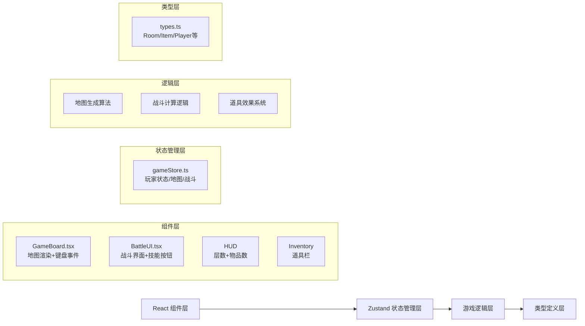

## 1. 架构设计



## 2. 技术说明

- 前端框架：React 18 + TypeScript（严格模式）
- 构建工具：Vite + @vitejs/plugin-react
- 状态管理：Zustand
- 样式方案：原生CSS + CSS Modules（内联样式处理动态值）
- 动画实现：CSS transitions + keyframes + requestAnimationFrame
- 无后端，纯前端浏览器运行

## 3. 目录结构

```
auto256/
├── package.json
├── vite.config.js
├── tsconfig.json
├── index.html
└── src/
    ├── types.ts           # 所有类型定义
    ├── gameStore.ts       # Zustand状态管理
    ├── main.tsx           # 应用入口
    ├── App.tsx            # 根组件
    ├── index.css          # 全局样式
    └── components/
        ├── GameBoard.tsx  # 9x9地图渲染
        ├── BattleUI.tsx   # 战斗界面
        ├── HUD.tsx        # 顶部信息显示
        └── Inventory.tsx  # 道具栏
```

## 4. 核心数据模型

### 4.1 房间类型
```typescript
type RoomType = 'start' | 'end' | 'normal' | 'treasure' | 'monster' | 'wall' | 'corridor';

interface Room {
  x: number;
  y: number;
  type: RoomType;
  visited: boolean;
  hasMonster: boolean;
  monster?: Monster;
  hasTreasure: boolean;
  treasure?: Item;
}
```

### 4.2 玩家状态
```typescript
interface Player {
  x: number;
  y: number;
  hp: number;
  maxHp: number;
  energy: number;
  maxEnergy: number;
  attack: number;
  attackBuffTurns: number;
  inventory: Item[];
}
```

### 4.3 怪物与道具
```typescript
interface Monster {
  name: string;
  hp: number;
  maxHp: number;
  attack: number;
}

type ItemType = 'heal_potion' | 'energy_potion' | 'attack_boost';

interface Item {
  id: string;
  type: ItemType;
  name: string;
  description: string;
  icon: string;
}
```

### 4.4 战斗状态
```typescript
interface BattleState {
  active: boolean;
  monster: Monster | null;
  playerTurn: boolean;
  log: string[];
}
```

## 5. 关键算法

### 5.1 地图生成算法
1. 初始化9x9全墙网格
2. 随机选择起点（左上区域）和终点（右下区域）
3. 使用深度优先搜索（DFS）或随机漫步生成走廊连接起点和终点
4. 在走廊两侧随机放置普通房间、怪物房间、宝箱房间
5. 确保连通性（起点可达终点）

### 5.2 战斗计算
- 普通攻击伤害：10-15随机 + 攻击buff加成
- 特殊技伤害：25-30随机 + 攻击buff加成，消耗能量
- 防御：减少下回合受到伤害50%
- 怪物攻击：5-10随机伤害

## 6. 性能优化
- 使用CSS transform实现角色移动（GPU加速）
- 战斗动画使用CSS transitions而非JS动画
- Zustand选择器避免不必要重渲染
- 地图网格使用CSS Grid布局，减少DOM节点数
- 帧率目标：≥30fps，动画响应≤0.1s
