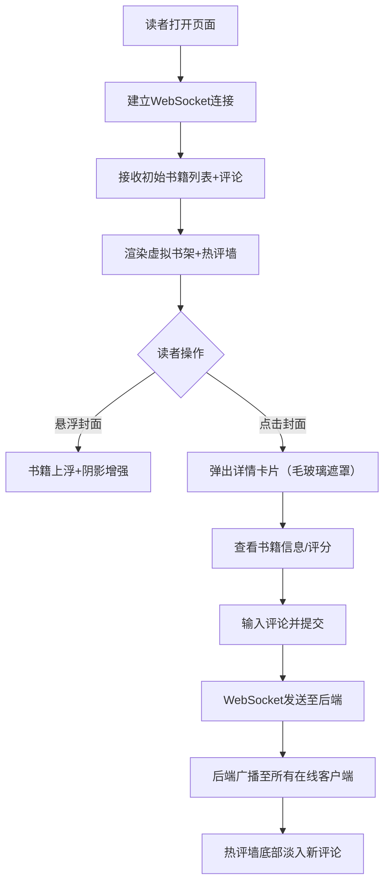

## 1. 产品概述

"书架乐章"是一款为初创在线书店打造的沉浸式虚拟书架Web应用，通过动态书籍陈列、详情交互卡片和实时书评社区，为读者提供兼具美感与社交属性的阅读探索体验。

- 核心价值：将传统书店的"逛书架"乐趣移植到线上，结合实时社交评论激发阅读讨论
- 目标用户：热爱阅读、追求品质界面体验、乐于分享书评的年轻读者群体

## 2. 核心特性

### 2.1 用户角色

| 角色 | 注册方式 | 核心权限 |
|------|----------|----------|
| 访客读者 | 匿名访问（Socket连接即代表在线） | 浏览书架、查看书籍详情、发表评论、查看热评墙 |

### 2.2 功能模块

1. **虚拟书架页面**：动态书籍封面陈列、悬浮交互、详情卡片弹窗
2. **书籍详情卡片**：书籍信息展示、星级评分、评论输入框
3. **实时热评墙**：评论滚动展示、用户头像、淡入动画

### 2.3 页面详情

| 页面名称 | 模块名称 | 功能描述 |
|----------|----------|----------|
| 主页面（书架） | 书架陈列区 | 50本虚拟书籍，CSS Grid 4-5列布局，随机柔和封面色，悬浮上浮+阴影效果 |
| 主页面（书架） | 详情卡片弹窗 | 点击封面弹出，毛玻璃遮罩，圆角16px，含书名/作者/简介/5星评分/评论输入 |
| 主页面（书架） | 热评墙 | 页面底部固定，高180px，最近20条评论倒序，新评论底部淡入，滚动条隐藏 |

## 3. 核心流程

读者进入应用 → 连接WebSocket → 接收初始书籍列表和历史评论 → 浏览书架（悬浮交互）→ 点击书籍封面 → 弹出详情卡片 → 输入评论并提交 → WebSocket广播 → 所有客户端热评墙更新显示

## 4. 用户界面设计

### 4.1 设计风格

- **主色调**：深邃蓝紫渐变背景（#1B1B2F → #16213E），磨砂蓝书架层（#0F3460半透明）
- **点缀色**：15种柔和低饱和封面色（#A3D1C6、#D4A5A5、#C9A8D6等），金色评分星（#F5C518）
- **卡片风格**：书籍卡片圆角8px、详情卡片圆角16px、白色背景+30%黑阴影
- **字体方向**：使用思源黑体或Noto Sans SC，标题加粗、正文轻盈
- **动效风格**：全部过渡0.2-0.3s ease，悬浮translateY(-10px)，关闭卡片缩放0.9淡出，评论淡入0.5s
- **质感层次**：backdrop-filter毛玻璃、多层box-shadow、渐变叠层营造空间深度

### 4.2 页面设计概览

| 页面名称 | 模块名称 | UI元素 |
|----------|----------|--------|
| 主页面 | 顶部标题区 | "书架乐章"大标题+副标题，居中，白色文字，优雅字体 |
| 主页面 | 书架陈列区 | 磨砂蓝半透明背景容器，CSS Grid布局，间距均匀，书籍卡片悬浮上浮 |
| 主页面 | 详情卡片 | 居中400px宽白色卡片，毛玻璃遮罩层，书籍信息+星级+评论输入 |
| 主页面 | 热评墙 | 底部fixed定位，高180px，深灰蓝背景，评论从底部淡入滚动 |

### 4.3 响应式

- 桌面优先设计（≥1200px：每行5本书）
- 平板自适应（768-1199px：每行4本书）
- 移动端适配（<768px：每行2本书，详情卡片宽度90%屏幕）

## 5. 性能指标

| 指标 | 目标值 |
|------|--------|
| 50本书首次渲染时间 | ≤1.5秒 |
| 评论提交→热评墙显示延迟 | ≤200ms |
| 交互过渡动画流畅度 | 60fps无卡顿 |
