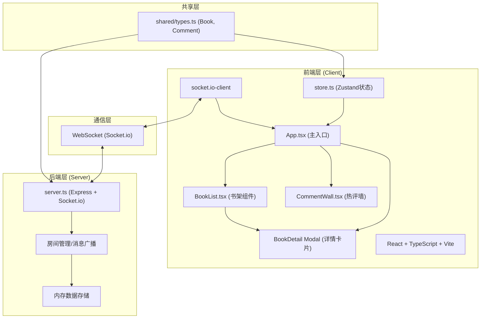

## 1. 架构设计



## 2. 技术栈说明

- **前端框架**：React 18 + TypeScript（严格模式）
- **构建工具**：Vite 5 + @vitejs/plugin-react
- **状态管理**：Zustand（轻量状态库，管理书籍/评论/选中状态）
- **实时通信**：socket.io-client
- **后端服务**：Node.js + Express 4
- **WebSocket**：Socket.io（房间管理、事件广播）
- **跨域处理**：cors中间件
- **ID生成**：uuid
- **并发启动**：concurrently（同时启动前后端dev服务）

## 3. 项目文件结构与调用关系

```
auto257/
├── package.json              # 根package，前后端依赖统一管理，dev脚本并发启动
├── vite.config.js            # Vite配置：React插件 + /api代理到3001端口
├── tsconfig.json             # TS严格模式配置
├── index.html                # 入口HTML，挂载#root
└── src/
    ├── shared/
    │   └── types.ts          # ⬅️ 共享类型：Book, Comment接口
    ├── server/
    │   └── server.ts         # ⬅️ 后端入口：Express(3001) + Socket.io，管理房间/广播
    └── client/
        ├── App.tsx           # ⬅️ 前端主入口：连接Socket，整合组件，监听事件
        ├── BookList.tsx      # ⬅️ 书架：读取store.books，渲染Grid，点击选中
        ├── CommentWall.tsx   # ⬅️ 热评墙：读取store.comments，渲染滚动列表
        └── store.ts          # ⬅️ Zustand：books/comments/selectedBook + actions
```

**数据流向**：
1. 客户端启动 → App.tsx建立Socket连接
2. 服务端推送 `initial-data`（书籍列表+历史评论）→ App调用store.setBooks/setComments
3. BookList从store订阅books → 渲染书籍卡片
4. 用户点击书籍 → BookList调用store.setSelectedBook → App检测到渲染详情Modal
5. 用户提交评论 → App通过Socket emit `new-comment` → 服务端广播 `comment-broadcast`
6. 所有客户端接收广播 → App调用store.addComment → CommentWall自动重渲染

## 4. Socket.io事件定义

| 事件名 | 方向 | 数据类型 | 说明 |
|--------|------|----------|------|
| `connection` | S←C | - | 客户端连接建立 |
| `initial-data` | S→C | `{ books: Book[], comments: Comment[] }` | 连接成功后推送初始数据 |
| `new-comment` | S←C | `{ bookId: string, username: string, content: string, rating: number }` | 客户端提交新评论 |
| `comment-broadcast` | S→C | `Comment` | 服务端向所有客户端广播新评论 |
| `disconnect` | S←C | - | 客户端断开连接 |

## 5. 共享类型定义（shared/types.ts）

```typescript
export interface Book {
  id: string;
  title: string;
  author: string;
  description: string;
  rating: number;       // 0-5 浮点，显示时取整
  coverColor: string;   // 柔和色hex值
}

export interface Comment {
  id: string;
  bookId: string;
  bookTitle: string;
  username: string;
  content: string;
  rating: number;
  timestamp: number;    // Date.now()
}
```

## 6. 服务端内存数据模型

服务端启动时初始化：
- `Map<string, Book>`：50本预置虚拟书籍数据，随机分配15种柔和封面色，评分3.0-4.8随机
- `Comment[]`：历史评论列表，上限100条，新评论unshift后slice(0, 100)
- `Set<Socket>`：当前在线连接集合，用于广播

## 7. 关键性能保障

1. **Vite开发代理**：WebSocket走HTTP升级路径，vite.config.js配置ws:true的代理
2. **Zustand选择器订阅**：BookList只订阅books，CommentWall只订阅comments，避免无效重渲染
3. **CSS硬件加速**：transform/opacity动画走GPU层，backdrop-filter仅用于遮罩层
4. **评论列表虚拟化**：热评墙只渲染最近20条DOM节点
5. **Socket防抖**：快速连续提交评论时前端做500ms节流保护
