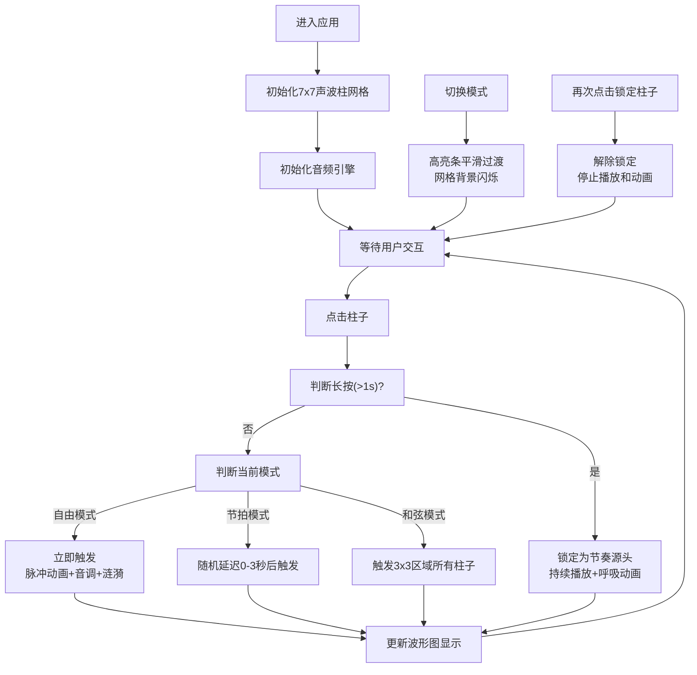

## 1. 产品概述

节奏之墙是一个交互式音乐可视化应用，用户通过点击7x7网格中的声波柱触发音频与视觉反馈，形成动态的音乐墙。应用将Web Audio API与流畅的动画效果相结合，创造沉浸式的音乐创作体验。

- 核心价值：让用户无需音乐基础即可通过直观的点击交互创作独特的节奏和旋律
- 目标用户：音乐爱好者、创意人士、休闲娱乐用户

## 2. 核心功能

### 2.1 功能模块

1. **主界面**：声波柱网格、音频波形图、模式切换栏
2. **交互系统**：点击触发、涟漪扩散、长按锁定、模式切换
3. **音频引擎**：音调生成、波形变化、低频脉冲、实时波形可视化

### 2.2 页面详情

| 页面名称 | 模块名称 | 功能描述 |
|-----------|-------------|---------------------|
| 主页面 | 声波柱网格 | 7x7（移动端5x5）声波柱，点击触发脉冲动画和音调，涟漪扩散效果 |
| 主页面 | 音频波形图 | 左上角实时显示音频输出波形，Canvas绘制 |
| 主页面 | 模式切换栏 | 底部三种模式切换：自由模式、节拍模式、和弦模式 |
| 主页面 | 长按锁定功能 | 长按1秒锁定柱子为节奏源头，持续播放低频脉冲音和呼吸动画 |

## 3. 核心流程

## 4. 用户界面设计

### 4.1 设计风格

- **主色调**：#0A0E1A（深背景）、#1A2035（次背景）、#00BCD4（青色主色）、#FF4081（粉色强调）、#FFD700（金色高亮）
- **背景**：#0A0E1A到#1A2035的径向渐变
- **声波柱**：#00BCD4到#FF4081的垂直渐变，柱底发光（box-shadow 0 0 8px currentColor），柱顶圆角4px
- **字体**：现代无衬线字体，清晰易读
- **交互反馈**：悬停放大1.1倍并增加亮度，点击脉冲动画（ease-out），涟漪扩散效果

### 4.2 页面设计概述

| 页面名称 | 模块名称 | UI元素 |
|-----------|-------------|-------------|
| 主页面 | 声波柱网格 | 7x7居中布局，柱间距6px，整体白色描边，背景径向渐变 |
| 主页面 | 波形图 | 200x60px，#121626背景，1px #334455边框，渐变线条，半透明填充 |
| 主页面 | 模式切换栏 | 底部居中，三个按钮，高亮条0.3s平滑过渡，选中文字#FFD700 |

### 4.3 响应式设计

- **桌面端（≥600px）**：7x7网格，柱子宽度为视口宽度的1/10
- **移动端（<600px）**：5x5网格，柱子宽度按比例缩放
- **触摸优化**：增加点击区域，确保移动端交互流畅

## 5. 性能要求

- 所有交互反馈60FPS流畅运行
- 动画帧率不低于30FPS
- 音频播放延迟不超过50ms
- Canvas波形绘制效率优化
