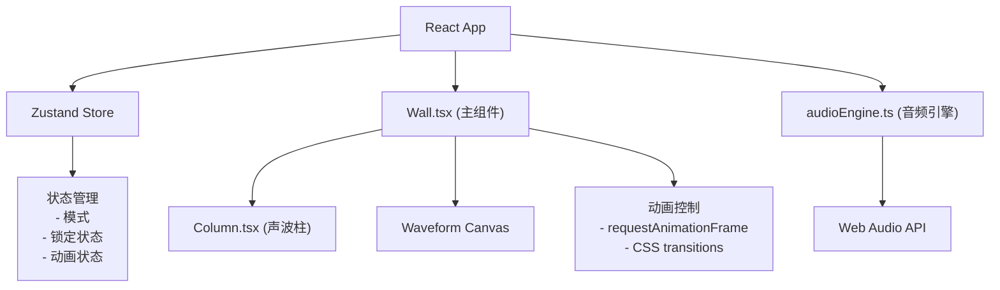

## 1. 架构设计



## 2. 技术描述

- **前端**：React 18 + TypeScript + Vite
- **状态管理**：Zustand
- **音频**：Web Audio API（原生）
- **构建工具**：Vite 5
- **样式**：CSS Modules / 内联样式（Styled Components可选，这里使用原生CSS配合React）
- **动画**：CSS Transitions + requestAnimationFrame

### 依赖包
```
react ^18.2.0
react-dom ^18.2.0
zustand ^4.4.0
typescript ^5.3.0
vite ^5.0.0
@vitejs/plugin-react ^4.2.0
```

## 3. 项目结构

```
├── index.html                 # 入口HTML
├── package.json               # 依赖配置
├── tsconfig.json              # TypeScript配置
├── vite.config.js             # Vite配置
└── src/
    ├── main.tsx              # React入口
    ├── App.tsx               # 根组件
    ├── Wall.tsx              # 主组件（网格布局、动画控制）
    ├── Column.tsx            # 声波柱组件
    ├── audioEngine.ts        # 音频引擎模块
    ├── store.ts              # Zustand状态管理
    └── types.ts              # TypeScript类型定义
```

## 4. 类型定义

```typescript
// types.ts
export type Mode = 'free' | 'beat' | 'chord';

export interface ColumnState {
  id: string;
  row: number;
  col: number;
  baseHeight: number;
  currentHeight: number;
  frequency: number;
  waveform: OscillatorType;
  isLocked: boolean;
  isPulsing: boolean;
  rippleIntensity: number;
  opacity: number;
}

export interface AppState {
  mode: Mode;
  columns: ColumnState[];
  lockedColumnId: string | null;
  setMode: (mode: Mode) => void;
  triggerColumn: (id: string, delay?: number) => void;
  lockColumn: (id: string) => void;
  unlockColumn: (id: string) => void;
  triggerRipple: (centerId: string) => void;
  triggerChord: (centerId: string) => void;
}
```

## 5. 核心模块说明

### 5.1 audioEngine.ts
- `AudioEngine`类封装Web Audio API
- `playTone(frequency, waveform, duration, volume)`：播放单音
- `startContinuousTone(frequency, volume)`：开始持续播放
- `stopContinuousTone()`：停止持续播放
- `getWaveformData()`：获取实时波形数据用于Canvas绘制

### 5.2 Wall.tsx
- 管理7x7/5x5网格布局
- 处理模式切换逻辑
- 控制涟漪扩散效果
- 渲染Canvas波形图

### 5.3 Column.tsx
- 处理点击和长按事件
- 脉冲动画（0.15s升高40%回弹）
- 呼吸动画（锁定时2s周期）
- 涟漪高度波动

### 5.4 store.ts (Zustand)
- 管理全局应用状态
- 处理模式切换状态
- 管理柱子锁定状态
- 协调动画触发

## 6. 性能优化策略

1. **音频优化**：
   - 复用AudioContext实例
   - 预创建OscillatorNode池
   - 使用requestAnimationFrame同步音频与视觉

2. **动画优化**：
   - 使用transform和opacity属性动画（GPU加速）
   - 避免layout thrashing
   - 使用will-change提示浏览器优化

3. **渲染优化**：
   - 柱子组件使用React.memo
   - Canvas使用离屏渲染优化
   - 状态更新批量处理

4. **响应式优化**：
   - 使用ResizeObserver监听窗口变化
   - 按需重计算网格布局参数
