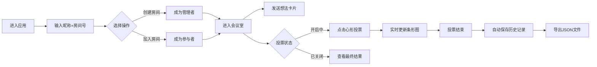

## 1. 产品概述

头脑风暴与投票决策协作应用，帮助团队在会议中高效记录想法、进行民主投票并可视化呈现结果。解决传统会议中想法碎片难以记录、投票过程繁琐、结果缺乏直观展示的痛点。

- 核心目标：提升团队协作效率，让每个想法都被看见，让决策过程透明化
- 目标用户：产品团队、项目组、创意部门等需要集体决策的组织
- 市场价值：填补实时协作脑暴与结构化投票结合的工具空白

## 2. 核心功能

### 2.1 用户角色

| 角色 | 加入方式 | 核心权限 |
|------|----------|----------|
| 房间创建者 | 输入昵称+房间号创建 | 开启/关闭投票、删除发言、管理房间 |
| 普通参与者 | 输入昵称+房间号加入 | 发送想法卡片、参与投票、查看历史记录 |

### 2.2 功能模块

1. **房间入口页**：房间创建/加入、昵称输入、4位房间号校验
2. **脑暴墙页面**：实时想法卡片流、卡片发送、字数限制、入场动画
3. **投票看板模块**：投票开启/关闭、心形投票按钮、实时条形图结果展示
4. **历史记录栏**：历史投票列表、详情查看、JSON导出下载

### 2.3 页面详情

| 页面名称 | 模块名称 | 功能描述 |
|----------|----------|----------|
| 房间入口页 | 登录表单 | 自动聚焦房间号输入框、4位数字校验、昵称非空验证 |
| 房间入口页 | 操作按钮 | 创建房间/加入房间双模式切换 |
| 主会议室 | 顶部导航栏 | 房间号展示、在线人数Chip、管理按钮组 |
| 主会议室 | 脑暴墙 | 卡片滚动列表、140字输入框、发送按钮、字数计数 |
| 主会议室 | 投票看板 | 投票状态指示、条形图结果、投票操作区、统计数据 |
| 主会议室 | 历史记录栏 | 可展开/收起、历史列表、详情弹窗、导出按钮 |

## 3. 核心流程

用户进入应用 → 输入昵称和4位房间号 → 选择创建或加入房间 → 进入会议室 → 发送想法卡片参与脑暴 → 管理者开启投票 → 参与者点击心形图标投票 → 投票结束后查看结果 → 历史记录自动保存 → 可导出JSON

## 4. 用户界面设计

### 4.1 设计风格
- 主背景色：#0F0E17（深空黑）
- 次要背景：#1A1A2E（深紫蓝）
- 强调色：#FF8906（活力橙）
- 投票色：#FF4D6D（玫红）
- 渐变条形：#FF6B6B → #FFD93D → #6BCB77
- 文字色：#E0E0E0（浅灰）
- 按钮样式：圆角8px，悬停光晕涟漪效果
- 字体：系统默认无衬线字体
- 布局风格：卡片式布局，毛玻璃效果，深度阴影
- 图标风格：线性简约图标，统一24px尺寸

### 4.2 页面设计概述

| 页面名称 | 模块名称 | UI元素 |
|----------|----------|--------|
| 房间入口页 | 登录表单 | 深色背景、橙色按钮、输入框聚焦效果、错误提示动画 |
| 主会议室 | 顶部导航栏 | 固定高度56px、毛玻璃背景、房间号高亮、人数Chip、管理按钮 |
| 主会议室 | 脑暴墙 | 纵向滚动、卡片渐变背景、圆角16px、入场动画（淡入+缩放）、悬停上浮 |
| 主会议室 | 投票看板 | 毛玻璃效果、40px高度条形图、渐变色填充、百分比数字、过渡动画0.5s |
| 主会议室 | 历史记录栏 | 底部抽屉式、可展开、历史项卡片、详情弹窗、导出按钮 |

### 4.3 响应式设计
- **桌面端（≥1024px）**：左右分栏布局，左侧脑暴墙45%，右侧投票看板50%
- **平板端（768px-1023px）**：上下堆叠布局，脑暴墙在上，投票看板在下
- **手机端（<768px）**：投票看板以底部抽屉形式呈现，0.3s滑入滑出动画，cubic-bezier缓动

### 4.4 动画与交互
- 卡片入场：0.3s淡入，放大1.1倍再回正
- 卡片悬停：上浮4px，增加内阴影
- 投票条形：0.5s ease-out宽度过渡
- 按钮反馈：0.2s过渡，#FF8906光晕涟漪效果
- 抽屉滑动：0.3s cubic-bezier(0.4, 0, 0.2, 1)

## 5. 性能指标
- WebSocket消息延迟：<200ms（20人同时操作）
- 页面动画帧率：≥55fps
- 首屏加载时间：<2s
- 输入响应延迟：<100ms
