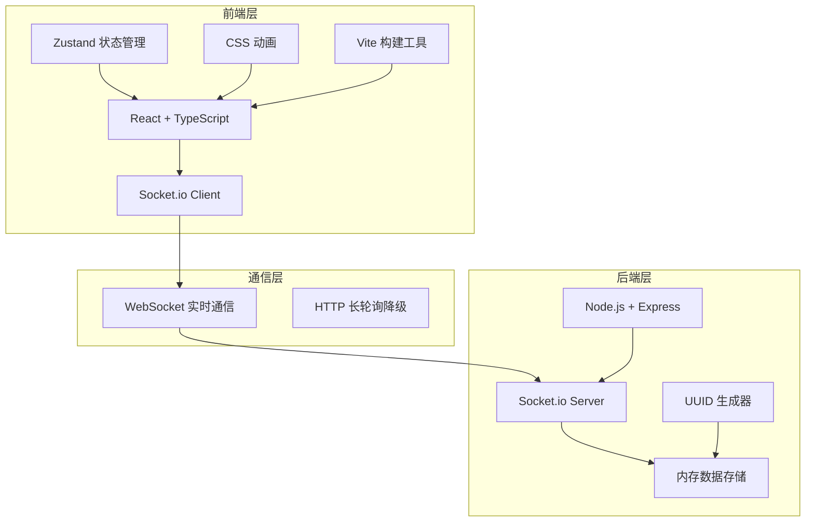
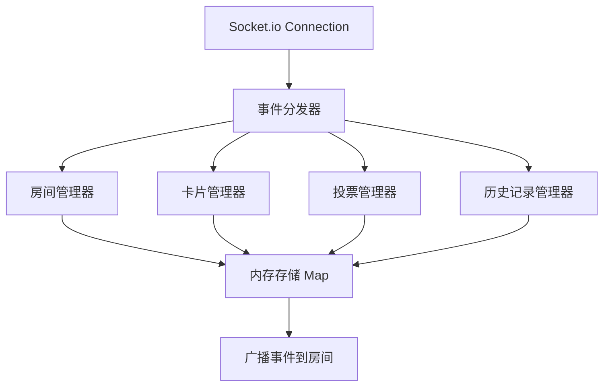

## 1. 架构设计



## 2. 技术描述

- **前端**：React@18 + TypeScript@5 + Vite@5 + Socket.io-client@4 + Zustand@4
- **状态管理**：Zustand 轻量级状态管理，管理本地投票状态和UI状态
- **实时通信**：Socket.io 4.x，支持WebSocket和HTTP长轮询降级
- **后端**：Node.js + Express@4 + Socket.io@4 + UUID@9 + CORS@2
- **数据存储**：内存存储（Map结构），无需数据库
- **构建工具**：Vite 5，HMR热更新，生产环境优化构建

## 3. 目录结构

```
auto259/
├── package.json              # 项目依赖与脚本
├── index.html                # 入口HTML
├── vite.config.js            # Vite配置
├── tsconfig.json             # TypeScript配置
├── src/
│   └── client/
│       ├── App.tsx           # 主应用组件
│       ├── store.ts          # Zustand状态管理
│       ├── types.ts          # TypeScript类型定义
│       └── components/
│           ├── RoomEntry.tsx      # 房间入口
│           ├── BrainstormWall.tsx # 脑暴墙
│           ├── VotingPanel.tsx    # 投票看板
│           ├── HistoryBar.tsx     # 历史记录栏
│           ├── IdeaCard.tsx       # 想法卡片组件
│           └── VoteBar.tsx        # 投票条形图组件
└── server/
    └── index.ts              # 后端入口
```

## 4. 路由定义

| 路由 | 用途 |
|------|------|
| / | 入口页面，根据状态显示房间入口或会议室 |

（应用为单页应用，无多路由，通过内部状态切换视图）

## 5. Socket.io 事件定义

### 5.1 客户端 → 服务端

| 事件名 | 数据类型 | 描述 |
|--------|----------|------|
| `room:join` | `{ roomId: string, nickname: string, isCreator: boolean }` | 加入/创建房间 |
| `card:add` | `{ roomId: string, content: string, nickname: string }` | 发送想法卡片 |
| `card:delete` | `{ roomId: string, cardId: string }` | 删除卡片（管理者权限） |
| `vote:open` | `{ roomId: string, cardIds: string[] }` | 开启投票（管理者权限） |
| `vote:cast` | `{ roomId: string, cardId: string }` | 提交投票 |
| `vote:close` | `{ roomId: string }` | 关闭投票（管理者权限） |
| `history:get` | `{ roomId: string }` | 获取历史投票记录 |

### 5.2 服务端 → 客户端

| 事件名 | 数据类型 | 描述 |
|--------|----------|------|
| `room:joined` | `{ roomId: string, users: User[], cards: Card[], voteState: VoteState | null }` | 成功加入房间 |
| `room:error` | `{ message: string }` | 房间操作错误 |
| `user:joined` | `{ user: User }` | 新用户加入 |
| `user:left` | `{ userId: string }` | 用户离开 |
| `card:added` | `{ card: Card }` | 新卡片已添加 |
| `card:deleted` | `{ cardId: string }` | 卡片已删除 |
| `vote:opened` | `{ voteState: VoteState }` | 投票已开启 |
| `vote:updated` | `{ votes: Record<string, number>, totalVotes: number }` | 投票数更新 |
| `vote:closed` | `{ history: VoteHistory }` | 投票已关闭 |
| `history:list` | `{ history: VoteHistory[] }` | 历史记录列表 |

### 5.3 数据类型定义

```typescript
interface User {
  id: string;
  socketId: string;
  nickname: string;
  isCreator: boolean;
  roomId: string;
}

interface Card {
  id: string;
  content: string;
  nickname: string;
  roomId: string;
  createdAt: number;
}

interface VoteState {
  isOpen: boolean;
  cardIds: string[];
  votes: Record<string, number>;
  userVotes: Record<string, string[]>;
  totalVotes: number;
  startedAt: number;
}

interface VoteHistory {
  id: string;
  roomId: string;
  options: { cardId: string; content: string; votes: number }[];
  totalVotes: number;
  startedAt: number;
  endedAt: number;
}
```

## 6. 服务器架构



### 6.1 核心模块

| 模块 | 职责 |
|------|------|
| 房间管理器 | 房间创建、加入、用户管理、权限校验 |
| 卡片管理器 | 卡片添加、删除、字数校验、广播同步 |
| 投票管理器 | 投票开启/关闭、票数统计、防重复投票、最多3票限制 |
| 历史记录管理器 | 投票结束后自动保存、历史查询、JSON导出 |

### 6.2 内存数据结构

```typescript
interface Room {
  id: string;
  creatorId: string;
  users: Map<string, User>;
  cards: Card[];
  currentVote: VoteState | null;
  voteHistory: VoteHistory[];
}

const rooms: Map<string, Room> = new Map();
```

## 7. 前端状态管理（Zustand）

```typescript
interface AppState {
  // 用户状态
  userId: string | null;
  nickname: string | null;
  roomId: string | null;
  isCreator: boolean;
  
  // 房间状态
  users: User[];
  cards: Card[];
  
  // 投票状态
  voteState: VoteState | null;
  myVotes: string[];
  
  // 历史记录
  history: VoteHistory[];
  
  // UI状态
  isHistoryOpen: boolean;
  error: string | null;
  
  // Actions
  setUser: (user: { userId: string; nickname: string; roomId: string; isCreator: boolean }) => void;
  setRoomState: (state: { users: User[]; cards: Card[]; voteState: VoteState | null }) => void;
  addCard: (card: Card) => void;
  deleteCard: (cardId: string) => void;
  openVote: (voteState: VoteState) => void;
  updateVotes: (votes: Record<string, number>, totalVotes: number) => void;
  closeVote: (history: VoteHistory) => void;
  castVote: (cardId: string) => void;
  setHistory: (history: VoteHistory[]) => void;
  toggleHistory: () => void;
  setError: (error: string | null) => void;
  reset: () => void;
}
```

## 8. 性能优化策略

1. **WebSocket优化**：
   - 消息批量发送，减少IO次数
   - 房间内消息仅广播给相关用户
   - 使用volatile消息处理非关键数据

2. **React优化**：
   - 使用`React.memo`包装列表项组件
   - 虚拟滚动处理大量卡片（>100条）
   - 使用`useCallback`和`useMemo`减少重渲染

3. **动画优化**：
   - 使用CSS transform和opacity实现GPU加速
   - 避免layout thrashing
   - 使用will-change提示浏览器优化

4. **构建优化**：
   - Vite代码分割
   - 按需加载组件
   - 生产环境Tree Shaking
