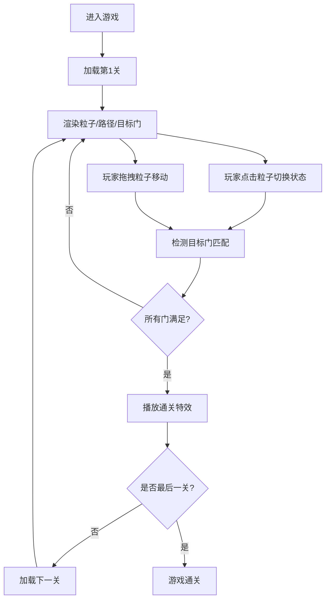

## 1. 产品概述

量子叠影是一款以量子力学中的叠加态和纠缠态为核心理念的2D解谜游戏。玩家通过操作粒子的量子状态（经典态、叠加态、纠缠态、坍缩态），将粒子与目标门颜色匹配来解开谜题，逐步通过10个精心设计的关卡。

- 核心玩法：点击粒子切换量子状态，拖拽粒子在动态路径网格上移动，匹配目标门的颜色需求
- 目标用户：休闲解谜游戏爱好者，对量子力学概念感兴趣的玩家
- 市场价值：创新的量子力学玩法机制，精美的视觉效果，流畅的操作体验

## 2. 核心功能

### 2.1 功能模块

1. **游戏主界面**：Canvas游戏画布、UI信息面板、功能按钮栏
2. **粒子状态系统**：四种状态切换（经典→叠加→纠缠→坍缩），状态过渡动画
3. **关卡系统**：10个关卡，渐进式难度，关卡数据生成
4. **路径网格系统**：8x8网格，动态路径生成，连通性保证，脉冲流光动画
5. **目标门系统**：四种颜色门（蓝/橙/紫/绿），不同匹配规则，吸附检测
6. **视觉反馈系统**：粒子爆发特效，通关动画，状态切换缓动效果

### 2.2 页面详情

| 页面名称 | 模块名称 | 功能描述 |
|-----------|-------------|---------------------|
| 游戏主界面 | Canvas画布 | 渲染粒子、路径网格、目标门、特效动画 |
| 游戏主界面 | 顶部信息栏 | 显示关卡编号、步数统计、重置按钮 |
| 游戏主界面 | 底部功能栏 | 信息、提示、设置、暂停四个功能按钮 |
| 游戏主界面 | 功能面板 | 点击底部按钮展开的滑入式面板 |

## 3. 核心流程

玩家进入游戏后，从第1关开始，通过点击粒子切换量子状态，拖拽粒子在路径上移动，将匹配颜色需求的粒子放置到对应目标门上。当所有目标门都被满足时，关卡通关，进入下一关。

## 4. 用户界面设计

### 4.1 设计风格

- **设计主题**：量子科幻风，深空蓝到紫黑的神秘氛围
- **主色调**：深空蓝#0A0E27、紫黑#1A002D、路径蓝#4A90D9、纠缠紫#7B68EE
- **粒子颜色**：蓝色#3B82F6、橙色#F97316、紫色#8B5CF6、绿色#22C55E
- **按钮样式**：圆形毛玻璃效果，悬停缩放1.1倍，平滑过渡
- **字体**：现代无衬线字体，白色为主，金色#FFD700用于强调
- **布局**：居中自适应，相对单位vw/vh，最小宽度适配

### 4.2 动画效果

- **粒子状态切换**：0.3秒ease-in-out缓动过渡
- **路径流光**：宽度2-4px循环，周期2秒
- **目标门脉冲**：半径20-30px扩散，周期1.5秒
- **面板滑入**：底部向上滑入，0.3秒ease-out
- **通关特效**：150个粒子爆发，持续1秒，文字放大动画

### 4.3 交互设计

- **粒子点击**：点击切换状态，高亮可移动相邻格子
- **粒子拖拽**：限制在路径相邻格子，拖拽时路径发光增强
- **按钮悬停**：缩放1.1倍，阴影增强
- **吸附检测**：距离小于30px时自动吸附到目标门

### 4.4 响应式设计

- Desktop-first设计，1920x1080和1280x720分辨率自动居中
- 使用vw/vh相对单位，最小宽度1280px适配
- 画布等比缩放，保持游戏区域比例
