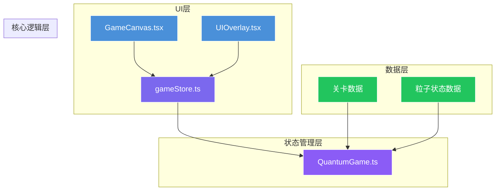
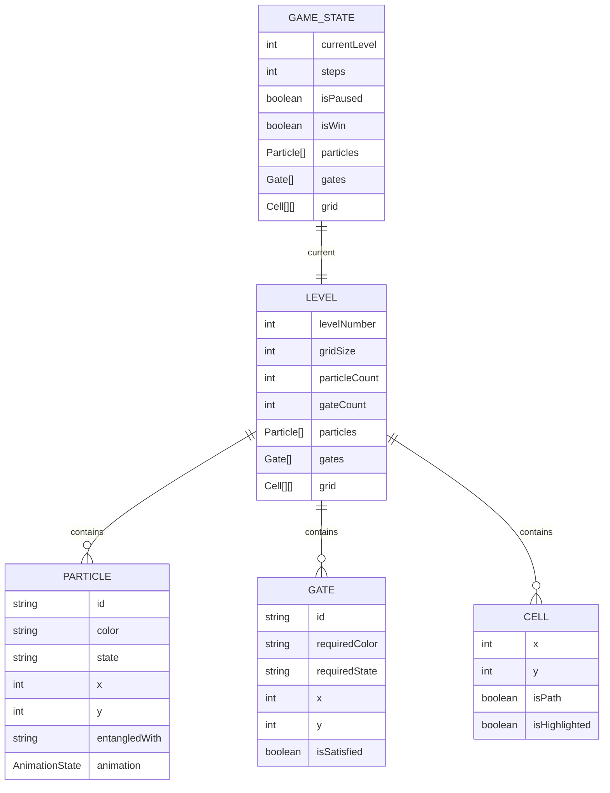

## 1. 架构设计



**数据流向说明：**
1. 用户点击/拖拽 → GameCanvas.tsx → gameStore action → QuantumGame.ts 处理逻辑
2. QuantumGame.ts 更新状态 → gameStore 更新 → GameCanvas/UIOverlay 重新渲染
3. UIOverlay 用户操作（重置/下一关）→ gameStore action → QuantumGame.ts

## 2. 技术描述

- **前端框架**：React 18 + TypeScript
- **构建工具**：Vite 5
- **状态管理**：Zustand 4
- **渲染引擎**：HTML5 Canvas API
- **依赖包**：react, react-dom, zustand, typescript, vite, @vitejs/plugin-react, uuid
- **开发服务器**：`npm run dev`

## 3. 文件结构与调用关系

```
src/
├── game/
│   └── core/
│       └── QuantumGame.ts      # 核心游戏逻辑（被gameStore调用）
├── store/
│   └── gameStore.ts            # Zustand状态管理（调用QuantumGame，被UI组件使用）
├── ui/
│   ├── GameCanvas.tsx          # Canvas渲染组件（使用gameStore）
│   └── UIOverlay.tsx           # UI覆盖层组件（使用gameStore）
├── types/                      # TypeScript类型定义
│   └── game.ts
├── utils/                      # 工具函数
│   ├── animation.ts            # 动画缓动函数
│   └── pathfinding.ts          # 路径生成算法
├── App.tsx                     # 主应用组件（组合GameCanvas和UIOverlay）
├── main.tsx                    # 应用入口
└── index.css                   # 全局样式
```

**调用关系：**
- [App.tsx](file:///d:/Pro/tasks/auto26/src/App.tsx) → [GameCanvas.tsx](file:///d:/Pro/tasks/auto26/src/ui/GameCanvas.tsx) + [UIOverlay.tsx](file:///d:/Pro/tasks/auto26/src/ui/UIOverlay.tsx)
- [gameStore.ts](file:///d:/Pro/tasks/auto26/src/store/gameStore.ts) → [QuantumGame.ts](file:///d:/Pro/tasks/auto26/src/game/core/QuantumGame.ts)
- [GameCanvas.tsx](file:///d:/Pro/tasks/auto26/src/ui/GameCanvas.tsx) → [gameStore.ts](file:///d:/Pro/tasks/auto26/src/store/gameStore.ts)
- [UIOverlay.tsx](file:///d:/Pro/tasks/auto26/src/ui/UIOverlay.tsx) → [gameStore.ts](file:///d:/Pro/tasks/auto26/src/store/gameStore.ts)

## 4. 数据模型

### 4.1 数据模型定义



### 4.2 核心类型定义

```typescript
// 粒子状态枚举
enum ParticleState {
  CLASSIC = 'classic',      // 经典态
  SUPERPOSITION = 'superposition',  // 叠加态
  ENTANGLED = 'entangled',  // 纠缠态
  COLLAPSED = 'collapsed'   // 坍缩态
}

// 粒子颜色枚举
enum ParticleColor {
  BLUE = 'blue',
  ORANGE = 'orange'
}

// 目标门颜色枚举
enum GateColor {
  BLUE = 'blue',      // 需要蓝色经典态
  ORANGE = 'orange',  // 需要橙色经典态
  PURPLE = 'purple',  // 需要蓝+橙纠缠态
  GREEN = 'green'     // 需要叠加态
}

// 粒子接口
interface Particle {
  id: string;
  color: ParticleColor;
  state: ParticleState;
  gridX: number;
  gridY: number;
  entangledWith: string | null;
  animation: AnimationState;
}

// 目标门接口
interface Gate {
  id: string;
  color: GateColor;
  gridX: number;
  gridY: number;
  isSatisfied: boolean;
}

// 网格单元接口
interface Cell {
  gridX: number;
  gridY: number;
  isPath: boolean;
}

// 关卡数据接口
interface LevelData {
  levelNumber: number;
  gridSize: number;
  particles: Particle[];
  gates: Gate[];
  grid: Cell[][];
}

// 游戏状态接口
interface GameState {
  currentLevel: number;
  steps: number;
  isPaused: boolean;
  isWin: boolean;
  particles: Particle[];
  gates: Gate[];
  grid: Cell[][];
  effects: VisualEffect[];
}
```

## 5. 核心模块说明

### 5.1 QuantumGame.ts 核心逻辑

**主要职责：**
- 8x8网格管理与路径生成（保证连通性）
- 粒子状态机管理（经典→叠加→纠缠→坍缩）
- 关卡数据生成（10关渐进难度）
- 胜负判断与目标门匹配检测
- 粒子移动验证与相邻格子检测
- 接收点击坐标，返回状态更新

**核心方法：**
- `initLevel(levelNumber): LevelData` - 初始化关卡
- `clickParticle(particleId): ParticleState` - 点击切换粒子状态
- `moveParticle(particleId, targetX, targetY): boolean` - 移动粒子
- `checkWinCondition(): boolean` - 检查胜利条件
- `resetLevel(): void` - 重置当前关卡
- `getAdjacentPathCells(gridX, gridY): Cell[]` - 获取可移动的相邻格子

### 5.2 gameStore.ts 状态管理

**主要职责：**
- 存储游戏状态：关卡数据、粒子状态、步数、游戏结果
- 提供Actions：初始化、点击粒子、重置关卡、加载下一关
- 桥接UI组件与核心游戏逻辑

**核心Actions：**
- `initializeGame(levelNumber)` - 初始化游戏
- `handleParticleClick(particleId)` - 处理粒子点击
- `handleParticleMove(particleId, targetX, targetY)` - 处理粒子移动
- `resetLevel()` - 重置关卡
- `loadNextLevel()` - 加载下一关

### 5.3 GameCanvas.tsx Canvas渲染

**主要职责：**
- 绘制粒子（蓝橙渐变圆，直径28px）
- 绘制叠加态分身（半透明度0.4，偏移±6px）
- 绘制纠缠虚线（2px白色虚线，发光效果）
- 绘制目标门（六边形边框，闪烁彩色边框）
- 绘制路径网格（脉冲流光动画）
- 监听鼠标点击/拖拽事件
- 调用gameStore actions处理用户交互

### 5.4 UIOverlay.tsx UI覆盖层

**主要职责：**
- 显示关卡编号（毛玻璃标题栏）
- 显示步数统计（图标+数字）
- 显示重置按钮（圆形，反转箭头图标）
- 底部功能按钮栏（信息?、提示💡、设置⚙️、暂停⏸️）
- 功能面板滑入动画

## 6. 性能优化策略

1. **Canvas渲染优化**：
   - 使用requestAnimationFrame进行动画循环
   - 离屏Canvas缓存静态元素（路径网格）
   - 脏矩形渲染，只重绘变化区域
   - 粒子对象池复用，避免频繁GC

2. **状态更新优化**：
   - Zustand selectors避免不必要的重渲染
   - 批量状态更新，减少渲染次数
   - 动画状态与游戏逻辑状态分离

3. **交互响应优化**：
   - 拖拽检测使用事件委托
   - 距离计算使用曼哈顿距离近似
   - 点击命中检测使用空间分区

4. **FPS保障**：
   - 逻辑更新与渲染分离，固定60FPS逻辑帧
   - 复杂计算使用Web Worker（路径生成）
   - 粒子数量限制，特效粒子对象池
