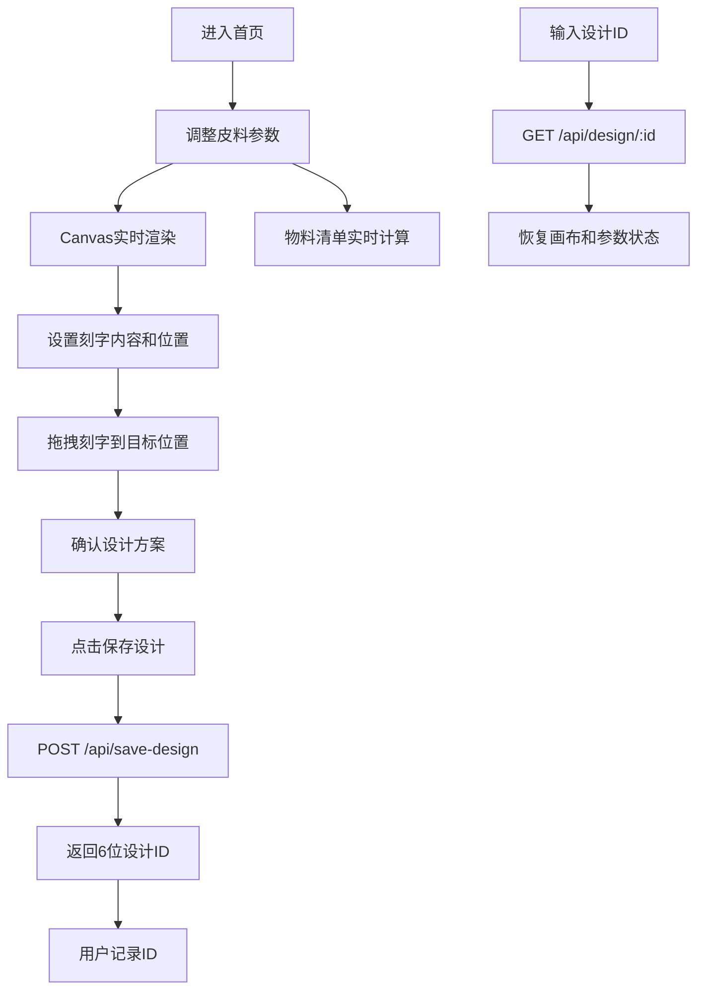

## 1. 产品概述

皮具定制工坊是一款面向手工皮具电商平台的在线定制设计工具，让买家在下单前实时预览皮带/手环的个性化样式搭配。

- 主要用途：提供皮料颜色、扣环样式、刻字内容的可视化定制体验
- 目标用户：手工皮具卖家及买家
- 产品价值：提升转化率，减少定制沟通成本，实现所见即所得的下单体验

## 2. 核心功能

### 2.1 用户角色
本应用无需登录，所有访客均可使用全部功能。

### 2.2 功能模块
1. **主预览画布区**：Canvas 2D实时渲染皮带俯视图，支持长度拖拽调节
2. **参数控制面板**：皮料颜色选择、扣环样式选择、皮带长度调节
3. **刻字设置模块**：文本输入、字体选择、字号调节、拖拽定位
4. **物料清单模块**：实时计算皮料面积、扣环费用、刻字费用及总价
5. **设计保存与加载**：6位设计ID持久化存储，支持设计稿恢复

### 2.3 页面详情
| 页面名称 | 模块名称 | 功能描述 |
|---------|---------|---------|
| 主页面 | 预览画布 | 600x400 Canvas实时绘制皮带、扣环、刻字；支持长度拖拽和刻字位置拖拽 |
| 主页面 | 参数调整卡片 | 15种皮料颜色下拉选择、3种扣环材质按钮组、长度滑块(80-120cm) |
| 主页面 | 刻字设置卡片 | 文本输入框(限8英文/4中文)、字体下拉(楷体/宋体/黑体)、字号滑块(16-36px) |
| 主页面 | 物料清单卡片 | 皮料面积、扣环单价×数量、刻字加工费、总价(橙色加粗高亮) |
| 主页面 | 保存/加载区 | 保存设计按钮(生成6位ID)、设计ID输入框、加载按钮 |

## 3. 核心流程

用户进入应用 → 选择皮料颜色/扣环样式/调节长度 → 输入刻字并拖拽调整位置 → 右侧物料清单实时更新 → 点击保存设计获得6位ID → 下次输入ID可恢复设计

## 4. 用户界面设计

### 4.1 设计风格
- **主色调**：暖棕#6D4C41（卡片标题栏）、深棕#4E342E（悬停）、橙色#FF8F00（选中边框）、深橙#E65100（总价高亮）
- **背景色**：暖灰#F0EDEA（页面背景）、纯白#FFFFFF（画布区）、浅灰#F5F5F5（清单卡片）、浅橙#FFF3E0（总价行高亮）
- **边框色**：#D7CCC8（画布边框）、#BDBDBD（输入框默认下划线）
- **按钮风格**：圆角6px/12px，0.2s背景色过渡，点击scale(0.98)缩放反馈
- **字体**：系统字体栈，标题粗体白色
- **布局**：左右分栏（左65%画布，右35%控制面板），最小高度700px
- **卡片设计**：三张功能卡片（参数调整/刻字设置/物料清单），标题栏#6D4C41背景+白色粗体字
- **扣环选择器**：60x60px圆角6px按钮，选中时#FF8F00边框+1.5px box-shadow

### 4.2 页面设计概述
| 页面名称 | 模块名称 | UI元素 |
|---------|---------|--------|
| 主页面 | 布局容器 | 左右flex分栏，响应式<768px切换上下布局，整体缩小10% |
| 主页面 | 画布区 | 纯白背景+2px #D7CCC8边框+3px圆角，内部600x400 Canvas |
| 主页面 | 参数卡片 | 标题栏#6D4C41，颜色下拉、扣环按钮组、长度滑块 |
| 主页面 | 刻字卡片 | 下划线输入框(Focus时从#BDBDBD过渡到#6D4C41，0.3s)、字体下拉、字号滑块 |
| 主页面 | 清单卡片 | #F5F5F5背景圆角12px，间距8px，总价行#FFF3E0背景+#E65100粗体字 |

### 4.3 响应式
- 桌面端：左右分栏（左65%/右35%），最小高度700px
- 移动端（<768px）：上下布局，画布100%宽在上，控制面板100%宽在下，字体和控件整体缩小10%
- 触控优化：拖拽操作支持touch事件

### 4.4 交互细节
- 画布重绘：requestAnimationFrame节流，最高30fps
- 长度拖拽：皮带右端旋钮，范围80-120cm，画布2:1比例显示
- 刻字拖拽：仅在皮带区域内有效，白色#FFFFFF文字+1px黑色描边
- 保存响应：本地环境不超过600ms
