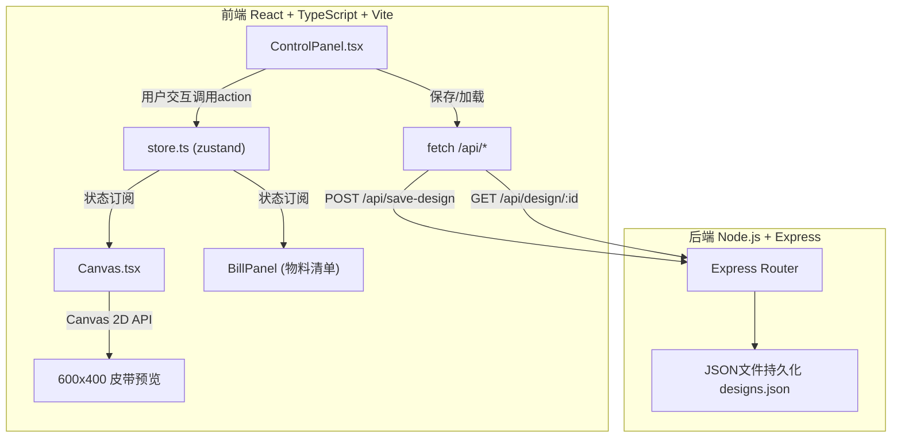
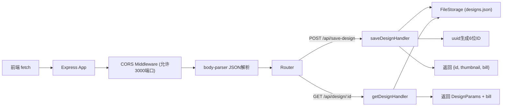
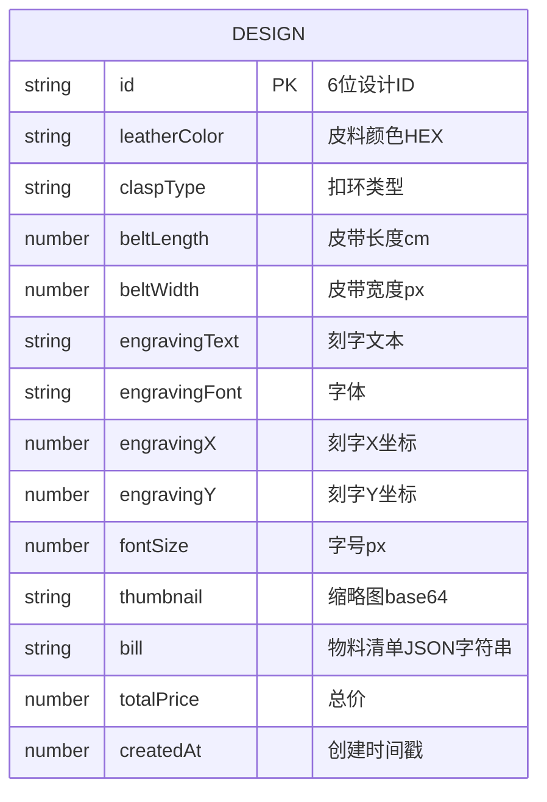

## 1. 架构设计



## 2. 技术描述

- **前端框架**：React 18 + TypeScript（严格模式）
- **构建工具**：Vite + @vitejs/plugin-react（proxy将/api转发到localhost:3001）
- **状态管理**：zustand（单store管理所有设计状态和物料清单）
- **绘图技术**：Canvas 2D API + requestAnimationFrame节流（最高30fps）
- **后端框架**：Express 4 + cors + uuid + body-parser
- **数据持久化**：本地JSON文件（designs.json）
- **前后端通信**：REST API（无WebSocket）

## 3. 路由定义

| 路由 | 用途 |
|------|------|
| / | 主页面（皮具定制工坊） |

## 4. API定义

```typescript
// 设计参数
interface DesignParams {
  leatherColor: string;       // 皮料颜色 HEX，默认#8B4513
  claspType: 'silver' | 'gold' | 'copper'; // 扣环类型，默认silver
  beltLength: number;         // 皮带长度 cm，范围80-120，默认100
  beltWidth: number;          // 皮带宽度 px，默认40
  engravingText: string;      // 刻字文本，限8英文/4中文
  engravingFont: 'KaiTi' | 'SimSun' | 'SimHei'; // 字体，默认KaiTi
  engravingX: number;         // 刻字X坐标
  engravingY: number;         // 刻字Y坐标
  fontSize: number;           // 字号px，16-36，默认24
}

// 物料清单项
interface BillItem {
  name: string;
  quantity: number;
  unitPrice: number;
  total: number;
}

// 保存请求 POST /api/save-design
interface SaveDesignRequest extends DesignParams {}

// 保存响应
interface SaveDesignResponse {
  id: string;                  // 6位设计ID
  thumbnail: string;           // 缩略图base64
  bill: BillItem[];            // 物料清单
  totalPrice: number;          // 总价
}

// 获取设计响应 GET /api/design/:id
interface GetDesignResponse extends DesignParams {
  id: string;
  bill: BillItem[];
  totalPrice: number;
}
```

**扣环价格表：**
- 银扣 silver：15元
- 金扣 gold：30元
- 铜扣 copper：20元

**刻字加工费**：固定10元

**皮料面积计算**：长度(cm) × 宽度(cm) → 实际面积(cm²)，画布上2:1比例显示

## 5. 服务器架构图



## 6. 数据模型

### 6.1 数据模型定义



### 6.2 数据存储
使用本地JSON文件 `designs.json` 持久化设计数据，结构如下：

```json
{
  "designs": {
    "A1B2C3": {
      "id": "A1B2C3",
      "leatherColor": "#8B4513",
      "claspType": "silver",
      "beltLength": 100,
      "beltWidth": 40,
      "engravingText": "MYBELT",
      "engravingFont": "KaiTi",
      "engravingX": 300,
      "engravingY": 200,
      "fontSize": 24,
      "thumbnail": "data:image/png;base64,...",
      "bill": [
        { "name": "皮料", "quantity": 400, "unitPrice": 0.05, "total": 20 },
        { "name": "银扣", "quantity": 1, "unitPrice": 15, "total": 15 },
        { "name": "刻字加工费", "quantity": 1, "unitPrice": 10, "total": 10 }
      ],
      "totalPrice": 45,
      "createdAt": 1718000000000
    }
  }
}
```
