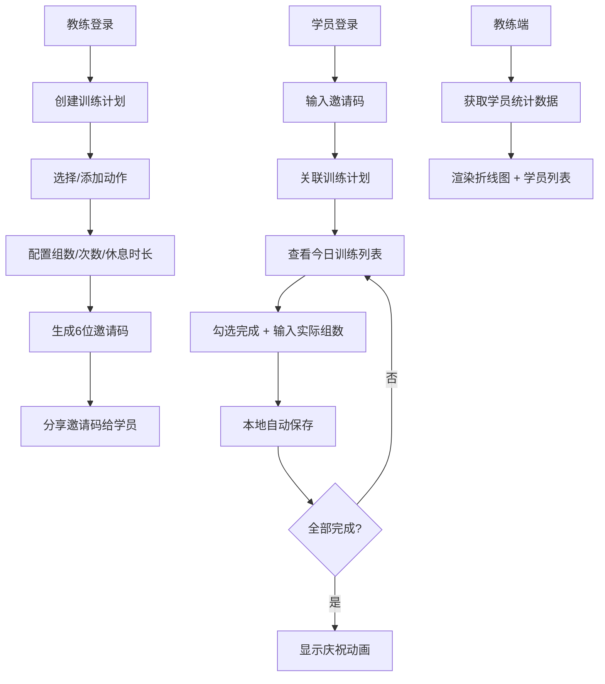

## 1. 产品概述
FitFlow 训练助手是一款面向健身教练和学员的个性化训练计划管理应用，解决教练批量管理学员训练任务、学员查看历史完成率和获取动作反馈的痛点。
- 核心目标：让教练高效制定和分发训练计划，让学员直观跟踪每日训练进度
- 目标用户：健身教练（批量管理学员）、健身学员（执行和记录每日训练）
- 市场价值：填补中小型健身工作室轻量化训练管理工具的空白

## 2. 核心功能

### 2.1 用户角色
| 角色 | 登录方式 | 核心权限 |
|------|----------|----------|
| 教练 | 角色切换 | 创建训练计划、生成邀请码、查看学员统计数据、监控完成率 |
| 学员 | 角色切换 + 邀请码 | 输入邀请码关联计划、记录每日训练、查看完成庆祝动画 |

### 2.2 功能模块
1. **教练端面板**：创建计划表单、邀请码展示、周完成率趋势图、学员当日完成率列表
2. **学员端面板**：邀请码输入、今日训练动作列表、完成记录、庆祝消息
3. **全局状态管理**：角色切换、计划数据缓存、本地存储自动保存

### 2.3 页面详情
| 页面名称 | 模块名称 | 功能描述 |
|----------|----------|----------|
| 角色选择页 | 角色切换卡片 | 教练/学员角色选择入口 |
| 教练端面板 | 创建计划表单 | 计划名称输入、预设动作库选择（下拉多选带复选框）、自定义动作新增、目标组数/次数/休息时长配置 |
| 教练端面板 | 邀请码展示 | 6位字母数字邀请码生成、7天有效期提示、一键复制 |
| 教练端面板 | 统计图表区 | Canvas绘制7天周完成率折线图，多学员彩色折线，悬浮显示数值 |
| 教练端面板 | 学员列表 | 显示每位学员当日完成率（实际组数/目标组数×100%） |
| 学员端面板 | 邀请码输入 | 输入邀请码关联训练计划 |
| 学员端面板 | 训练卡片列表 | 按教练设定顺序显示动作卡片，含名称、目标组数次数、休息时长、复选框、实际组数输入框 |
| 学员端面板 | 庆祝动画 | 全部完成后底部滑入渐变文字消息，2s后自动隐藏 |

## 3. 核心流程
教练创建训练计划 → 系统生成唯一6位邀请码 → 学员输入邀请码关联计划 → 学员每日登录查看训练列表 → 学员勾选完成并输入实际组数（自动本地保存） → 教练端实时查看学员完成率统计

## 4. 用户界面设计

### 4.1 设计风格
- **主题**：深色系，科技健身风
- **主背景色**：#121212
- **卡片背景**：#1E1E1E
- **文字主色**：#E0E0E0
- **强调色**：#7C4DFF（紫色）
- **完成状态色**：#4CAF50（绿色）
- **未完成状态色**：#FF5252（红色）
- **按钮**：#7C4DFF 背景，白色文字，圆角 8px，悬停亮度 +20%，禁用透明度 0.4
- **卡片**：圆角 12px，微弱白色阴影，间距 16px

### 4.2 页面设计概览
| 页面名称 | 模块名称 | UI元素 |
|----------|----------|--------|
| 角色选择 | 角色卡片 | 两张大卡片，图标+角色名，hover缩放动效，深色渐变背景 |
| 教练端-创建计划 | 表单区域 | 浅色底输入框，圆角8px，焦点边框#7C4DFF + 0.2s过渡，下拉多选带复选框 |
| 教练端-统计图表 | 折线图 | Canvas绘制，背景#1A1A1A，文字#B0B0B0，折线颜色从5色随机分配，点半径4px，悬浮tooltip |
| 学员端-训练卡片 | 动作卡片 | 缩放动画（勾选时1.02倍，0.4s），边框颜色变化，数字输入框防抖保存 |
| 学员端-庆祝消息 | Toast | 底部滑入，渐变文字#FFD700→#FF6F00，0.3s淡入，2s后淡出 |

### 4.3 响应式设计
- 桌面端（>=1024px）：训练卡片两列布局
- 平板端（>=768px）：单列布局
- 手机端（<768px）：全宽单列，卡片间距缩小为8px

### 4.4 动效设计
- 复选框勾选：0.4s卡片整体缩放1.02倍，边框颜色从#E0E0E0过渡到#4CAF50
- 庆祝消息：从底部滑入 + 0.3s淡入，2s后自动隐藏
- 按钮悬停：亮度提高20%，平滑过渡
- 输入框焦点：边框变为#7C4DFF，0.2s过渡
