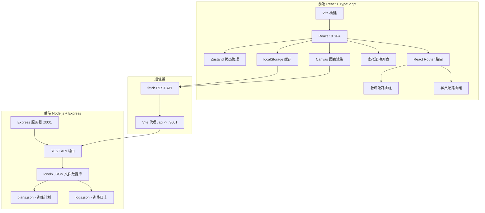
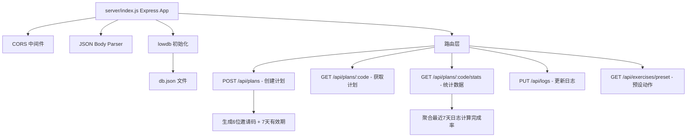

## 1. 架构设计



## 2. 技术描述
- **前端框架**：React@18 + TypeScript@5 + Vite@5
- **前端构建**：Vite + @vitejs/plugin-react
- **状态管理**：Zustand@4
- **路由**：React Router DOM@6（useRoutes 配置）
- **后端框架**：Express@4
- **数据库**：lowdb@7（轻量 JSON 文件数据库）
- **后端工具**：uuid（唯一ID生成）、cors（跨域）
- **启动方式**：concurrently 同时启动前后端开发服务器
- **图表**：原生 Canvas 2D API 绘制折线图
- **性能优化**：虚拟滚动（可视区域+上下50px缓冲）、localStorage 防抖写入（1.5s）

## 3. 路由定义
| 路由路径 | 用途 |
|----------|------|
| / | 角色选择页 |
| /coach | 教练端主面板 |
| /client | 学员端主面板 |

## 4. API 定义

### 4.1 TypeScript 类型
```typescript
interface Exercise {
  id: string;
  name: string;
  sets: number;
  reps: number;
  restSeconds: number;
  isCustom?: boolean;
}

interface TrainingPlan {
  id: string;
  name: string;
  inviteCode: string;
  inviteExpiresAt: string;
  exercises: Exercise[];
  createdAt: string;
  studentName?: string;
}

interface DailyLog {
  id: string;
  planId: string;
  date: string;
  studentName: string;
  exerciseLogs: {
    exerciseId: string;
    actualSets: number;
    completed: boolean;
  }[];
}

interface StudentStats {
  studentName: string;
  color: string;
  weekData: { date: string; completionRate: number }[];
  todayCompletion: number;
}
```

### 4.2 REST API 端点
| 方法 | 路径 | 说明 | 请求体 | 响应 |
|------|------|------|--------|------|
| POST | /api/plans | 创建训练计划 | `{ name, exercises, studentName }` | `TrainingPlan` |
| GET | /api/plans/:code | 根据邀请码获取计划 | - | `TrainingPlan` |
| GET | /api/plans/:code/stats | 获取学员统计数据 | - | `StudentStats[]` |
| PUT | /api/logs | 更新学员完成记录 | `{ planId, studentName, date, exerciseLogs }` | `DailyLog` |
| GET | /api/exercises/preset | 获取预设动作库 | - | `Exercise[]` |

## 5. 后端架构



## 6. 数据模型

### 6.1 ER 图
```mermaid
erDiagram
    TRAINING_PLAN {
        string id PK
        string name
        string inviteCode UK
        string inviteExpiresAt
        string exercises JSON
        string createdAt
        string studentName
    }
    DAILY_LOG {
        string id PK
        string planId FK
        string date
        string studentName
        string exerciseLogs JSON
    }
    TRAINING_PLAN ||--o{ DAILY_LOG : "has"
```

### 6.2 lowdb 数据结构
```json
{
  "plans": [
    {
      "id": "uuid",
      "name": "计划名称",
      "inviteCode": "ABC123",
      "inviteExpiresAt": "ISO日期字符串",
      "exercises": [
        { "id": "uuid", "name": "深蹲", "sets": 4, "reps": 12, "restSeconds": 60 }
      ],
      "createdAt": "ISO日期字符串",
      "studentName": "学员姓名"
    }
  ],
  "logs": [
    {
      "id": "uuid",
      "planId": "关联计划ID",
      "date": "YYYY-MM-DD",
      "studentName": "学员姓名",
      "exerciseLogs": [
        { "exerciseId": "动作ID", "actualSets": 3, "completed": true }
      ]
    }
  ]
}
```

### 6.3 预设动作库（10种常见动作）
| 动作名称 | 标准组数 | 次数 | 休息时长(秒) |
|----------|----------|------|--------------|
| 深蹲 | 4 | 12 | 60 |
| 卧推 | 4 | 10 | 90 |
| 硬拉 | 4 | 8 | 120 |
| 引体向上 | 3 | 10 | 90 |
| 哑铃肩推 | 3 | 12 | 60 |
| 杠铃划船 | 4 | 10 | 90 |
| 腿举 | 3 | 15 | 60 |
| 俯卧撑 | 3 | 20 | 45 |
| 平板支撑 | 3 | 60 | 30 |
| 卷腹 | 4 | 20 | 30 |
