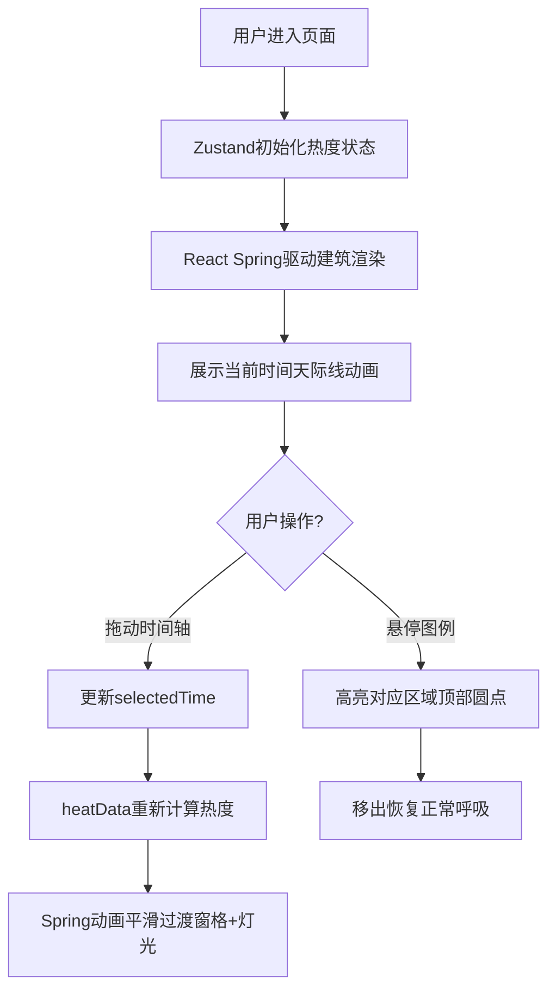

## 1. 产品概述

城市呼吸灯是一个赛博朋克风格的城市活动热度可视化界面，通过抽象的城市天际线和彩色灯光的呼吸节奏，实时反映不同时间段的城市活动热度变化。用户可以通过滑动时间轴来观察各区域（交通区、商业区、居住区、文化区）在不同时刻的活动强度变化。

- 主要目的：以视觉化方式展示城市日夜活动节律，为用户提供沉浸式的城市脉搏体验
- 目标用户：城市规划爱好者、数据可视化研究者、普通用户用于欣赏和理解城市节奏

## 2. 核心特性

### 2.1 功能模块

1. **主界面天际线展示**：深蓝夜空背景 + 10-15个建筑剪影 + 顶部发光圆点 + 随机亮灭的窗格
2. **时间轴交互**：底部滑块拖动控制时间，实时更新热度数据，气泡显示时间与热度
3. **图例面板**：右上角区域颜色说明，悬停高亮对应区域建筑
4. **动态呼吸效果**：顶部圆点按热度节奏呼吸闪烁，窗格密度随热度平滑变化

### 2.2 页面详情

| 页面名称 | 模块名称 | 功能描述 |
|---------|---------|---------|
| 主界面 | 城市天际线 | 10-15个不同高度建筑，3x5窗格矩阵，顶部发光圆点 |
| 主界面 | 背景渐变 | #0B0D17 到 #1A1D2E 的深蓝夜空渐变 |
| 主界面 | 时间轴滑块 | 底部灰色圆角滑块，拖动更新时间，气泡显示当前时间+热度 |
| 主界面 | 图例面板 | 右上角磨砂玻璃图例，悬停高亮对应区域 |
| 主界面 | 动画系统 | 呼吸灯、窗格亮灭、热度过渡全部采用0.2-0.3s缓动 |

## 3. 核心流程

用户进入页面后，系统自动初始化热度数据，建筑开始按当前时间（默认实时时间）展示活动状态。用户拖动底部时间轴滑块，界面平滑过渡到对应时刻的热度状态。用户悬停图例项，对应区域建筑顶部圆点短暂高亮。

## 4. 用户界面设计

### 4.1 设计风格

- **主色调**：深蓝夜空渐变背景（#0B0D17 → #1A1D2E）
- **区域色彩**：交通区#00E5FF、商业区#FFD700、居住区#FF6B6B、文化区#C084FC
- **暖色窗格**：#FFE082 暖黄色
- **UI元素**：所有元素带有赛博朋克式微弱发光边框 box-shadow: 0 0 6px rgba(0,229,255,0.3)
- **交互过渡**：所有状态变化统一使用 transition: all 0.2s ease
- **滑块**：#4A4A6A 灰色，圆角8px，宽度60%
- **时间气泡**：#FFFFFF 背景，透明度0.15，白色字体
- **图例面板**：磨砂玻璃效果 rgba(255,255,255,0.05)，圆角12px，边框1px solid rgba(255,255,255,0.1)

### 4.2 页面设计概览

| 模块 | UI元素 | 设计描述 |
|-----|--------|---------|
| 背景层 | 渐变夜空 | 垂直线性渐变 #0B0D17 → #1A1D2E，占满视口 |
| 建筑层 | 10-15个建筑 | 宽度均匀分布，高度20-120px随机，3x5窗格矩阵 |
| 灯光层 | 顶部圆点 | 直径6px，半透明发光，按热度周期(0.5s-3s)呼吸 |
| 时间轴 | 滑块+气泡 | 底部居中，气泡跟随滑块位置显示时间'HH:MM'和热度'XX%' |
| 图例 | 四个色标 | 右上角，竖向排列，每项色块+名称，悬停高亮 |

### 4.3 响应式设计

- **1200px以上**：天际线居中，占满视口高度
- **768px以下**：建筑整体等比缩小至70%，图例面板移至底部居中
- **触控优化**：滑块支持触摸拖动，热区适当放大

### 4.4 性能要求

- 动画帧率：稳定30fps以上
- 窗格更新计算：滑动时控制在3ms以内
- 热度更新：每秒更新一次（正弦波模拟日变化）
- 呼吸周期：0.5s(高热) - 3s(低热) 随热度值变化
