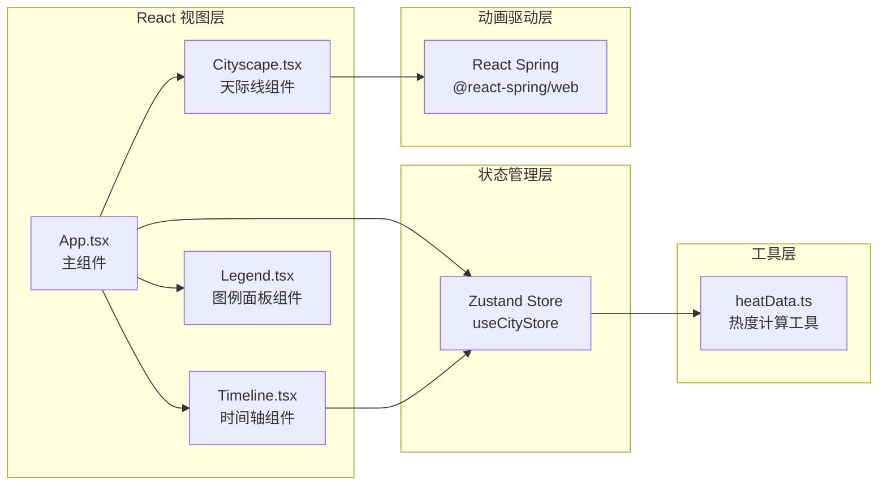

## 1. 架构设计



## 2. 技术选型说明

| 分类 | 技术 | 版本 | 用途 |
|------|------|------|------|
| 前端框架 | React | ^18.x | UI组件化开发 |
| 语言 | TypeScript | ^5.x | 类型安全，严格模式 |
| 构建工具 | Vite | ^5.x | 极速开发构建 |
| 状态管理 | Zustand | ^4.x | 轻量全局状态（时间/热度/高亮） |
| 动画库 | @react-spring/web | ^9.x | 窗格亮灭/灯光强度的弹簧动画 |
| Vite插件 | @vitejs/plugin-react | ^4.x | React HMR支持 |

**初始化方式**：不使用默认vite脚手架模板，手动创建文件结构以精确控制依赖版本和配置。

## 3. 核心文件结构

```
auto265/
├── index.html                          # 入口HTML，含#root全屏div
├── package.json                        # 依赖与脚本 (npm run dev)
├── vite.config.js                      # React插件配置
├── tsconfig.json                       # 严格模式, target ES2020
└── src/
    ├── App.tsx                         # 主组件：组装+初始化+布局
    ├── components/
    │   ├── Cityscape.tsx               # 天际线：建筑/窗格/呼吸灯渲染
    │   ├── Timeline.tsx                # 时间轴：滑块+气泡+拖动交互
    │   └── Legend.tsx                  # 图例：悬停高亮交互
    └── utils/
        └── heatData.ts                 # 热度数据生成+正弦波模拟
```

## 4. 数据模型与状态设计

### 4.1 Zustand Store (useCityStore)

```typescript
interface Building {
  id: number;
  height: number;       // 20-120px
  zoneType: ZoneType;   // 'traffic' | 'commercial' | 'residential' | 'cultural'
  windowGrid: boolean[][]; // 3列 x 5行 = 15格的亮灭状态
}

type ZoneType = 'traffic' | 'commercial' | 'residential' | 'cultural';

interface CityState {
  selectedTime: number;        // 0 - 1439 (分钟，00:00-23:59)
  hotness: Record<ZoneType, number>; // 各区域热度 0-100
  buildings: Building[];       // 10-15个建筑数据
  hoveredZone: ZoneType | null; // 当前悬停高亮的区域
  setSelectedTime: (min: number) => void;
  setHoveredZone: (z: ZoneType | null) => void;
  updateHotness: () => void;   // 每秒触发热度更新
}
```

### 4.2 热度计算规则 (heatData.ts)

- 基础趋势：正弦波模拟日变化周期(24h)
  - 交通区(traffic)：双峰 8:00/18:00 早晚高峰
  - 商业区(commercial)：单峰 14:00 午后高峰
  - 居住区(residential)：双峰 7:00/22:00 早晚在家
  - 文化区(cultural)：单峰 20:00 晚间活动
- 叠加 5%-10% 随机噪声，避免过于机械
- 返回 `Record<ZoneType, number>`，值域 [0, 100]

### 4.3 窗格亮灭算法

- 每个建筑 3×5 = 15 个窗格，大小 4×4px，间距 2px
- 亮灯概率 = 该建筑所属区域当前 hotness 值 / 100
- 基于稳定种子伪随机（building.id + 时间桶）决定哪几格亮，保证视觉连续性
- 状态切换通过 React Spring `useTransition` / `animated` 驱动透明度0.3s缓动

## 5. 交互与动画实现要点

| 需求 | 实现方案 |
|------|---------|
| 呼吸灯周期随热度变化 (0.5s-3s) | 基于hotness线性映射周期，requestAnimationFrame 或 CSS `@keyframes animation-duration` 动态绑定 |
| 透明度 0.3 ↔ 1.0 循环 | CSS animation + `opacity` 属性，或 Spring 的 loop config |
| 拖动更新平滑过渡 (0.3s缓动) | React Spring `useSpring`，config: { tension: 170, friction: 26 } |
| 图例悬停高亮 | Zustand hoveredZone 状态 → 对应建筑顶部圆点 opacity 瞬间拉满到 1，0.2s transition |
| 性能：窗格更新 <3ms | 矩阵运算移出渲染循环，时间分桶(每5分钟一档)减少重算频率 |
| 帧率 ≥30fps | 避免整树重渲：`React.memo` 包裹建筑组件，animation 走 GPU 合成层(transform/opacity) |

## 6. 关键类型定义 (TypeScript)

```typescript
// src/utils/heatData.ts
export const ZONE_COLORS = {
  traffic: '#00E5FF',
  commercial: '#FFD700',
  residential: '#FF6B6B',
  cultural: '#C084FC',
} as const;

export type ZoneType = keyof typeof ZONE_COLORS;

export function generateBuildings(count: number = 12): Building[];
export function computeHotness(minuteOfDay: number): Record<ZoneType, number>;
export function generateWindowGrid(seed: number, density: number): boolean[][];
```

## 7. 响应式策略

- 使用纯 CSS `@media` 查询处理断点，不引入额外响应式库
- `>=1200px`：天际线容器 `max-width: 1400px; margin: 0 auto; height: 100vh`
- `<=768px`：建筑容器整体 `transform: scale(0.7); transform-origin: bottom center`，图例面板改为 `position: fixed; bottom: 24px; left: 50%; transform: translateX(-50%)`
- 滑块触控：`touch-action: none` + pointer events 兼容鼠标/触摸
