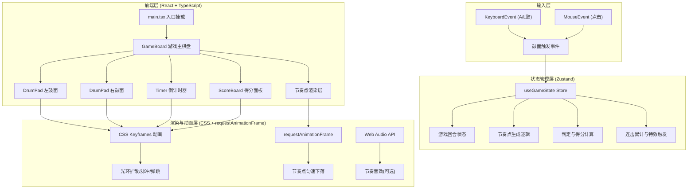

## 1. 架构设计



## 2. 技术栈说明

- **前端框架**：React 18 + TypeScript
- **构建工具**：Vite（@vitejs/plugin-react）
- **状态管理**：Zustand
- **样式方案**：原生CSS + CSS Modules（组件内样式）
- **动画实现**：CSS Keyframes + requestAnimationFrame
- **输入处理**：原生键盘事件 + 鼠标事件

## 3. 项目结构

```
d:\Pro\tasks\auto266\
├── package.json
├── vite.config.js
├── tsconfig.json
├── index.html
├── .trae/
│   └── documents/
│       ├── PRD.md
│       └── ARCHITECTURE.md
└── src/
    ├── main.tsx              # React挂载入口
    ├── GameBoard.tsx         # 游戏主棋盘组件
    ├── hooks/
    │   └── useGameState.ts   # Zustand状态管理Store
    └── Components/
        ├── DrumPad.tsx       # 单个鼓面组件
        ├── Timer.tsx         # 倒计时进度条组件
        └── ScoreBoard.tsx    # 得分面板组件
```

## 4. 数据模型定义

### 4.1 游戏状态类型定义

```typescript
// 判定结果类型
type JudgmentType = 'perfect' | 'good' | 'miss' | null;

// 玩家标识
type PlayerId = 'left' | 'right';

// 节奏点数据结构
interface BeatPoint {
  id: string;
  targetTime: number;      // 到达判定线的目标时间戳(ms)
  lane: PlayerId;          // 归属轨道（左/右）
  status: 'pending' | 'judged' | 'missed';
  spawnTime: number;       // 生成时间戳
}

// 玩家状态
interface PlayerState {
  score: number;
  combo: number;
  maxCombo: number;
  lastJudgment: JudgmentType;
}

// 特效事件
interface EffectEvent {
  id: string;
  type: 'perfect-flash' | 'good-flash' | 'miss-mark' | 'combo-text' | 'screen-shake' | 'ripple';
  player: PlayerId;
  timestamp: number;
  duration: number;
  data?: any;
}

// 游戏状态Store
interface GameState {
  // 回合状态
  phase: 'idle' | 'playing' | 'ended';
  startTime: number | null;
  endTime: number | null;
  remainingTime: number;  // 剩余秒数
  
  // BPM配置
  bpm: number;            // 默认120
  beatInterval: number;   // 节奏间隔(ms) = 60000 / bpm
  
  // 玩家数据
  players: {
    left: PlayerState;
    right: PlayerState;
  };
  
  // 节奏点队列
  beatPoints: BeatPoint[];
  
  // 当前活跃特效
  activeEffects: EffectEvent[];
  
  // 胜利者
  winner: PlayerId | 'draw' | null;
  
  // Actions
  startGame: () => void;
  resetGame: () => void;
  triggerDrum: (player: PlayerId, triggerTime: number) => void;
  updateTick: (currentTime: number) => void;
}
```

## 5. 核心算法

### 5.1 节奏点生成算法
- 基于BPM计算间隔：`beatInterval = 60000 / bpm` (120BPM时为500ms)
- 游戏开始后，每个 `beatInterval` 生成一个节奏点
- 节奏点随机分配到左/右轨道（50%概率，可调整平衡）
- 每个节奏点的 `targetTime = startTime + N * beatInterval + 下落时间`
- 下落时间固定为2000ms（从顶部到判定线的动画时长）

### 5.2 判定时机算法
```typescript
function judgeTiming(triggerTime: number, targetTime: number): JudgmentType {
  const diff = Math.abs(triggerTime - targetTime);
  if (diff <= 100) return 'perfect';
  if (diff <= 200) return 'good';
  return 'miss';
}
```

### 5.3 得分与连击逻辑
```typescript
function calculateScore(judgment: JudgmentType, currentCombo: number): { score: number; newCombo: number } {
  switch (judgment) {
    case 'perfect':
      return { score: 100, newCombo: currentCombo + 1 };
    case 'good':
      return { score: 50, newCombo: 0 };
    case 'miss':
      return { score: 0, newCombo: 0 };
    default:
      return { score: 0, newCombo: currentCombo };
  }
}
```

### 5.4 requestAnimationFrame 动画循环
- 使用 `useEffect` 启动RAF循环
- 每帧计算当前时间，更新剩余时间、节奏点位置、特效状态
- 检查是否有超时未判定的节奏点（自动判为Miss）
- 检查游戏是否结束（剩余时间 <= 0）

## 6. 性能优化方案

1. **节奏点对象池**：复用已判定/过期的节奏点对象，减少GC压力
2. **CSS硬件加速**：动画元素使用 `transform: translate3d()` 和 `will-change` 触发GPU加速
3. **批量状态更新**：每帧统一更新一次Zustand状态，避免多次渲染
4. **特效自动清理**：超过duration的特效自动从数组中移除
5. **throttle输入事件**：键盘事件节流处理（已通过判定逻辑天然去重）
6. **memo优化**：DrumPad、Timer、ScoreBoard组件使用React.memo包裹
