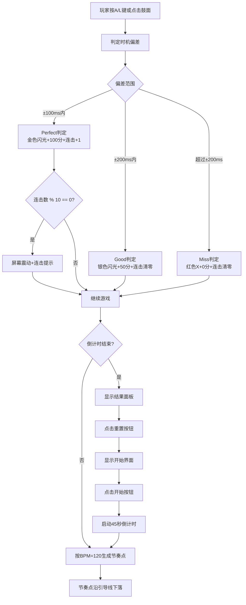

## 1. 产品概述

幻音战鼓是一款双人同屏节奏对战游戏，两名玩家轮流敲击虚拟鼓面，根据节奏准确度得分并触发炫酷的连击特效。游戏融合了音乐节奏与竞技对战元素，带来紧张刺激的对战体验。

- 核心玩法：根据节奏点下落时机精准敲击鼓面，连续Perfect判定累计连击获得高分
- 目标用户：休闲游戏爱好者、双人对战场景（朋友聚会、家庭娱乐）
- 产品价值：提供低门槛、高爽感的节奏对战体验，炫酷特效增强视觉冲击力

## 2. 核心功能

### 2.1 用户角色
| 角色 | 注册方式 | 核心权限 |
|------|----------|----------|
| 玩家1（左） | 无需注册，开始游戏即加入 | 控制左侧鼓面（A键/点击） |
| 玩家2（右） | 无需注册，开始游戏即加入 | 控制右侧鼓面（L键/点击） |

### 2.2 功能模块
1. **游戏主界面**：开始按钮、倒计时进度条、鼓面区域、节奏引导线
2. **鼓面交互模块**：按键/点击触发、动画效果、光环扩散、判定闪光
3. **节奏系统模块**：节奏点生成、下落动画、预备指示、时机判定
4. **计分系统模块**：分数计算、连击累计、屏幕震动、连击提示
5. **结果展示模块**：胜负判定、结果面板、重置功能

### 2.3 页面详情
| 页面名称 | 模块名称 | 功能描述 |
|----------|----------|----------|
| 游戏主界面 | 开始按钮 | 圆角红色按钮，悬停变暗，点击缩放，启动45秒倒计时 |
| 游戏主界面 | 倒计时进度条 | 顶部中央300x6px，颜色渐变，最后5秒红色闪烁 |
| 游戏主界面 | 双鼓面区域 | 左右圆形鼓面，键盘+鼠标触发，同心圆装饰 |
| 游戏主界面 | 节奏引导线 | 竖直虚线引导线，水平虚线参考线 |
| 游戏主界面 | 得分面板 | 双方分数显示、连击数、数字弹跳动画、颜色分级 |
| 判定系统 | Perfect判定 | ±100ms，金色闪光，100分，连击+1 |
| 判定系统 | Good判定 | ±200ms，银色闪光，50分，连击清零 |
| 判定系统 | Miss判定 | 超时，红色X标记，0分，连击清零 |
| 特效系统 | 连击特效 | 每10连击屏幕震动+浮动连击提示文字 |
| 结果界面 | 胜负展示 | 半透明遮罩，获胜者信息，重置按钮 |

## 3. 核心流程

游戏开始 -> 显示开始界面 -> 点击开始按钮 -> 倒计时45秒 -> 节奏点按BPM生成并下落 -> 玩家按键/点击触发鼓面 -> 判定时机并计算得分 -> 触发对应闪光和特效 -> 累计连击触发震动 -> 倒计时结束 -> 显示结果面板 -> 点击重置重新开始

## 4. 用户界面设计

### 4.1 设计风格
- **主色调**：深色渐变背景（#1A1A2E → #16213E），营造科幻炫酷氛围
- **强调色**：左鼓红色#E74C3C，右鼓蓝色#3498DB，节奏点金色#F1C40F，成功金色#FFD700
- **按钮风格**：圆角矩形，悬停过渡，点击缩放反馈
- **字体**：使用现代感字体（如Orbitron），大字号突出分数和连击提示
- **布局风格**：居中对称布局，鼓面位于水平43%/57%处，垂直居中
- **视觉元素**：同心圆装饰、虚线引导线、渐变进度条、发光阴影特效

### 4.2 页面设计概述
| 页面名称 | 模块名称 | UI元素 |
|----------|----------|--------|
| 开始界面 | 开始按钮 | 居中红色圆角按钮，白色文字，悬停#C0392B，点击缩放0.95 |
| 游戏界面 | 背景 | 深色径向/线性渐变 #1A1A2E → #16213E |
| 游戏界面 | 鼓面 | 180px圆形，默认#2C3E50，按下变色，光环扩散动画 |
| 游戏界面 | 装饰 | 半径110px半透明白色同心圆，水平虚线参考线 |
| 游戏界面 | 进度条 | 顶部300x6px，圆角3px，#27AE60→#E74C3C渐变填充 |
| 游戏界面 | 节奏点 | 8px金色圆点，竖直虚线引导线，预备指示小圆点 |
| 游戏界面 | 得分面板 | 分数数字弹跳，<1000白色，1000-3000橙色，>3000金色 |
| 特效 | Perfect闪光 | #FFD700，半径60px，0.2s闪烁 |
| 特效 | Good闪光 | #C0C0C0，半径40px，0.15s闪烁 |
| 特效 | Miss标记 | #E74C3C红色X，0.3s消失 |
| 特效 | 连击提示 | 60px金色#F1C40F文字，发光阴影，上飘100px渐隐 |
| 结果界面 | 面板 | 半透明黑色遮罩，48px获胜者信息，重置按钮 |

### 4.3 响应式设计
- **设计原则**：桌面端优先，移动端自适应
- **移动端适配**：
  - 鼓面尺寸缩小至120px
  - 进度条宽度缩小至200px
  - 所有字体缩小0.7倍
  - 保持对称布局和对齐方式
  - 触摸区域优化，确保可点击范围充足

### 4.4 动效设计
- 鼓面按下：颜色变化 + 0.3s光环扩散（20px→250px，透明度0.6→0）
- 判定反馈：0.1s鼓面脉冲缩放1.2倍→1.0倍
- 分数变化：0.15s数字弹跳1.3倍→1.0倍
- 连击触发：画面左右偏移3px震动0.1s，连击文字上飘渐隐0.8s
- 倒计时最后5秒：填充色#E74C3C，0.5s周期闪烁
- 节奏点下落：匀速平滑动画，预备指示0.5s前出现
