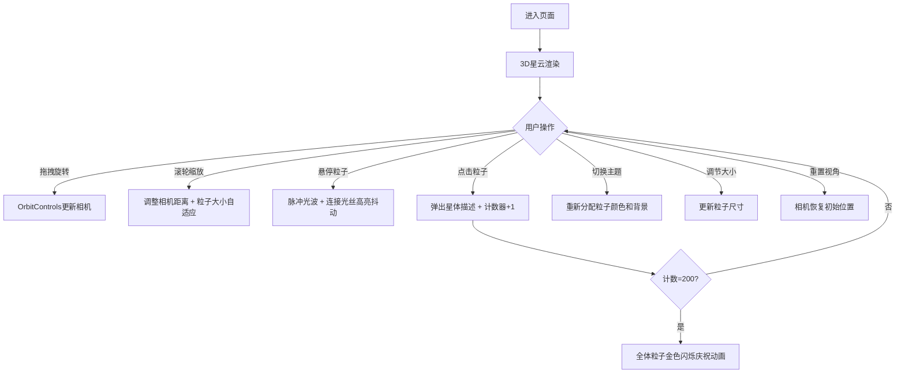

## 1. 产品概述

星尘画廊是一个沉浸式的3D粒子星云可视化交互应用，通过Three.js在三维空间中呈现动态生成的虚拟星空，让用户以探索者的身份发现和欣赏200颗独特的星体。

- 核心价值：打造富有艺术感和探索乐趣的3D交互体验
- 目标用户：艺术爱好者、科技爱好者、普通休闲用户
- 产品定位：创意交互展示类Web应用

## 2. 核心功能

### 2.1 用户角色

| 角色 | 注册方式 | 核心权限 |
|------|----------|----------|
| 探索者 | 无需注册 | 浏览星空、交互探索、切换主题、调整参数 |

### 2.2 功能模块

1. **3D粒子星云系统**：200颗动态粒子组成的球体星云，带发光效果和布朗运动
2. **星座光丝连接系统**：近距离粒子间的动态光丝连接，悬停时高亮抖动
3. **交互控制系统**：鼠标拖拽旋转视角、滚轮缩放、点击/悬停粒子交互
4. **主题控制面板**：三种颜色主题切换、粒子大小调节、视角重置
5. **星体发现计数器**：记录已发现星体数量，达成全发现触发庆祝动画

### 2.3 页面详情

| 页面名称 | 模块名称 | 功能描述 |
|----------|----------|----------|
| 主页面 | 3D星空场景 | 200个发光粒子组成半径5单位的球体星云，Y轴缓慢旋转，粒子布朗运动 |
| 主页面 | 星座光丝 | 距离<0.8单位的粒子间生成混合色光丝，每帧动态更新 |
| 主页面 | 控制面板 | 左侧半透明面板，含主题切换、大小滑块、重置按钮 |
| 主页面 | 星图计数器 | 右上角悬浮计数器，显示"已发现星体：X/200" |
| 主页面 | 星体描述弹窗 | 点击粒子弹出随机星体描述文字 |
| 主页面 | 庆祝动画 | 计数达200时全体粒子金色闪烁三次 |

## 3. 核心流程

用户进入页面后，首先看到深邃的星空调色背景和缓缓旋转的粒子星云。用户可以：
- 拖拽鼠标旋转视角探索星云
- 滚轮缩放观察细节
- 悬停粒子触发脉冲光波和光丝高亮效果
- 点击粒子查看星体描述并计数
- 使用左侧控制面板切换主题或调整参数
- 发现全部200颗星体后触发金色庆祝动画

## 4. 用户界面设计

### 4.1 设计风格

- **主色调**：深空渐变背景 `#0A0A1A → #1A1A3E`
- **粒子调色板**：`#FF6B6B`（珊瑚红）、`#FFD93D`（琥珀黄）、`#6BCB77`（薄荷绿）、`#4D96FF`（天蓝）、`#9B59B6`（紫罗兰）
- **交互色**：控制滑块填充 `#4D96FF`，悬停高亮 `#FFFFFF15`，庆祝金色 `#FFD700`
- **按钮风格**：圆角12px，半透明背景，悬停微亮，点击缩放0.95（0.1s过渡）
- **字体**：现代无衬线字体，白色半透明文字
- **布局风格**：沉浸式全屏3D场景 + 浮动UI控件（左控制面板 + 右上计数器）
- **图标风格**：简洁矢量图标，发光线条风格

### 4.2 页面设计概述

| 页面名称 | 模块名称 | UI元素 |
|----------|----------|--------|
| 主页面 | 3D场景 | 全屏Canvas，深空渐变背景，200发光粒子，动态光丝，柔和发光 |
| 主页面 | 控制面板 | 左侧40px位置，220px宽，12px圆角，`#00000033`背景，三个控件垂直排列 |
| 主页面 | 计数器 | 右上角悬浮，白色半透明圆角矩形，清晰数字显示 |
| 主页面 | 弹窗 | 点击粒子位置附近，半透明深色圆角卡片，随机星体描述文字 |

### 4.3 响应式

- Desktop-first设计，全屏沉浸式体验
- 控制面板在小屏幕上可考虑折叠或缩小
- 触摸设备支持单指旋转、双指缩放

### 4.4 3D场景指引

- **环境**：深空渐变背景，无外部HDRI，营造宇宙沉浸感
- **光照**：粒子自发光（Additive Blending），无需场景光源
- **相机**：PerspectiveCamera，初始距离8-10单位，fov约60°
- **运动**：整体Y轴旋转0.02rad/s，粒子±0.05布朗运动，周期0.5-1.5s
- **交互**：OrbitControls（阻尼0.1），缩放范围0.5-10，粒子sizeAttenuation关闭保持屏幕像素大小
- **后期**：粒子使用圆形纹理 + 加法混合实现发光效果
- **性能预算**：200粒子 + ≤400光丝，稳定30fps以上
