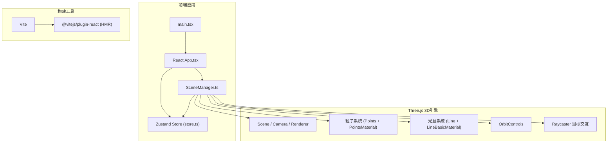

## 1. 架构设计



## 2. 技术描述

- **前端框架**：React 18 + TypeScript
- **3D引擎**：Three.js（直接使用，非R3F）
- **状态管理**：Zustand
- **构建工具**：Vite 5 + @vitejs/plugin-react
- **语言版本**：TypeScript strict模式，target ES2020，moduleResolution bundler

## 3. 路由定义

| 路由 | 用途 |
|------|------|
| / | 主页面，全屏3D星空场景 + 控制面板 + 计数器 |

## 4. 数据模型

### 4.1 Zustand Store 状态定义

```typescript
interface Particle {
  id: number;
  basePosition: [number, number, number]; // 初始球坐标位置
  color: string;
  size: number;
  opacity: number;
  discovered: boolean;
  description: string;
}

interface Connection {
  from: number; // particle index
  to: number;   // particle index
  baseOpacity: number;
}

type Theme = 'stardust' | 'aurora' | 'lava';

interface StarDustState {
  particles: Particle[];
  connections: Connection[];
  theme: Theme;
  particleSizeScale: number;
  discoveredCount: number;
  selectedParticleId: number | null;
  hoveredParticleId: number | null;
  isCelebrating: boolean;
  // actions
  setTheme: (t: Theme) => void;
  setParticleSizeScale: (s: number) => void;
  discoverParticle: (id: number) => void;
  selectParticle: (id: number | null) => void;
  hoverParticle: (id: number | null) => void;
  triggerCelebration: () => void;
  resetCamera: () => void; // 触发信号
  cameraResetSignal: number;
}
```

### 4.2 Theme 配色定义

| 主题名 | 粒子颜色 | 背景渐变 |
|--------|----------|----------|
| stardust | #FF6B6B, #FFD93D, #6BCB77, #4D96FF, #9B59B6 | #0A0A1A → #1A1A3E |
| aurora | #00F5D4, #00BBF9, #9B5DE5, #F15BB5, #FEE440 | #0A1A2E → #1A3A5E |
| lava | #FF4500, #FF6347, #FFA500, #FFD700, #DC143C | #1A0A0A → #3E1A1A |

## 5. 项目文件结构

```
auto269/
├── index.html                 # 入口HTML，#root全屏div
├── package.json               # 依赖与脚本
├── vite.config.js             # Vite React插件配置
├── tsconfig.json              # TypeScript严格模式配置
└── src/
    ├── main.tsx               # React入口
    ├── App.tsx                # 主组件：Canvas + 控制面板 + 计数器
    ├── store.ts               # Zustand状态管理
    └── SceneManager.ts        # Three.js场景管理类
```

## 6. SceneManager 核心职责

SceneManager.ts 作为独立的类管理所有Three.js逻辑：

1. **初始化阶段 (constructor/init)**
   - 创建Scene、PerspectiveCamera、WebGLRenderer
   - 设置OrbitControls（enableDamping=true, dampingFactor=0.1, min/maxDistance）
   - 生成圆形Canvas纹理（用于PointsMaterial的map）
   - 创建粒子系统（BufferGeometry + PointsMaterial + Points）
   - 创建光丝系统（每条连线单独Line对象，或单BufferGeometry动态更新）
   - 设置Raycaster用于鼠标拾取
   - 绑定事件监听（pointermove, click, resize）

2. **状态同步**
   - 订阅Zustand store变化：theme、particleSizeScale、hoveredParticleId、selectedParticleId、cameraResetSignal
   - theme变化 → 重新分配所有粒子颜色 + 更新renderer背景渐变
   - particleSizeScale变化 → 更新PointsMaterial的size属性
   - hover变化 → 对应粒子放大 + 脉冲光波（通过shader或逐帧缩放） + 关联光丝高亮变白 + 抖动
   - selected变化 → 触发星体描述弹窗（通过store状态由React层渲染）
   - cameraResetSignal变化 → 重置OrbitControls目标和相机位置

3. **动画循环 (animate)**
   - 整体粒子群绕Y轴旋转0.02rad/s
   - 每个粒子在basePosition附近做正弦布朗运动（±0.05单位，独立相位周期0.5-1.5s）
   - 每帧更新粒子positions buffer
   - 每帧重建/更新距离<0.8的光丝顶点位置
   - 悬停时：光丝透明度0.3s内升至0.9变白 + 0.02随机抖动（10Hz）
   - 庆祝模式：所有粒子颜色插值到#FFD700，透明度0.3↔1.0闪烁三次
   - 相机距离变化时调整粒子size保持屏幕像素相对恒定

4. **性能优化**
   - 光丝距离计算限制：只处理400条以内（按距离排序取最近400对）
   - 使用BufferGeometry而非Geometry
   - 粒子位置更新使用setFromVector3Array批量写入
   - Raycaster检测时限制对Points的intersectObjects调用

## 7. 星体描述文案池

约30-50条随机描述，涵盖恒星、行星、星云、脉冲星等天体类型，每句15-40字。
