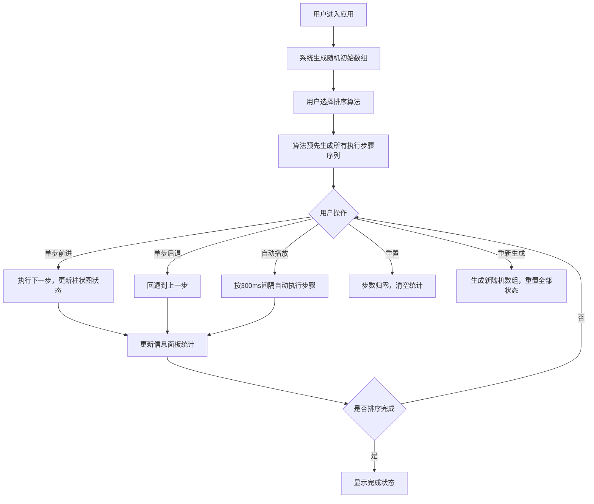

## 1. 产品概述

算法可视化沙盒是一款面向编程初学者的交互式学习工具，通过将抽象的排序算法转化为直观的彩色柱状图动态演示，帮助学习者理解算法的工作原理。

- **目标用户**：编程初学者、计算机科学专业学生、算法自学者
- **核心价值**：将抽象算法逻辑具象化，降低学习门槛，提升理解效率

## 2. 核心功能

### 2.1 用户角色

| 角色 | 注册方式 | 核心权限 |
|------|---------|---------|
| 学习者 | 无需注册，直接使用 | 选择算法、控制播放、观察可视化过程、查看统计信息 |

### 2.2 功能模块

1. **顶部工具栏**：算法选择下拉菜单、播放控制按钮组
2. **中央可视化区**：动态柱状图展示、元素高亮与交换动画
3. **底部信息面板**：伪代码展示、步骤统计、性能指标

### 2.3 页面详情

| 页面名称 | 模块名称 | 功能描述 |
|---------|---------|---------|
| 主页面 | 算法选择 | 下拉菜单切换冒泡/插入/选择/快速排序四种算法 |
| 主页面 | 播放控制 | 单步前进/后退、自动播放/暂停、重置、重新生成数组 |
| 主页面 | 柱状图可视化 | 数组元素渲染为柱状条，支持比较高亮和交换浮动动画 |
| 主页面 | 信息面板 | 伪代码行高亮、步骤计数、比较/交换次数、运行耗时 |

## 3. 核心流程

## 4. 用户界面设计

### 4.1 设计风格

- **主色调**：#4A90D9（柱状条默认色）
- **高亮色**：#FF6B6B（比较/交换高亮）、#FFD700（伪代码行高亮背景）、#64FFDA（统计数字）
- **背景色**：#1E1E2E（页面背景）、#2A2A3E（卡片背景）、#33334D（下拉菜单背景）
- **文字色**：#E0E0E0（主文字）、#A0A0B0（次要文字）、#FFFFFF（下拉菜单文字）
- **基线色**：#3A3A4A（柱状图基线）
- **按钮风格**：圆角6px，背景#4A4A6A，悬浮#5A5A7E，点击缩小0.95倍
- **字体**：系统字体 + monospace（伪代码和统计数字）

### 4.2 页面设计概览

| 页面名称 | 模块名称 | UI元素 |
|---------|---------|--------|
| 主页面 | 工具栏 | flex左对齐布局，圆角8px下拉菜单，圆角6px按钮组，0.2s过渡动画 |
| 主页面 | 可视化区 | 占80%高度，柱状条底部对齐水平排列，间隔2px，底部1px基线，空状态提示文字 |
| 主页面 | 信息面板 | 两列网格布局，左monospace伪代码，右等宽统计数字，<768px切换单列 |

### 4.3 响应式设计

- 桌面端优先设计
- 宽度 < 768px：底部面板切换单列、工具栏按钮换行、柱状条最小宽度从10px调至8px
- 触控优化：按钮最小可点击区域不低于40x40px

### 4.4 动画设计

- 柱状条颜色变化：0.3s CSS transition过渡
- 交换浮动动画：transform translateY，上浮30px再落下，持续0.4s
- 下拉菜单展开：0.2s淡入动画
- 按钮交互：悬浮背景渐变、点击scale(0.95) 0.2s过渡
- 性能要求：自动运行每步误差±50ms，动画帧率≥45fps
