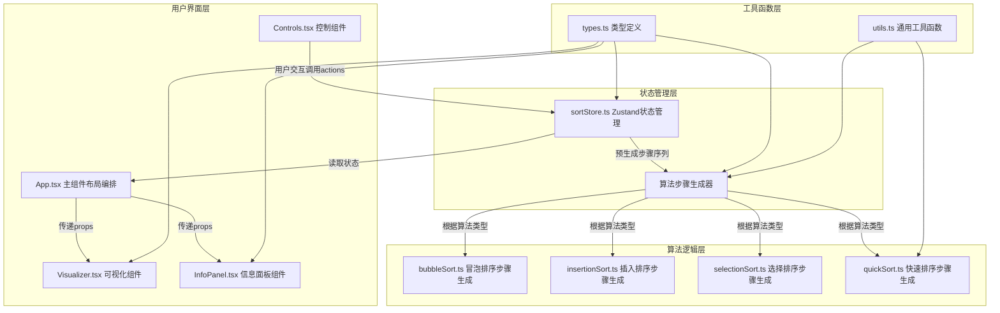

## 1. 架构设计



## 2. 技术说明

- **前端框架**：React@18 + TypeScript@5（严格模式，target ES2020）
- **构建工具**：Vite@5 + @vitejs/plugin-react
- **状态管理**：Zustand@4（集中管理数组、步数、算法类型、运行状态、统计数据）
- **动画方案**：CSS transition/transform + requestAnimationFrame（自动播放循环）
- **无后端**：纯前端应用，无需API服务
- **无UI组件库**：原生CSS实现深色主题，保持轻量

## 3. 文件结构与数据流向

| 文件路径 | 职责说明 | 调用关系 |
|---------|---------|---------|
| `package.json` | 项目依赖与脚本配置 | 启动入口 |
| `vite.config.js` | Vite构建配置，启用React插件 | 构建配置 |
| `tsconfig.json` | TypeScript严格模式配置 | 编译配置 |
| `index.html` | HTML入口，#root容器 | 应用挂载点 |
| `src/main.tsx` | 应用入口，挂载App组件 | 调用App.tsx |
| `src/App.tsx` | 主组件，三区域布局编排 | 读取sortStore状态，传递给子组件 |
| `src/store/sortStore.ts` | Zustand全局状态 | 提供数组、步数、统计、播放控制actions |
| `src/algorithms/types.ts` | 算法相关类型定义 | 被store、algorithms、components引用 |
| `src/algorithms/generator.ts` | 算法步骤生成器 | 根据算法类型生成完整的步骤序列 |
| `src/algorithms/bubbleSort.ts` | 冒泡排序步骤生成 | 被generator引用 |
| `src/algorithms/insertionSort.ts` | 插入排序步骤生成 | 被generator引用 |
| `src/algorithms/selectionSort.ts` | 选择排序步骤生成 | 被generator引用 |
| `src/algorithms/quickSort.ts` | 快速排序步骤生成 | 被generator引用 |
| `src/components/Visualizer.tsx` | 柱状图可视化 | 读取store的数组和步数，渲染高亮动画 |
| `src/components/Controls.tsx` | 工具栏控制按钮 | 用户交互触发store的actions |
| `src/components/InfoPanel.tsx` | 底部信息面板 | 读取store显示伪代码和统计 |
| `src/styles/global.css` | 全局样式与CSS变量 | 定义主题色、布局、动画 |

**数据流向**：
1. 用户操作Controls → 调用sortStore actions（stepForward/setAlgorithm等）
2. sortStore 更新内部状态（currentStepIndex/comparisons/swaps等）
3. Visualizer/InfoPanel 通过useStore订阅状态变化 → 重新渲染UI
4. 算法预生成：切换算法或数组时，generator生成完整Step[]数组存入store

## 4. 核心数据模型

### 4.1 类型定义

```typescript
// 算法类型
type AlgorithmType = 'bubble' | 'insertion' | 'selection' | 'quick';

// 步骤类型
type StepType = 'compare' | 'swap' | 'insert' | 'pivot' | 'sorted';

// 单个算法步骤
interface SortStep {
  type: StepType;
  indices: number[];        // 涉及的元素索引
  arraySnapshot: number[];  // 执行后的数组快照
  comparisons: number;      // 累计比较次数
  swaps: number;            // 累计交换次数
  pseudocodeLine: number;   // 对应伪代码行号
}

// 伪代码定义
interface Pseudocode {
  lines: string[];
}

// Store状态
interface SortState {
  array: number[];
  originalArray: number[];
  steps: SortStep[];
  currentStepIndex: number;
  algorithm: AlgorithmType;
  isPlaying: boolean;
  comparisons: number;
  swaps: number;
  startTime: number | null;
  elapsedTime: number;
  
  // Actions
  generateNewArray: () => void;
  setAlgorithm: (algo: AlgorithmType) => void;
  stepForward: () => void;
  stepBackward: () => void;
  reset: () => void;
  togglePlay: () => void;
}
```

## 5. 性能保障方案

### 5.1 自动播放精度
- 使用 `setTimeout` + `performance.now()` 校准每步间隔（目标300ms）
- 每步记录实际耗时，动态调整下一步延迟，确保总误差≤±50ms
- 播放循环使用 `requestAnimationFrame` 检查播放状态，确保流畅性

### 5.2 渲染性能
- 柱状图更新仅修改CSS transform/background-color，避免DOM重排
- 使用 `React.memo` 包裹柱状条子组件，跳过不必要重渲染
- 步骤数组一次性预生成，播放时仅切换索引，避免实时计算

### 5.3 帧率监控
- 动画使用CSS transform触发GPU合成层，保障≥45fps
- 颜色过渡使用硬件加速的transition属性
