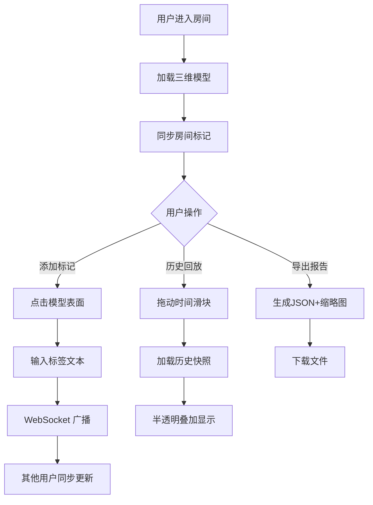

## 1. 产品概述

三维空间协同批注系统是一款基于 WebGL 的建筑图纸多人协作审图工具，解决团队审图时意见分散、标记不直观、历史标记难以回溯的核心痛点。通过三维模型可视化与实时同步技术，让团队成员在同一虚拟空间中高效协作。

- 核心价值：直观的三维标记 + 实时多人协同 + 完整的历史回溯
- 目标用户：建筑设计师、施工方、审图专家团队

## 2. 核心功能

### 2.1 用户角色

| 角色 | 注册方式 | 核心权限 |
|------|---------|---------|
| 普通用户 | 昵称+房间号进入 | 查看模型、添加/编辑/删除标记、回放历史、导出报告 |

### 2.2 功能模块

1. **三维模型浏览**：L形建筑模型渲染、轨道控制旋转缩放
2. **标记批注系统**：点击添加标记、文本标签、创建者信息
3. **多人实时协同**：房间机制、WebSocket 同步、用户列表
4. **历史回放系统**：时间轴滑块、快照回溯、半透明叠加
5. **报告导出功能**：JSON 导出、俯视缩略图、完整元数据

### 2.3 页面详情

| 页面名称 | 模块名称 | 功能描述 |
|---------|---------|---------|
| 登录入口页 | 房间进入模块 | 昵称输入（2-8字符）、房间号输入（4位数字）、创建/加入按钮 |
| 主审图页面 | 三维场景模块 | 建筑模型渲染、OrbitControls 交互、光照环境 |
| 主审图页面 | 标记交互模块 | 点击添加标记、标签卡片输入、标签悬浮面向相机 |
| 主审图页面 | 侧边栏模块 | 用户列表、标记列表、操作按钮 |
| 主审图页面 | 时间轴模块 | 底部时间滑块、刻度显示、播放/暂停 |
| 主审图页面 | 导出模块 | 右上角导出按钮、JSON 报告生成 |

## 3. 核心流程

### 3.1 用户进入流程
用户输入昵称和房间号 → 系统验证格式 → 创建/加入房间 → 加载三维模型 → 同步房间内现有标记 → 开始协作

### 3.2 标记添加流程
用户点击模型表面 → 计算交点坐标 → 弹出标签输入卡片 → 输入文本并提交 → 本地创建标记 → 通过 WebSocket 广播 → 其他用户实时接收

### 3.3 历史回放流程
拖动时间轴滑块 → 计算目标时间点 → 查询历史快照 → 切换标记为半透明状态 → 叠加显示在模型上 → 可继续操作当前标记

## 4. 用户界面设计

### 4.1 设计风格

- **设计方向**：暗色科技风，专业审图工具质感
- **主色调**：蓝紫色系 (#3498DB, #9B59B6, #1ABC9C)
- **背景色**：深空蓝 (#1A1A2E)
- **面板风格**：毛玻璃效果 (backdrop-filter: blur(8px), 背景 rgba(30,39,58,0.85))
- **边框**：1px solid rgba(255,255,255,0.1)
- **按钮样式**：统一圆角 6px，悬停上浮 2px + 阴影 #00000040
- **标记点**：黄色发光球体 (#FFD700)，带光晕正弦波动
- **标签卡片**：圆角 8px，背景 #2C3E50，文字 #FFFFFF，150x60px

### 4.2 页面设计概览

| 页面名称 | 模块名称 | UI 元素 |
|---------|---------|---------|
| 登录页 | 登录卡片 | 毛玻璃面板、两个输入框、渐变按钮、居中布局 |
| 主页面 | 三维场景 | 全屏 Canvas、L形建筑、环境光、平行光 |
| 主页面 | 标记点 | 黄色发光球、光晕脉动、标签卡片面向相机 |
| 主页面 | 侧边栏 | 左侧用户列表、毛玻璃面板、在线状态指示 |
| 主页面 | 时间轴 | 底部 80% 宽度、轨道 #34495E、滑块 #1ABC9C、30秒刻度 |
| 主页面 | 导出按钮 | 右上角 #27AE60 背景、悬停变 #2ECC71、下载图标 |

### 4.3 动效设计

- 标签卡片出现：底部滑入 (0.3s cubic-bezier)
- 标签删除：缩小消失 (0.2s)
- 标记被他人编辑/删除：脉冲反馈 (放大 1.3 倍恢复，0.2s)
- 按钮悬停：上浮 2px + 阴影加深
- 历史模式切换：标记淡入淡出 (0.3s)

### 4.4 响应式设计

- 桌面端 (≥768px)：完整侧边栏、标准时间轴高度
- 移动端 (<768px)：侧边栏收起为图标按钮、时间轴高度缩小为 20px
- 触控优化：增大点击热区、支持双指缩放

### 4.5 3D 场景设计

- **模型构成**：三个棱柱体组成 L 形主体，楼高 8 单位，一层高 3 单位
- **材质**：屋顶半透明蓝色 (#4A90D9, 透明度 0.3)，墙体浅灰色 (#C0C0C0)
- **光照**：环境光 + 平行光 + 半球光，模拟自然光照
- **相机**：PerspectiveCamera，初始距离 15 单位
- **控制**：OrbitControls，距离范围 3-25 单位
- **标记点**：球体 + 发光效果，半径 0.2 单位，光晕 0.1-0.5 正弦波动
- **标签**：HTML 标签，CSS3DRenderer 或 Sprite，始终面向相机

## 5. 性能指标

- 帧率：稳定 50FPS 以上
- 标记上限：200 个
- 性能优化：超过 150 个标记时，超出部分转为点云渲染（不显示标签卡片）
- 历史缓存：内存中保留完整时间线快照
