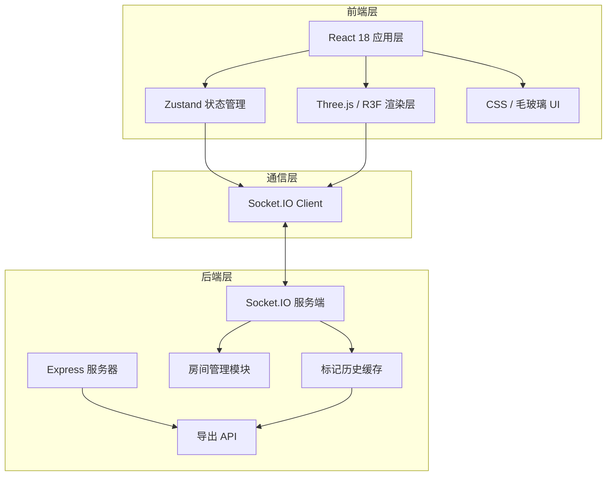

## 1. 架构设计



## 2. 技术栈说明

### 2.1 前端技术

| 技术 | 版本 | 用途 |
|------|------|------|
| React | 18.x | UI 框架 |
| TypeScript | 5.x | 类型系统 |
| Vite | 5.x | 构建工具 |
| three | 0.160.x | WebGL 3D 渲染 |
| @react-three/fiber | 8.x | Three.js React 绑定 |
| @react-three/drei | 9.x | R3F 实用组件 (OrbitControls, Html 等) |
| zustand | 4.x | 状态管理 |
| socket.io-client | 4.x | WebSocket 客户端 |

### 2.2 后端技术

| 技术 | 版本 | 用途 |
|------|------|------|
| Node.js | 18+ | 运行时 |
| Express | 4.x | HTTP 服务器 |
| Socket.IO | 4.x | WebSocket 服务端 |
| uuid | 9.x | ID 生成 |
| cors | 2.x | 跨域支持 |

### 2.3 构建工具

- Vite 作为前端构建工具，热更新快
- 后端使用 ts-node 或直接编译运行
- `npm run dev` 同时启动前后端

## 3. 项目目录结构

```
.
├── package.json              # 根 package，管理依赖和脚本
├── vite.config.js            # Vite 配置
├── tsconfig.json             # TypeScript 配置
├── index.html                # HTML 入口
├── server/
│   └── index.ts              # Express + Socket.IO 服务器
└── src/
    ├── main.tsx              # React 入口
    ├── App.tsx               # 根组件
    ├── store/
    │   └── markersStore.ts   # Zustand 状态管理
    ├── components/
    │   ├── SceneViewer.tsx   # 3D 场景组件
    │   ├── TimeSlider.tsx    # 时间轴滑块
    │   ├── LoginPanel.tsx    # 登录面板
    │   ├── Sidebar.tsx       # 侧边栏
    │   ├── MarkerLabel.tsx   # 标记标签组件
    │   └── ExportButton.tsx  # 导出按钮
    ├── types/
    │   └── index.ts          # 类型定义
    └── utils/
        └── socket.ts         # Socket.IO 客户端
```

## 4. 数据模型

### 4.1 标记数据类型

```typescript
interface Marker {
  id: string;
  position: { x: number; y: number; z: number };
  text: string;
  author: string;
  createdAt: number;
  updatedAt: number;
  isDeleted?: boolean;
}
```

### 4.2 用户数据类型

```typescript
interface User {
  id: string;
  nickname: string;
  roomId: string;
  joinedAt: number;
}
```

### 4.3 房间数据类型

```typescript
interface Room {
  id: string;
  users: Map<string, User>;
  markers: Marker[];
  history: HistorySnapshot[];
  createdAt: number;
}

interface HistorySnapshot {
  timestamp: number;
  markers: Marker[];
}
```

### 4.4 导出报告类型

```typescript
interface ExportReport {
  roomId: string;
  exportTime: string;
  snapshotTime?: string;
  markers: Array<{
    id: string;
    position: { x: number; y: number; z: number };
    text: string;
    author: string;
    timestamp: string;
  }>;
  thumbnail: string; // base64
}
```

## 5. API 与 Socket 事件定义

### 5.1 Socket.IO 事件

| 事件名 | 方向 | 数据 | 说明 |
|--------|------|------|------|
| `join-room` | 客户端→服务端 | `{ nickname, roomId }` | 加入房间 |
| `room-joined` | 服务端→客户端 | `{ users, markers, roomId }` | 加入成功，返回当前状态 |
| `user-joined` | 服务端→客户端 | `{ user }` | 新用户加入 |
| `user-left` | 服务端→客户端 | `{ userId }` | 用户离开 |
| `add-marker` | 客户端→服务端 | `{ position, text }` | 添加标记 |
| `marker-added` | 服务端→客户端 | `{ marker }` | 标记已添加（广播） |
| `edit-marker` | 客户端→服务端 | `{ markerId, text }` | 编辑标记 |
| `marker-edited` | 服务端→客户端 | `{ marker }` | 标记已编辑（广播） |
| `delete-marker` | 客户端→服务端 | `{ markerId }` | 删除标记 |
| `marker-deleted` | 服务端→客户端 | `{ markerId }` | 标记已删除（广播） |

### 5.2 HTTP API

| 方法 | 路径 | 说明 |
|------|------|------|
| GET | `/api/rooms/:roomId/markers` | 获取房间所有标记 |
| GET | `/api/rooms/:roomId/history?time=` | 获取指定时间的标记快照 |
| GET | `/api/export/:roomId?time=` | 导出 JSON 报告（含缩略图） |

## 6. 状态管理设计

### 6.1 Zustand Store 结构

```typescript
interface MarkersStore {
  // 状态
  roomId: string | null;
  currentUser: User | null;
  users: User[];
  markers: Marker[];
  playbackTime: number | null; // null 表示实时模式
  isPlaybackMode: boolean;
  
  // Actions
  setRoom: (roomId: string, user: User) => void;
  addUser: (user: User) => void;
  removeUser: (userId: string) => void;
  addMarker: (marker: Marker) => void;
  editMarker: (markerId: string, text: string) => void;
  deleteMarker: (markerId: string) => void;
  setPlaybackTime: (time: number | null) => void;
  setMarkers: (markers: Marker[]) => void;
}
```

### 6.2 数据流

```
用户操作 → UI 组件 → Socket 发送 → 
服务端处理 → Socket 广播 → 
其他客户端 → Store Action → 
组件重新渲染
```

## 7. 性能优化策略

### 7.1 渲染优化

- 超过 150 个标记时，超出部分使用 `THREE.Points` 点云渲染
- 使用 `InstancedMesh` 批量渲染标记球体
- 标签卡片使用 `Html` 组件（CSS3D），仅渲染可见标记的标签
- 视锥体剔除优化

### 7.2 状态优化

- Zustand 选择器（selectors）避免不必要重渲染
- 标记数据 memoization
- 历史快照按 30 秒间隔存储，减少内存占用

### 7.3 网络优化

- 标记变更增量同步，而非全量推送
- 历史数据按需加载
- 消息节流与合并

## 8. 关键实现要点

### 8.1 标记点击检测

- 使用 `Raycaster` 进行射线检测
- 检测所有可点击的模型表面
- 计算交点世界坐标

### 8.2 标签始终面向相机

- 使用 `@react-three/drei` 的 `Html` 组件
- 或手动更新标签旋转角度
- 保证标签始终正对相机平面

### 8.3 历史回放实现

- 服务端每 30 秒生成一次快照
- 前端拖动时间轴时，请求对应时间的快照
- 快照标记以半透明 (opacity 0.4) 叠加显示
- 实时标记与历史标记分层渲染

### 8.4 缩略图生成

- 创建离屏 Canvas
- 设置俯视正投影相机
- 渲染模型后转 base64
- 嵌入导出 JSON 中

### 8.5 毛玻璃效果

- 使用 `backdrop-filter: blur(8px)`
- 背景 `rgba(30,39,58,0.85)`
- 边框 `1px solid rgba(255,255,255,0.1)`
- 兼容降级处理

## 9. 构建与运行

### 9.1 依赖安装

```bash
npm install
```

### 9.2 开发模式

```bash
npm run dev
```
同时启动：
- Vite 开发服务器 (前端，默认 5173 端口)
- Express + Socket.IO 服务器 (后端，默认 3001 端口)

### 9.3 生产构建

```bash
npm run build
npm run start
```
