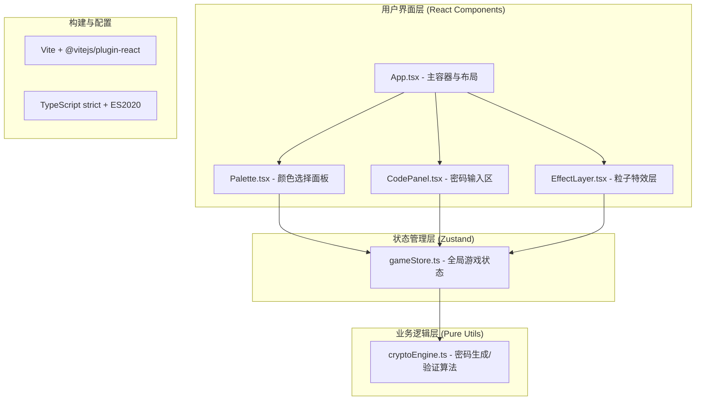

## 1. 架构设计



## 2. 技术描述

- **前端框架**：React@18（函数组件 + Hooks）
- **构建工具**：Vite@5 + @vitejs/plugin-react@4
- **语言**：TypeScript@5（strict严格模式，target: ES2020）
- **状态管理**：Zustand@4（轻量级，immutable状态更新）
- **渲染技术**：
  - DOM/CSS：用于Palette、CodePanel、App组件布局与UI
  - Canvas 2D：用于EffectLayer粒子特效（高性能逐帧渲染）
- **动画控制**：所有时间敏感动画使用 requestAnimationFrame 驱动，确保60fps稳定
- **后端**：无（纯前端单页应用）
- **数据库**：无（状态仅存在内存中，刷新即重置）

## 3. 文件结构定义

```
d:\Pro\tasks\auto275\
├── package.json               # 依赖与启动脚本
├── vite.config.js             # Vite React插件配置
├── tsconfig.json              # TS严格模式 + ES2020
├── index.html                 # 入口页面，div#root全屏容器
└── src/
    ├── main.tsx               # React入口，挂载App
    ├── App.tsx                # 主组件：集成Palette/CodePanel/EffectLayer，布局+状态栏+按钮
    ├── utils/
    │   └── cryptoEngine.ts    # 密码引擎：generateCode/hashSequence/matchColors（纯函数）
    ├── store/
    │   └── gameStore.ts       # Zustand store：状态定义+dispatch动作
    └── components/
        ├── Palette.tsx        # 颜色选择面板：4x6网格，24色，点击动画
        ├── CodePanel.tsx      # 密码槽位面板：5槽，验证反馈动画
        └── EffectLayer.tsx    # Canvas粒子特效：爆发+渐隐
```

## 4. 核心数据结构与类型定义

### 4.1 基础类型

```typescript
// cryptoEngine.ts 相关
type ColorHex = string;           // 形如 '#FF5733'
type SequenceHash = string;       // 密码序列的哈希字符串

interface GenerateResult {
  sequence: ColorHex[];           // 长度5的颜色序列（用于提示比对，不直接暴露给玩家）
  hash: SequenceHash;             // 序列哈希（存储于store用于验证）
}

// gameStore.ts 相关
type GameStatus = 'idle' | 'playing' | 'won' | 'timeout';

interface Particle {
  id: number;
  x: number;
  y: number;
  vx: number;
  vy: number;
  size: number;
  color: ColorHex;
  alpha: number;
  life: number;    // 0~1，1=刚出生，0=消亡
}

interface GameState {
  level: number;
  score: number;
  timeLeft: number;
  totalTime: number;
  status: GameStatus;
  colorPool: ColorHex[];                 // 当前关卡可用颜色池（24/16/12）
  targetSequence: ColorHex[];            // 正确密码（内部使用）
  targetHash: SequenceHash;              // 密码哈希（用于验证）
  selectedSequence: ColorHex[];          // 玩家已选序列（长度0~5）
  failCount: number;                     // 本关失败次数
  hintCount: number;                     // 本关已用提示次数（≤3）
  particles: Particle[];                 // 当前活跃粒子
  showHint: { slotIndex: number; color: ColorHex } | null;  // 即时提示
  verifyState: 'idle' | 'checking' | 'success' | 'fail';    // 槽位视觉状态
}

interface GameActions {
  startGame: () => void;
  restartGame: () => void;
  nextLevel: () => void;
  selectColor: (color: ColorHex) => void;
  clearSelection: () => void;
  decrementTime: () => void;
  triggerParticleBurst: (centerX: number, centerY: number) => void;
  updateParticles: () => void;
  consumeHint: () => void;
  setVerifyState: (s: GameState['verifyState']) => void;
}

type GameStore = GameState & GameActions;
```

## 5. 模块详细说明

### 5.1 cryptoEngine.ts（纯函数模块，无副作用）

| 函数签名 | 功能说明 |
|----------|----------|
| `PRESET_COLORS: ColorHex[]` | 24种预设颜色常量 |
| `generateCode(poolSize: number): GenerateResult` | 从指定大小的颜色池中随机不重复抽取5色，返回序列+哈希；poolSize∈{24,16,12} |
| `hashSequence(seq: ColorHex[]): SequenceHash` | 使用简化DJB2或FNV-1a算法将颜色序列转为字符串哈希（不需要加密安全） |
| `matchSequence(selected: ColorHex[], targetHash: SequenceHash): boolean` | 计算selected的哈希并与targetHash比较，返回布尔值 |
| `shrinkColorPool(base: ColorHex[], size: number): ColorHex[]` | 根据关卡缩减颜色池，去除指定的暗色系 |

### 5.2 gameStore.ts（Zustand Store）

- 初始化时自动调用 `startGame()` 生成第一关
- 使用 `setInterval` + `decrementTime` 驱动倒计时，但优先通过 `requestAnimationFrame` 对齐帧同步
- `selectColor`：推入已选序列，达到5个自动调用cryptoEngine验证，分支处理成功/失败逻辑
- `triggerParticleBurst`：在指定坐标生成50个Particle，随机初速度、大小、颜色
- `updateParticles`：逐帧更新粒子位置（vx,vy + 重力/阻力）和alpha，移除life≤0的粒子
- `consumeHint`：失败次数每到3倍数时触发，从targetSequence中随机选一个未显示过的槽位，设置showHint

### 5.3 EffectLayer.tsx（Canvas组件）

- 使用`useRef<HTMLCanvasElement>`获取canvas上下文
- `useEffect`中注册rAF循环，每帧调用`updateParticles`后重绘
- 使用globalCompositeOperation='lighter'叠加粒子，增强发光感
- 组件卸载时cancelAnimationFrame，防止内存泄漏
- pointer-events:none，绝对定位覆盖全屏

### 5.4 Palette.tsx

- 遍历colorPool生成网格，CSS Grid布局（grid-template-columns: repeat(6, 1fr)）
- 每个色块：div + 背景色 + inset box-shadow（3D挤压）+ border
- 选中判断：selectedSequence.includes(color)，选中则color加深10%（mix with #000）
- 点击动画：通过短暂修改CSS transform实现，优先CSS transition，关键帧由rAF控制
- 响应式：@media (max-width: 768px) 修改grid列为repeat(3, 1fr)

### 5.5 CodePanel.tsx

- 渲染5个slot div，固定宽高60×60，border-radius 8px
- 每个slot显示selectedSequence[i]或空槽样式
- verifyState !== 'idle'时触发闪烁/渐变/抖动效果
- showHint存在时，对应slot使用半透明背景色持续0.5s

### 5.6 App.tsx

- 深空径向渐变背景，所有子元素z-index层级合理
- 顶部：关卡标题（#1E90FF，24px bold）+ 状态栏（得分/时间/提示）
- 中部：CodePanel卡片容器 + Palette卡片容器
- 底部：重新开始按钮
- 倒计时驱动：rAF循环，每累计1000ms调用decrementTime
- EffectLayer绝对定位在最顶层

## 6. 性能保障措施

1. **粒子系统**：单帧最多50个粒子，更新后立即过滤life≤0的粒子，避免数组无限增长
2. **Canvas渲染**：每帧先clearRect再绘制，离屏渲染无需创建临时canvas
3. **DOM动画**：色块按压/槽位抖动使用transform/opacity，触发GPU合成层，避免layout重排
4. **rAF统一调度**：粒子更新、倒计时、动画状态切换均挂载在同一requestAnimationFrame循环上，避免多个独立定时器
5. **纯函数验证**：cryptoEngine所有函数O(n)复杂度，n=5，确保<16ms响应
6. **React渲染**：Palette、CodePanel子组件使用memo或props浅比较避免不必要re-render

## 7. 颜色池定义

24色预设（第1-2关使用全部）：
```
#FF5733, #33FF57, #3357FF, #F333FF, #FF33A6, #33FFF5,
#FFC300, #C70039, #900C3F, #581845, #1ABC9C, #2ECC71,
#3498DB, #9B59B6, #34495E, #F1C40F, #E67E22, #E74C3C,
#ECF0F1, #95A5A6, #BDC3C7, #7F8C8D, #2E2E2E, #333333
```
第3-4关（16色）：移除最后8个暗/灰色（#BDC3C7, #7F8C8D, #95A5A6, #ECF0F1, #34495E, #581845, #2E2E2E, #333333）
第5关及以后（12色）：再移除#E74C3C, #E67E22, #C70039, #900C3F
