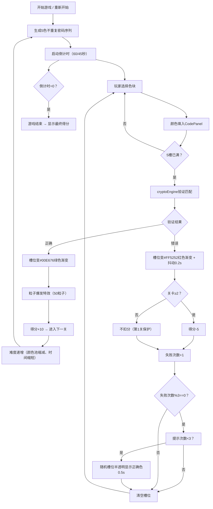

## 1. 产品概述

幻色密语是一款交互式色彩密码解密游戏应用，玩家通过选择并组合不同颜色的色块来猜测系统随机生成的密码序列。每次解密成功触发绚丽的粒子爆发特效，通过难度递增机制和限时挑战提供沉浸式的游戏体验。

- **主要用途**：休闲益智游戏，训练玩家记忆力与色彩辨识能力
- **目标用户**：喜欢解谜类游戏的休闲玩家
- **产品价值**：通过极简美观的视觉设计和流畅的交互反馈，提供高愉悦度的轻量级游戏体验

## 2. 核心功能

### 2.1 功能模块

1. **主游戏界面**：关卡信息展示、得分系统、倒计时器、提示计数、重新开始按钮
2. **颜色选择面板（Palette）**：24色网格选择器（4×6），带3D挤压视觉效果与交互动画
3. **密码输入区域（CodePanel）**：5槽位密码输入，自动验证，视觉反馈（颜色渐变+抖动）
4. **粒子特效层（EffectLayer）**：Canvas 2D粒子爆发系统，密码正确时触发50个彩色粒子扩散动画
5. **密码引擎（cryptoEngine）**：独立工具模块，负责密码生成、哈希计算与序列匹配
6. **游戏状态管理（gameStore）**：Zustand全局状态，管理关卡、得分、颜色池、已选序列、倒计时等

### 2.2 页面详情

| 页面名称 | 模块名称 | 功能描述 |
|----------|----------|----------|
| 主游戏页 | 顶部状态栏 | 显示当前关卡编号（#1E90FF蓝色粗体）、得分（#FFD700黄色）、剩余时间、已用提示次数 |
| 主游戏页 | 密码输入区 | 5个60×60px槽位横向排列，依次填入所选颜色，填满自动验证 |
| 主游戏页 | 颜色选择面板 | 4×6网格24色，点击填入密码，3D挤压效果，悬停/选中状态反馈 |
| 主游戏页 | 控制区 | 底部"重新开始"按钮，红色背景圆角20px |
| 主游戏页 | 粒子特效层 | Canvas覆盖层，解密成功时从密码区中心爆发彩色粒子 |

## 3. 核心流程

玩家进入游戏 → 系统生成长度为5的不重复颜色序列密码 → 倒计时开始（60秒/关）→ 玩家点击Palette选择颜色 → 颜色依次填入CodePanel槽位 → 填满5个后自动验证 → 验证正确：槽位变绿+粒子爆发+得10分+进入下关；验证错误：槽位变红抖动+扣5分+清空重新输入 → 每失败3次可获得1次提示（最多3次/关）→ 超时或主动点击重新开始 → 显示最终得分并重置

## 4. 用户界面设计

### 4.1 设计风格

- **设计主题**：深空科技感（Deep Space）
- **主背景**：径向渐变，中心#0D1117 → 边缘#1A1D2E
- **卡片/容器**：背景#2C2C3E，圆角12px，4px内阴影#00000080
- **文字主色**：#E0E0E0（浅灰白）
- **强调色**：
  - 关卡编号：#1E90FF（道奇蓝）
  - 得分数字：#FFD700（金色）
  - 倒计时：#FF4500（橙红色）
  - 验证通过：#00E676（翠绿色）
  - 验证失败：#FF5252（珊瑚红）
  - 重新开始按钮：#E53935 → #C62828
- **字体**：使用现代无衬线字体（font-family: 'Segoe UI', 'PingFang SC', system-ui, sans-serif）
- **按钮风格**：胶囊形按钮（圆角20px），纯色色块填充，悬停加深
- **布局风格**：垂直流式布局，顶部信息栏、中部密码区+颜色区、底部控制区，卡片式容器包裹
- **视觉细节**：色块使用内阴影营造3D挤压感（inset高光+inset暗部）

### 4.2 页面设计概览

| 页面名称 | 模块名称 | UI元素 |
|----------|----------|--------|
| 主游戏页 | 顶部状态栏 | Flex布局，间距16px，三项并列（得分、时间、提示），时间用⏱白色图标+#FF4500数字+⏱图标 |
| 主游戏页 | CodePanel | 5个60×60px圆角8px槽位，背景#2C2C3E，横向flex排列，间距12px，填入颜色后显示色块，验证时闪烁0.3s |
| 主游戏页 | Palette | 4×6网格（≤768px变3×8），每个色块3D内阴影，未选中边框#444，悬停变#FFF，选中后2px实线#FFF且颜色加深10%，点击时scale 0.95→1.1→1.0三段动画（按压+回弹） |
| 主游戏页 | 重新开始按钮 | 宽120px高40px，#E53935纯色，圆角20px，悬停#C62828，文字#FFF，居中 |
| 主游戏页 | EffectLayer | Canvas全屏绝对定位，z-index高于内容层，pointer-events:none |

### 4.3 响应式设计

- **桌面优先**，在≤768px断点进行适配
- **Palette网格**：桌面4×6 → 移动3×8
- **CodePanel槽位**：桌面60×60px → 移动40×40px
- **整体容器**：使用max-width+margin:auto居中，移动端左右padding缩减

### 4.4 动画与交互规范

- **色块点击**：点击瞬间scale(0.95)按压0.05s → 弹至scale(1.1) 0.05s → 回正scale(1.0)，总计0.1s
- **槽位验证闪烁**：0.3s内opacity在1↔0.4之间闪烁3次
- **验证成功渐变**：背景色平滑过渡至#00E676淡绿渐变（linear-gradient(135deg, #00E676, #69F0AE)）
- **验证失败抖动**：transform translateX ±6px循环，共0.2s，背景过渡至#FF5252淡红渐变（linear-gradient(135deg, #FF5252, #FF8A80)）
- **粒子爆发**：从CodePanel中心坐标发射，50个粒子，大小4-12px随机，随机方向初速度，重力衰减，2s内alpha从1→0，使用requestAnimationFrame逐帧更新
- **提示显示**：随机空槽位，正确色以opacity:0.3显示0.5s后消失

## 5. 难度递增规则

| 关卡范围 | 颜色池数量 | 每次错误扣分 | 单关限时 | 备注 |
|----------|-----------|-------------|---------|------|
| 第1关 | 24色 | 0（保护期） | 60秒 | 新手友好 |
| 第2关 | 24色 | 5分 | 60秒 | 开始扣分 |
| 第3-4关 | 16色（去除暗色#2E2E2E、#333333等8色） | 5分 | 60秒 | 颜色池缩减 |
| 第5关及以后 | 12色（再去除4色） | 5分 | 45秒 | 时间压力加大 |
