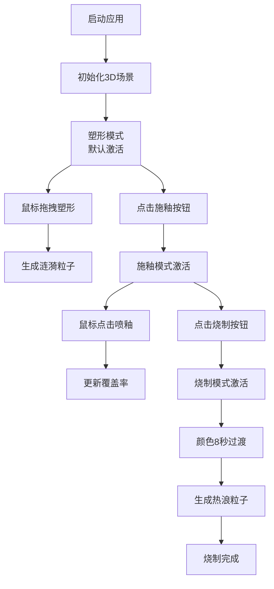

# 陶器烧制模拟应用 - 产品需求文档

## 1. 产品概述

### 1.1 产品定位
本应用是一个基于Web的3D交互式陶器烧制模拟器，让用户在浏览器中直观体验手工陶艺的完整制作流程。

### 1.2 核心价值
- **教育价值**：直观展示陶器从塑形、施釉到烧制的完整工艺过程
- **交互体验**：通过鼠标拖拽和点击实现沉浸式的陶艺创作体验
- **视觉呈现**：实时3D渲染，展示陶坯形变、釉色变化和烧制成色的动态效果

### 1.3 目标用户
- 陶艺爱好者和学习者
- 对传统工艺感兴趣的普通用户
- 需要展示陶艺过程的教育机构

## 2. 功能需求

### 2.1 3D场景系统
- **陶坯模型**：使用Three.js LatheGeometry生成，初始为圆柱体（高度3单位，半径1单位，分段数24）
- **木质转盘**：圆环+圆柱底座，材质颜色#8B5E3C，以30rpm匀速旋转
- **工坊环境**：渐变背景（#2B1B17到#3E2723），灰色棋盘格地面（格大小1单位，颜色#4A4A4A和#5C5C5C）
- **相机控制**：鼠标拖拽旋转视角，滚轮缩放（范围2-10单位），相机始终对准陶坯中心

### 2.2 塑形模式（默认开启）
- **交互方式**：鼠标在陶坯表面上下拖动，沿Y轴映射到半径变化
- **变形规则**：拖动距离每像素对应0.02单位半径增量/减量
- **视觉反馈**：变形时表面触发微小涟漪粒子（30个，大小0.04单位，颜色#E0E0E0，持续0.6秒后消散）
- **物理特性**：陶坯形变时保持重心稳定，形状数据存储在长度为24的状态数组中

### 2.3 施釉模式
- **进入方式**：点击右侧面板"施釉"按钮切换
- **交互方式**：鼠标点击陶坯表面喷溅色斑
- **釉色效果**：色斑从#87CEEB到#8A2BE2渐变色，直径0.3单位，半透明alpha0.8
- **叠加效果**：同一位置叠加五次颜色变深一级
- **统计计算**：实时计算施釉覆盖率（上釉面积/总面积×100%）

### 2.4 烧制模式
- **触发方式**：点击"烧制"按钮启动
- **颜色过渡**：8秒内从原始土色#CD853F匀速过渡到最终成色
- **成色规则**：
  - 施釉面积>50% → 亮红色#B22222
  - 施釉面积≤50% → 暗红色#8B0000
- **视觉效果**：周围出现热浪扭曲粒子（大小0.05-0.15单位随机，上升速度0.5单位/秒，半透明alpha0.4）

### 2.5 工具面板系统
- **左侧工具架**：三个固定位置图标（手形-塑形、喷雾瓶-施釉、火焰-烧制），尺寸40x40px，圆角8px
  - 未激活状态：背景#333，文字#B0B0B0
  - 激活状态：背景#8B4513，文字#FFE4B5
- **右侧步骤面板**：包含塑形、施釉、烧制三个步骤的按钮和滑块控件
- **右下角信息面板**：毛玻璃效果（背景rgba(0,0,0,0.5)，blur(10px)），圆角12px，白色文字#FFFFFF
  - 显示当前步骤名称（中文）
  - 陶坯高度（精确到0.01单位）
  - 重量（高度×密度1.2，单位kg）
  - 施釉覆盖率（精确到1%）

## 3. 非功能需求

### 3.1 性能要求
- 1920x1080分辨率下渲染帧率≥55fps
- 粒子数量≤100时帧率不下降
- 所有交互操作响应时间≤16ms

### 3.2 技术约束
- 使用TypeScript、Three.js和React开发
- Vite作为构建工具
- Zustand进行状态管理
- 所有动画使用requestAnimationFrame驱动

## 4. 数据状态定义

### 4.1 核心状态
- `shapePoints`：长度24的数组，存储每个分段点的半径值
- `currentStep`：当前步骤（'shaping' | 'glazing' | 'firing'）
- `glazeCoverage`：施釉覆盖率（0-100）
- `firingProgress`：烧制进度（0-1）
- `potteryHeight`：陶坯高度
- `potteryWeight`：陶坯重量

### 4.2 交互状态
- `isDragging`：是否正在拖拽
- `dragStartY`：拖拽起始Y坐标
- `mousePosition`：鼠标当前位置
- `glazeSpots`：施釉点位置数组

## 5. 交互流程图

