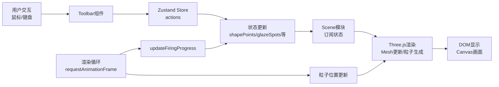

# 陶器烧制模拟应用 - 技术架构文档

## 1. 技术选型

### 1.1 核心框架与库

| 技术 | 版本要求 | 用途 |
|------|----------|------|
| React | ^18.2.0 | UI组件框架 |
| React DOM | ^18.2.0 | DOM渲染 |
| TypeScript | ^5.0.0 | 类型安全 |
| Three.js | ^0.160.0 | 3D图形渲染 |
| @types/three | ^0.160.0 | Three.js类型定义 |
| Zustand | ^4.4.0 | 状态管理 |
| Vite | ^5.0.0 | 构建工具 |
| @vitejs/plugin-react | ^4.2.0 | React插件 |

### 1.2 设计决策理由

- **Three.js**：原生WebGL的高级封装，提供LatheGeometry等几何体生成API，适合创建可变形的旋转体模型
- **Zustand**：轻量级状态管理，避免Redux的繁琐，支持跨组件状态共享，适合实时3D场景的状态同步
- **TypeScript**：提供编译时类型检查，减少运行时错误，提升代码可维护性
- **Vite**：基于ESM的快速开发服务器，支持HMR，提升开发效率

## 2. 项目结构

```
auto277/
├── package.json              # 项目依赖配置
├── vite.config.js            # Vite构建配置
├── tsconfig.json             # TypeScript配置
├── index.html                # 入口HTML
└── src/
    ├── main.tsx              # 应用入口，组合组件，启动渲染循环
    ├── store.ts              # Zustand状态管理，全局状态与动作
    ├── scene.ts              # Three.js场景初始化与渲染逻辑
    └── toolbar.tsx           # UI组件：工具面板与信息显示
```

## 3. 模块职责划分

### 3.1 src/store.ts - 状态管理层

**核心职责**：集中管理应用全部状态，提供状态修改的纯函数动作

**状态定义**：
```typescript
type Step = 'shaping' | 'glazing' | 'firing';

interface PotteryState {
  shapePoints: number[];      // 长度24的半径数组
  currentStep: Step;          // 当前步骤
  glazeCoverage: number;      // 施釉覆盖率 0-100
  firingProgress: number;     // 烧制进度 0-1
  isDragging: boolean;        // 是否拖拽中
  dragStartY: number;         // 拖拽起始Y
  dragStartPointIndex: number; // 拖拽作用的分段索引
  glazeSpots: GlazeSpot[];    // 施釉点数组
  potteryHeight: number;      // 陶坯高度
  potteryWeight: number;      // 陶坯重量
  isFiring: boolean;          // 是否正在烧制
  
  // 动作函数
  deformPottery: (pointIndex: number, delta: number) => void;
  addGlazeSpot: (x: number, y: number) => void;
  startFiring: () => void;
  updateFiringProgress: (delta: number) => void;
  setCurrentStep: (step: Step) => void;
  setDragging: (dragging: boolean, y?: number, index?: number) => void;
}

interface GlazeSpot {
  x: number;                  // 归一化X坐标 0-1
  y: number;                  // 归一化Y坐标 0-1
  intensity: number;          // 叠加次数 1-5
  color: string;              // 渐变颜色
}
```

**动作函数设计**：
1. `deformPottery(pointIndex, delta)` - 形变陶坯，更新shapePoints数组指定位置的值
2. `addGlazeSpot(x, y)` - 添加施釉点，检查邻近点叠加，更新覆盖率
3. `startFiring()` - 开始烧制，设置isFiring为true
4. `updateFiringProgress(delta)` - 更新烧制进度，由渲染循环调用
5. `setCurrentStep(step)` - 切换当前步骤
6. `setDragging(...)` - 设置拖拽状态

### 3.2 src/scene.ts - 3D渲染层

**核心职责**：初始化Three.js场景、处理3D渲染、应用状态到Mesh

**导出成员**：
```typescript
export const scene: THREE.Scene;
export const camera: THREE.PerspectiveCamera;
export const renderer: THREE.WebGLRenderer;
export const potteryMesh: THREE.Mesh;
export const wheelGroup: THREE.Group;

export function initScene(container: HTMLElement): void;
export function renderFrame(time: number): void;
export function updatePotteryShape(points: number[]): void;
export function updatePotteryMaterial(progress: number, coverage: number): void;
export function createRippleParticles(y: number): void;
export function createHeatParticles(): void;
export function createGlazeSpot(x: number, y: number): void;
export function handleMouseDown(event: MouseEvent): void;
export function handleMouseMove(event: MouseEvent): void;
export function handleMouseUp(event: MouseEvent): void;
```

**关键实现**：
1. **LatheGeometry动态更新**：通过修改points数组重新生成几何体
2. **粒子系统**：使用THREE.Points管理所有粒子，对象池模式复用粒子
3. **射线检测**：使用THREE.Raycaster进行鼠标与陶坯的相交检测
4. **材质过渡**：使用ShaderMaterial或材质颜色插值实现烧制颜色过渡

### 3.3 src/toolbar.tsx - UI组件层

**核心职责**：渲染工具面板、处理用户交互、显示实时信息

**组件结构**：
```tsx
export function Toolbar(): JSX.Element {
  return (
    <>
      {/* 左侧工具架 */}
      <div className="tool-rack">
        <div className={`tool-icon ${active?'active':''}`}>✋</div>
        <div className={`tool-icon ${active?'active':''}`}>🧴</div>
        <div className={`tool-icon ${active?'active':''}`}>🔥</div>
      </div>
      
      {/* 右侧步骤面板 */}
      <div className="step-panel">
        <button onClick={() => setStep('shaping')}>塑形</button>
        <button onClick={() => setStep('glazing')}>施釉</button>
        <button onClick={() => startFiring()}>烧制</button>
      </div>
      
      {/* 右下角信息面板 */}
      <div className="info-panel">
        <div>当前步骤：{stepName}</div>
        <div>高度：{height.toFixed(2)} 单位</div>
        <div>重量：{weight.toFixed(2)} kg</div>
        <div>施釉覆盖率：{coverage.toFixed(0)}%</div>
      </div>
    </>
  );
}
```

### 3.4 src/main.tsx - 应用入口

**核心职责**：组合所有模块，初始化应用，启动渲染循环

```tsx
function App() {
  const containerRef = useRef<HTMLDivElement>(null);
  
  useEffect(() => {
    if (containerRef.current) {
      initScene(containerRef.current);
      let animationId: number;
      const loop = (time: number) => {
        renderFrame(time);
        animationId = requestAnimationFrame(loop);
      };
      animationId = requestAnimationFrame(loop);
      return () => cancelAnimationFrame(animationId);
    }
  }, []);
  
  return (
    <div className="app-container">
      <div ref={containerRef} className="scene-container" />
      <Toolbar />
    </div>
  );
}
```

## 4. 数据流架构



## 5. 关键技术实现

### 5.1 陶坯形变算法

```typescript
// 将鼠标Y坐标映射到shapePoints数组索引
function getPointIndexFromY(y: number, height: number): number {
  const normalizedY = (y + height / 2) / height; // 0-1
  return Math.floor(normalizedY * 24);
}

// 形变时保持重心稳定
function deformPottery(pointIndex: number, delta: number) {
  const newPoints = [...shapePoints];
  const oldRadius = newPoints[pointIndex];
  const newRadius = Math.max(0.1, Math.min(2.5, oldRadius + delta));
  newPoints[pointIndex] = newRadius;
  
  // 计算重心偏移并调整
  const centerOfMass = calculateCenterOfMass(newPoints);
  const adjustment = 1.5 - centerOfMass;
  // 微调相邻点保持平滑
  if (pointIndex > 0) newPoints[pointIndex - 1] += delta * 0.3;
  if (pointIndex < 23) newPoints[pointIndex + 1] += delta * 0.3;
  
  return newPoints;
}
```

### 5.2 粒子对象池

```typescript
class ParticlePool {
  private pool: THREE.Points[] = [];
  private maxSize = 100;
  
  acquire(type: 'ripple' | 'heat' | 'glaze'): THREE.Points | null {
    if (this.pool.length >= this.maxSize) return null;
    const particle = createParticleByType(type);
    this.pool.push(particle);
    scene.add(particle);
    return particle;
  }
  
  release(particle: THREE.Points) {
    scene.remove(particle);
    const index = this.pool.indexOf(particle);
    if (index > -1) this.pool.splice(index, 1);
  }
  
  update(deltaTime: number) {
    this.pool.forEach(p => updateParticle(p, deltaTime));
  }
}
```

### 5.3 施釉覆盖率计算

```typescript
function calculateCoverage(glazeSpots: GlazeSpot[]): number {
  // 将陶坯表面分为网格计算覆盖率
  const gridSize = 50;
  const grid: boolean[][] = Array(gridSize).fill(null).map(() => Array(gridSize).fill(false));
  
  glazeSpots.forEach(spot => {
    const gridX = Math.floor(spot.x * gridSize);
    const gridY = Math.floor(spot.y * gridSize);
    const radius = Math.floor(0.3 * gridSize / 2); // 色斑直径0.3单位
    
    for (let dx = -radius; dx <= radius; dx++) {
      for (let dy = -radius; dy <= radius; dy++) {
        if (dx*dx + dy*dy <= radius*radius) {
          const gx = Math.max(0, Math.min(gridSize-1, gridX + dx));
          const gy = Math.max(0, Math.min(gridSize-1, gridY + dy));
          grid[gy][gx] = true;
        }
      }
    }
  });
  
  const covered = grid.flat().filter(Boolean).length;
  return (covered / (gridSize * gridSize)) * 100;
}
```

## 6. 性能优化策略

### 6.1 渲染性能
- **几何体复用**：形变时更新LatheGeometry的points而非重建Mesh
- **粒子池化**：使用对象池管理粒子，避免频繁创建销毁
- **材质共享**：同类型粒子共享材质，减少Draw Call
- **视锥体剔除**：Three.js默认开启，确保不可见对象不渲染

### 6.2 状态更新
- **批量更新**：形变时收集所有变更后一次性更新几何体
- **订阅优化**：使用Zustand的selectors避免不必要的重渲染
- **节流处理**：鼠标移动事件使用requestAnimationFrame节流

### 6.3 动画帧率
- **Delta时间**：所有动画使用帧间delta时间计算，确保速度一致
- **粒子上限**：粒子总数限制在100以内，超过时回收最旧粒子
- **简化计算**：覆盖率计算降低到50x50网格，平衡精度与性能

## 7. 着色器设计

### 7.1 陶坯着色器（支持颜色过渡）

```glsl
// vertex shader
varying vec2 vUv;
void main() {
  vUv = uv;
  gl_Position = projectionMatrix * modelViewMatrix * vec4(position, 1.0);
}

// fragment shader
uniform float uFiringProgress;
uniform float uGlazeCoverage;
uniform vec3 uClayColor;
uniform vec3 uGlazeColor1;
uniform vec3 uGlazeColor2;
uniform vec3 uFinalColorHigh;
uniform vec3 uFinalColorLow;

varying vec2 vUv;

void main() {
  vec3 baseColor = mix(uClayColor, uGlazeColor1, uFiringProgress * 0.3);
  
  if (uFiringProgress > 0.5) {
    vec3 finalColor = uGlazeCoverage > 0.5 ? uFinalColorHigh : uFinalColorLow;
    float fireMix = (uFiringProgress - 0.5) * 2.0;
    baseColor = mix(baseColor, finalColor, fireMix);
  }
  
  gl_FragColor = vec4(baseColor, 1.0);
}
```

## 8. 构建与部署

### 8.1 开发脚本
```json
{
  "scripts": {
    "dev": "vite",
    "build": "tsc && vite build",
    "preview": "vite preview"
  }
}
```

### 8.2 TypeScript配置要点
- `strict: true` - 开启严格模式
- `target: ES2020` - 支持现代JS特性
- `moduleResolution: bundler` - 适配Vite的模块解析
- `jsx: react-jsx` - 使用新的JSX转换
