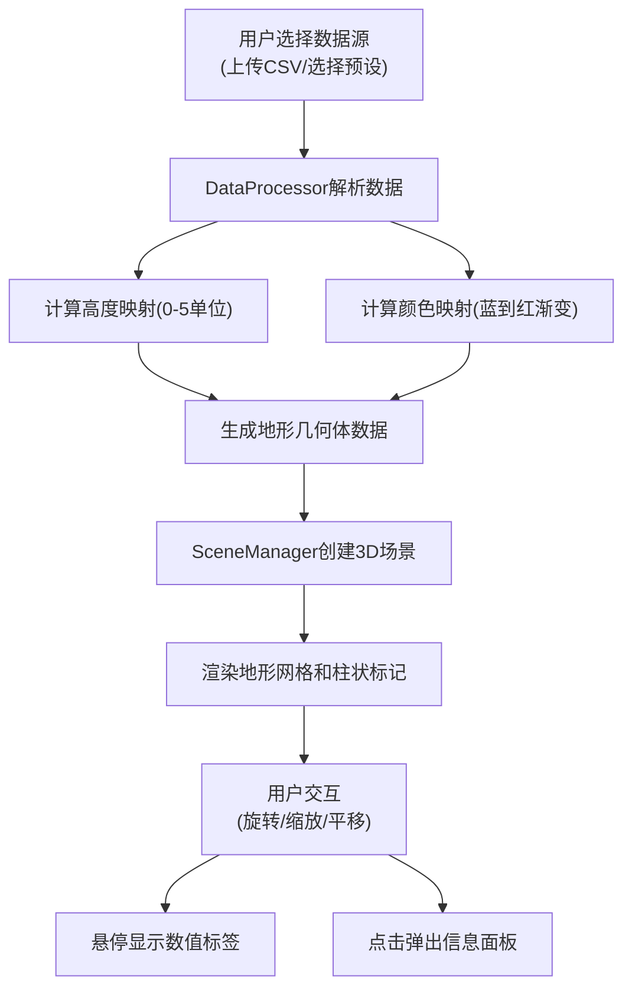

## 1. 产品概述

数据地貌是一款交互式3D数据可视化应用，将抽象的数值数据转化为直观的三维地形表面，帮助用户快速理解数据分布规律和空间特征。

- 面向数据分析师、科研人员和教育工作者，提供直观的数据可视化体验
- 通过三维地形的高低起伏和颜色变化，揭示数据背后的空间模式和异常值

## 2. 核心功能

### 2.1 用户角色
| 角色 | 注册方式 | 核心权限 |
|------|---------|----------|
| 普通用户 | 无需注册 | 上传数据、选择预设、调整视角、查看数据点详情 |

### 2.2 功能模块
1. **主界面**：左侧控制面板 + 右侧3D场景区域
2. **数据处理模块**：CSV文件解析、预设数据集生成、高度/颜色映射计算
3. **3D渲染模块**：地形网格生成、柱状标记、鼠标交互拾取
4. **UI控制模块**：文件上传、预设选择、颜色主题切换、视角控制

### 2.3 页面详情
| 页面名称 | 模块名称 | 功能描述 |
|---------|---------|----------|
| 主界面 | 控制面板 | 文件上传按钮、预设数据集选择、颜色主题切换、视角重置按钮 |
| 主界面 | 3D场景 | 可旋转缩放的地形表面、半透明柱状标记、悬停数值标签、点击信息面板 |
| 主界面 | 信息弹窗 | 显示选中数据点的x、y、value具体数值 |

## 3. 核心流程

用户上传CSV文件或选择预设数据集 → 系统解析数据并计算高度/颜色映射 → 生成三维地形网格和柱状标记 → 用户通过鼠标交互探索地形 → 悬停查看数值标签 → 点击标记查看详细信息

## 4. 用户界面设计

### 4.1 设计风格
- **主色调**：深色背景#0F0F1A，UI面板#1A1A2E，强调色#3B82F6（蓝色）和#4F46E5（紫色）
- **按钮样式**：胶囊形圆角按钮，上传按钮为蓝色系，预设按钮为深色系，选中状态带外发光
- **字体**：现代无衬线字体，数字使用等宽字体增强可读性
- **布局风格**：左侧固定宽度控制面板，右侧自适应3D场景区域
- **视觉效果**：毛玻璃半透明效果、按钮悬停发光动画、平滑过渡动画

### 4.2 页面设计概述
| 页面名称 | 模块名称 | UI元素 |
|---------|---------|--------|
| 主界面 | 控制面板 | 280px宽度，半透明毛玻璃背景，圆角12px，折叠卡片分组设计 |
| 主界面 | 3D场景 | 渐变背景#0B0B1A到#1A1A3A，地形20x20单位，网格100x100细分 |
| 主界面 | 柱状标记 | 半径0.1单位，高度与数值成正比，颜色与地形一致，悬停放大1.2倍 |
| 主界面 | 颜色主题 | 三个圆形色块，直径24px，选中时金色边框#FFD700 |

### 4.3 响应式
- 桌面端优先设计，最小支持1280px宽度
- 控制面板固定左侧，3D场景自适应剩余空间
- 触摸设备支持双指缩放和平移操作

### 4.4 3D场景指引
- **环境**：深色渐变背景，营造科技感和数据感氛围
- **光照**：环境光+方向光组合，地形使用MeshStandardMaterial，增强立体感
- **相机**：默认位置地形上方45度角，距离15单位，OrbitControls控制
- **交互**：左键旋转（速度0.5），滚轮缩放（5-30范围），右键平移
- **动画**：所有交互过渡duration 0.3s，悬停缩放动画，数值标签淡入淡出
- **性能**：顶点数控制在10000以内，帧率稳定30fps以上
