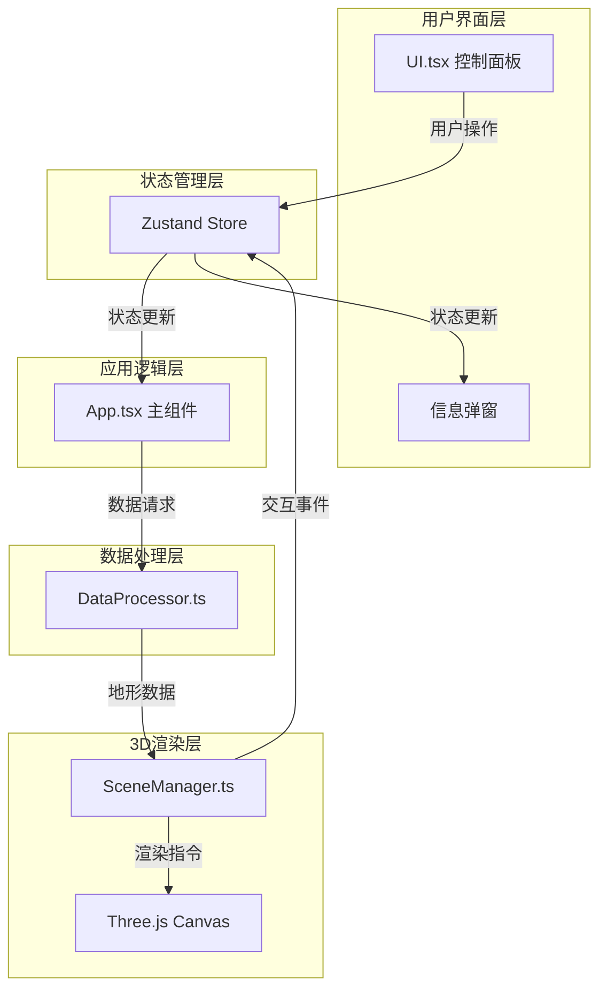

## 1. 架构设计



## 2. 技术描述

- **前端框架**：React@18 + TypeScript@5
- **3D渲染引擎**：Three.js@0.160
- **状态管理**：Zustand@4
- **构建工具**：Vite@5 + @vitejs/plugin-react@4
- **数据解析**：csv-parse@5
- **开发语言**：TypeScript（严格模式，目标ES2020）

## 3. 项目文件结构

| 文件路径 | 职责描述 |
|---------|----------|
| `package.json` | 项目依赖配置，启动脚本 |
| `index.html` | 应用入口HTML页面 |
| `vite.config.ts` | Vite构建配置，React插件 |
| `tsconfig.json` | TypeScript编译配置，严格模式 |
| `src/main.tsx` | 应用入口，挂载React根组件 |
| `src/App.tsx` | 主组件，组合3D场景和UI面板 |
| `src/SceneManager.ts` | Three.js场景管理，地形渲染，交互拾取 |
| `src/DataProcessor.ts` | 数据解析，高度/颜色映射，几何体生成 |
| `src/UI.tsx` | 控制面板组件，文件上传，预设选择 |
| `src/styles.css` | 全局样式，毛玻璃效果，动画 |
| `src/store.ts` | Zustand状态管理 |

## 4. 核心数据结构

### 4.1 数据点定义
```typescript
interface DataPoint {
  x: number;
  y: number;
  value: number;
}

interface TerrainVertex {
  position: [number, number, number];
  color: [number, number, number];
  height: number;
}

interface TerrainData {
  vertices: TerrainVertex[];
  indices: number[];
  markers: MarkerData[];
  gridSize: { width: number; height: number };
  bounds: { minValue: number; maxValue: number };
}

interface MarkerData {
  x: number;
  y: number;
  height: number;
  color: [number, number, number];
  value: number;
}

interface ColorTheme {
  id: string;
  name: string;
  lowColor: string;
  highColor: string;
}
```

### 4.2 应用状态
```typescript
interface AppState {
  terrainData: TerrainData | null;
  selectedPreset: string | null;
  colorTheme: ColorTheme;
  selectedMarker: MarkerData | null;
  isLoading: boolean;
  error: string | null;
  
  setTerrainData: (data: TerrainData | null) => void;
  setSelectedPreset: (preset: string | null) => void;
  setColorTheme: (theme: ColorTheme) => void;
  setSelectedMarker: (marker: MarkerData | null) => void;
  setIsLoading: (loading: boolean) => void;
  setError: (error: string | null) => void;
  loadPresetData: (presetType: string) => void;
  loadCSVData: (file: File) => void;
  resetCamera: () => void;
}
```

## 5. 核心模块说明

### 5.1 DataProcessor 模块
- **parseCSV**: 使用csv-parse解析CSV文件，验证x,y,value格式
- **generatePresetData**: 生成三种预设数据集（正弦波、Perlin噪声、高斯分布）
- **calculateHeightMapping**: 将value映射到0-5单位高度范围
- **calculateColorMapping**: 根据value在值域中的位置计算渐变色
- **generateGeometry**: 创建BufferGeometry所需的顶点、颜色和索引数组

### 5.2 SceneManager 模块
- **initScene**: 初始化Three.js场景、相机、渲染器、光照
- **createTerrain**: 接收TerrainData创建地形Mesh和线框辅助
- **createMarkers**: 在整数坐标点创建柱状标记和Sprite标签
- **setupControls**: 配置OrbitControls（旋转、缩放、平移）
- **setupPicking**: 实现鼠标悬停和点击的射线检测
- **handleResize**: 处理窗口大小变化
- **animate**: 渲染循环，处理悬停动画

### 5.3 UI 模块
- **FileUpload**: CSV文件上传组件，支持拖拽
- **PresetSelector**: 预设数据集选择器，胶囊形按钮
- **ColorThemePicker**: 颜色主题切换器，圆形色块
- **ControlPanel**: 折叠卡片式控制面板
- **InfoPanel**: 点击标记后显示的信息弹窗

## 6. 性能优化策略

1. **几何体优化**：使用BufferGeometry替代Geometry，索引化绘制
2. **材质复用**：地形和标记分别使用共享材质实例
3. **渲染优化**：使用Frustum Culling，不可见对象不参与渲染
4. **事件节流**：鼠标移动事件使用requestAnimationFrame节流
5. **内存管理**：切换数据集时正确dispose几何体和材质
6. **顶点数量控制**：网格细分100x100，顶点数10201，符合≤10000要求
