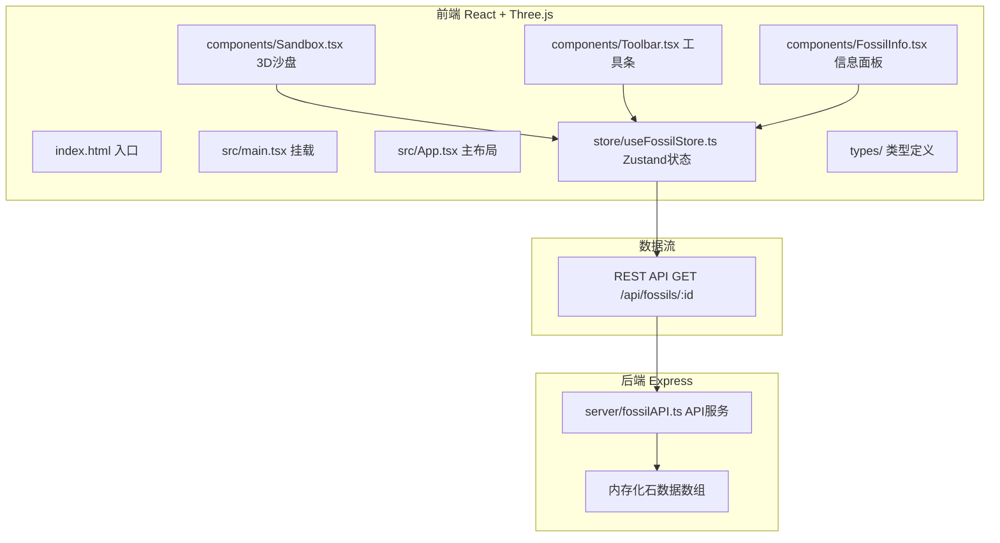

## 1. 架构设计



## 2. 技术描述

- **前端**：React 18 + TypeScript + Three.js + Zustand + Vite
- **构建工具**：Vite 5（@vitejs/plugin-react，proxy代理至后端3001端口）
- **后端**：Node.js + Express 4 + CORS（端口3001，内存存储）
- **包管理器**：npm
- **脚本**：`npm run dev` 同时启动前后端开发服务器

## 3. 目录结构

```
auto280/
├── index.html                    # 入口HTML，全屏容器
├── package.json                  # 前后端依赖与脚本
├── vite.config.js                # Vite配置 + proxy
├── tsconfig.json                 # TS严格模式，target ES2020
├── src/
│   ├── main.tsx                  # React入口
│   ├── App.tsx                   # 主布局组件（左沙盘+右面板）
│   ├── components/
│   │   ├── Sandbox.tsx           # 3D沙盘（Three.js场景、刷子、拼接）
│   │   ├── Toolbar.tsx           # 工具条（滑块、按钮）
│   │   └── FossilInfo.tsx        # 信息面板（详情+Canvas复原图）
│   ├── store/
│   │   └── useFossilStore.ts     # Zustand全局状态
│   └── types/
│       └── index.ts              # 共享类型定义
└── server/
    └── fossilAPI.ts              # Express后端API
```

## 4. API定义

### GET /api/fossils/:id
请求参数：`id: string`（化石ID，示例："trex-001"）

响应TypeScript类型：
```typescript
interface FossilDetail {
  id: string;
  speciesName: string;       // 物种名称（例：霸王龙）
  latinName: string;         // 拉丁学名（例：Tyrannosaurus rex）
  period: string;            // 生存年代
  location: string;          // 发现地点
  description: string;       // 描述文字
  reconstructionImageData?: string;  // 可选，预留图片字段
}
```

示例响应（id=trex-001）：
```json
{
  "id": "trex-001",
  "speciesName": "霸王龙",
  "latinName": "Tyrannosaurus rex",
  "period": "白垩纪晚期（约6800万年前）",
  "location": "美国蒙大拿州",
  "description": "骨骼完整度85%，含有罕见的尾椎骨愈合痕迹"
}
```

## 5. 状态模型（Zustand Store）

```typescript
interface SandParticle {
  id: number;
  x: number;
  y: number;
  z: number;
  radius: number;
  color: string;
  alpha: number;         // 透明度 0~1
  removing?: boolean;    // 是否正在消失动画
  removeProgress?: number;
}

interface BoneFragment {
  id: number;
  x: number; y: number; z: number;     // 埋藏位置
  targetX: number; targetY: number; targetZ: number;  // 拼接目标位置
  rotationX: number; rotationY: number; rotationZ: number;
  length: number;
  type: 'cylinder' | 'box' | 'compound';
  cleaned: boolean;        // 是否已清理
  assembled: boolean;      // 是否已拼接
  glowUntil?: number;      // 金色光晕截止时间戳
  assembleAnimation?: number; // 拼接动画进度 0~1
}

interface ToolSettings {
  brushSize: number;      // 1~10
  sandHardness: number;   // 0~1，影响清除速率
}

interface FossilStoreState {
  // 粒子
  sandParticles: SandParticle[];
  starParticles: { x:number; y:number; z:number; size:number; alpha:number }[];

  // 骨骼
  boneFragments: BoneFragment[];
  allCleaned: boolean;
  fullyAssembled: boolean;

  // 工具
  toolSettings: ToolSettings;

  // 化石信息
  fossilDetail: FossilDetail | null;
  fossilDetailLoading: boolean;
  selectedBoneId: number | null;

  // Actions
  initScene: () => void;
  removeParticlesInRadius: (worldX: number, worldZ: number, dt: number) => void;
  checkBoneCollision: (worldX: number, worldZ: number) => void;
  triggerAssembly: () => void;
  setToolSettings: (patch: Partial<ToolSettings>) => void;
  fetchFossilDetail: (id: string) => Promise<void>;
  resetScene: () => void;
  updateAnimations: (dt: number) => void;
}
```

## 6. 数据流向说明

1. **初始化**：App渲染 → Sandbox挂载 → 调用store.initScene() → 生成500沙土粒子、50星光粒子、10个骨骼碎片并设置目标拼接位置
2. **交互**：用户在Sandbox中鼠标拖拽 → Three.js Raycaster取得world坐标 → Sandbox调用removeParticlesInRadius(x,z,dt)与checkBoneCollision(x,z)
3. **状态更新**：store标记粒子removing并递减alpha；标记骨骼cleaned=true、抬升Y+0.5、随机旋转、设置glowUntil；每帧updateAnimations推进动画
4. **拼接触发**：第10个骨骼被标记cleaned → allCleaned=true → triggerAssembly() → 调用fetchFossilDetail("trex-001") → 骨骼assembleAnimation从0→1，插值到target位置
5. **展示**：拼接完成 → fullyAssembled=true → FossilInfo从store读取fossilDetail渲染卡片 + Canvas绘制霸王龙轮廓图；骨架浮动动画持续
6. **重置**：Toolbar点击"重新开始" → store.resetScene() → 清空状态 → initScene()重新生成

## 7. 前端路由

单页面应用，无路由切换。仅入口路由 `/`。

## 8. 性能优化策略
- 沙土粒子使用共享Geometry与Material的InstancedMesh或BufferGeometry合并渲染
- 骨骼碎片使用合并后的BufferGeometry（每个≤200顶点）
- 粒子移除采用对象池模式（设置visible=false而非销毁），避免频繁GC
- 刷子圆形选区使用网格空间划分（Grid Spatial Hash）优化O(n)粒子查询
- 帧率监控：requestAnimationFrame帧循环，采用dt时间步长控制动画速度
