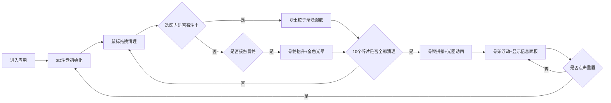

## 1. 产品概述

化石复原工作台是一款面向古生物博物馆参观者的3D交互可视化应用，通过虚拟沙盘模拟化石挖掘与骨骼复原的沉浸式体验。用户使用虚拟刷子清理沙土、拼接恐龙骨架，同时获取物种科普信息，寓教于乐。

## 2. 核心功能

### 2.1 功能模块
1. **3D沙盘场景**：网格地面、沙土粒子、埋藏骨骼、星光背景
2. **虚拟刷子交互**：鼠标拖拽清理沙土、骨骼碎片抬升发光
3. **骨架拼接系统**：碎片自动对齐组合、光圈扩散动画、骨架浮动效果
4. **化石信息展示**：物种名称、年代、地点、描述、复原图
5. **工具条控制**：刷子大小、沙土硬度、重置功能

### 2.2 页面详情

| 页面名称 | 模块名称 | 功能描述 |
|-----------|-------------|---------------------|
| 主工作台 | 3D沙盘模块 | 初始化Three.js场景，管理粒子移除、骨骼检测与拼接 |
| 主工作台 | 工具条模块 | 刷子大小/硬度滑块、重置按钮 |
| 主工作台 | 信息面板模块 | 显示化石详情、物种信息、Canvas复原图 |

## 3. 核心流程

用户进入应用 → 查看3D沙盘（含沙土与埋藏骨骼）→ 使用鼠标拖拽清理沙土 → 沙土粒子渐隐消失并爆散 → 接触骨骼碎片时碎片抬升发光 → 清理完10个碎片后触发自动拼接 → 拼接光圈动画扩散 → 骨架缓慢浮动 → 信息面板展示霸王龙详情 → 可点击重置回到初始状态

## 4. 用户界面设计

### 4.1 设计风格
- **主色调**：深色主题（#0F0C29 → #24243E渐变背景）
- **强调色**：金色#FFD700（骨骼光晕、标题、滑块把手）、蓝色#4A90D9（边框）
- **字体**：系统默认无衬线字体，标题金色、正文#E0E0E0、描述#B0B0B0
- **交互**：滑块弹性动画、粒子爆散、光圈扩散、骨骼浮动

### 4.2 页面设计概述

| 页面名称 | 模块名称 | UI元素 |
|-----------|-------------|-------------|
| 主工作台 | 3D沙盘（70%宽） | 网格地面渐变#3E2723→#5D4037、沙土粒子#C2A477→#8D6E63、骨骼#F5F5DC、星光粒子 |
| 主工作台 | 工具条（30%宽） | 半透明磨砂玻璃#1A1A2E/0.8、1px#4A90D9边框、圆形滑块把手直径20px带阴影 |
| 主工作台 | 信息面板 | 渐变背景#24243E→#302B63、圆角8px、内边距16px、Canvas线条复原图 |

### 4.3 响应式设计
- 桌面端：左侧70%沙盘 + 右侧30%工具条和信息面板（最小300px）
- 移动端（<768px）：沙盘居上，工具条+信息面板居下，各占50%高度，堆叠布局

### 4.4 3D场景指导
- **环境**：深色渐变背景，微弱星光粒子（50个，1-2px白色，透明度0.3-0.6）漂浮
- **灯光**：AmbientLight基础光 + DirectionalLight主光 + PointLight沙盘中心补光
- **相机**：PerspectiveCamera，45度视场，角度俯视约45度，距离沙盘中心15-20单位
- **交互**：射线检测鼠标world坐标，圆形选区半径由刷子大小决定
- **动画**：沙土透明度渐变、骨骼Y轴抬升旋转、金色光晕0.5s、同心圆光圈0→5单位2s、骨架上下浮动0.1单位周期2s
- **性能**：帧率60fps，总粒子≤600，每骨骼顶点≤200
