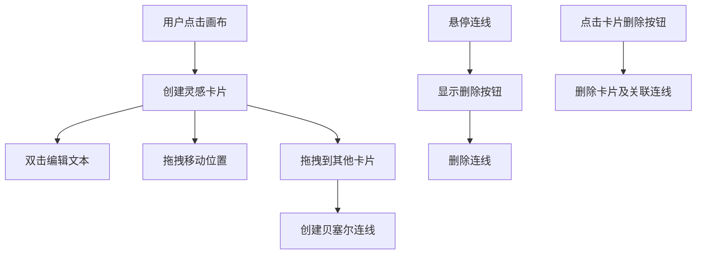

## 1. 产品概述

灵感轨迹是一款交互式灵感与任务看板应用，通过拖动与连接的方式帮助用户组织发散性想法与待办事项。

- 主要用途：视觉化管理创意想法、任务关系，通过卡片和连线构建思维网络图
- 目标用户：创意工作者、项目经理、学生、任何需要整理思路的人群
- 产品价值：提供直观的拖拽式交互，让思维过程可视化，促进发散性思考和任务关联

## 2. 核心功能

### 2.1 用户角色
| 角色 | 注册方式 | 核心权限 |
|------|----------|----------|
| 普通用户 | 无需注册，本地使用 | 创建、编辑、删除卡片和连线，拖拽操作 |

### 2.2 功能模块
1. **画布主页面**：无限画布区域、卡片管理、连线管理、交互操作

### 2.3 页面详情
| 页面名称 | 模块名称 | 功能描述 |
|-----------|-------------|---------------------|
| 画布主页 | 卡片创建 | 点击空白处创建灵感卡片，默认文本"新想法"，随机颜色 |
| 画布主页 | 卡片拖拽 | 自由拖拽卡片移动位置，实时更新连线端点 |
| 画布主页 | 卡片编辑 | 双击卡片进入编辑模式，支持文本修改 |
| 画布主页 | 卡片删除 | 点击卡片右上角删除按钮，同时删除关联连线 |
| 画布主页 | 连线创建 | 从一个卡片拖拽到另一个卡片创建贝塞尔曲线连线 |
| 画布主页 | 连线删除 | 悬停连线显示删除按钮，点击删除单条连线 |

## 3. 核心流程

### 3.1 创建卡片流程
用户点击画布空白处 → 系统生成随机颜色卡片 → 卡片显示"新想法"文本 → 可双击编辑或拖拽移动

### 3.2 卡片拖拽流程
用户按住卡片拖拽 → 卡片半透明显示，阴影加深 → 实时更新位置和连线 → 松手固定位置

### 3.3 创建连线流程
用户从卡片按住鼠标拖出 → 拖拽过程中显示临时连线 → 悬停目标卡片时高亮 → 松手生成贝塞尔曲线连线

### 3.4 编辑卡片流程
用户双击卡片 → 卡片背景变黄，显示输入框 → 用户编辑文本 → 回车或点击外部完成编辑

## 4. 用户界面设计

### 4.1 设计风格
- **主色调**：卡片颜色从预设调色板随机选取（#FF6B6B、#FFD93D、#6BCB77、#4D96FF、#C084FC）
- **背景色**：极浅灰 #F5F5F5
- **卡片样式**：白色圆角矩形，尺寸120x80px，左侧2px彩色竖条标识
- **阴影效果**：普通状态 0 2px 4px rgba(0,0,0,0.1)，拖拽状态 0 8px 16px rgba(0,0,0,0.2)
- **字体**：14px，居中显示，超长省略号截断（最多40字）
- **动画过渡**：所有操作200ms ease-out过渡
- **图标**：使用Unicode字符（删除✕，编辑✎）

### 4.2 页面设计概述
| 页面名称 | 模块名称 | UI元素 |
|-----------|-------------|-------------|
| 画布主页 | 卡片组件 | 白色圆角矩形、彩色竖条、删除按钮、文本区域 |
| 画布主页 | 连线组件 | 贝塞尔曲线、端点圆点、悬停虚线效果、删除按钮 |
| 画布主页 | 编辑状态 | 淡黄色背景#FFF9C4、自适应输入框 |
| 画布主页 | 拖拽状态 | 半透明opacity 0.7、加深阴影 |

### 4.3 响应性
- 桌面端优先设计
- 全屏无滚动条
- 卡片超出视口时自动缩小font-size至12px

### 4.4 性能指标
- 支持最多30个卡片和50条连线同时展示
- 拖拽与连线绘制不低于30FPS
- 使用requestAnimationFrame优化拖拽更新
