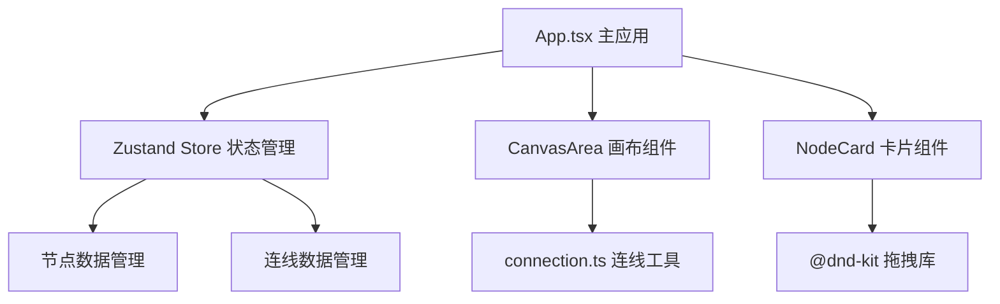
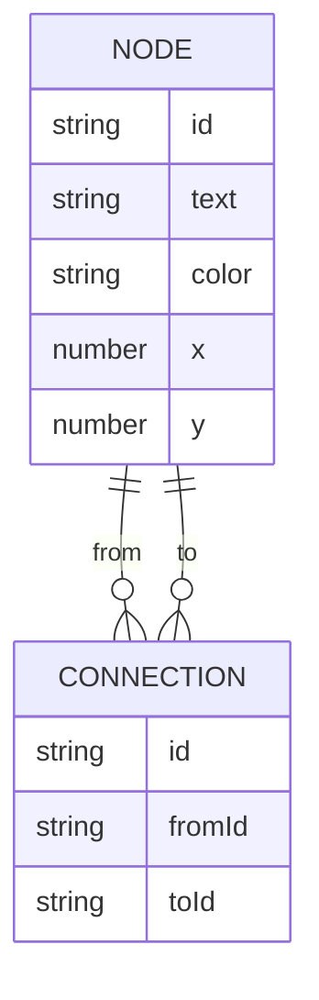

## 1. 架构设计



## 2. 技术描述

- **前端框架**：React 18 + TypeScript
- **构建工具**：Vite 5
- **状态管理**：Zustand 4
- **拖拽库**：@dnd-kit/core + @dnd-kit/sortable
- **ID生成**：uuid
- **绘图技术**：SVG + 贝塞尔曲线
- **性能优化**：requestAnimationFrame、memo

## 3. 项目结构

| 路径 | 用途 |
|------|------|
| `/package.json` | 项目依赖配置 |
| `/vite.config.js` | Vite构建配置 |
| `/tsconfig.json` | TypeScript配置 |
| `/index.html` | 入口HTML |
| `/src/App.tsx` | 主应用组件 |
| `/src/store.ts` | Zustand状态管理 |
| `/src/components/NodeCard.tsx` | 卡片组件 |
| `/src/components/CanvasArea.tsx` | 画布组件 |
| `/src/utils/connection.ts` | 连线绘制工具 |

## 4. 数据模型

### 4.1 数据结构定义



### 4.2 TypeScript 类型定义

```typescript
interface Node {
  id: string;
  text: string;
  color: string;
  x: number;
  y: number;
}

interface Connection {
  id: string;
  fromId: string;
  toId: string;
}

interface StoreState {
  nodes: Node[];
  connections: Connection[];
  addNode: (x: number, y: number) => void;
  deleteNode: (id: string) => void;
  updateNodePosition: (id: string, x: number, y: number) => void;
  updateNodeText: (id: string, text: string) => void;
  addConnection: (fromId: string, toId: string) => void;
  deleteConnection: (id: string) => void;
}
```

## 5. 核心模块说明

### 5.1 store.ts - 状态管理
- 定义Node和Connection数据结构
- 提供增删改查actions
- 使用Zustand的subscribe模式优化重渲染

### 5.2 CanvasArea.tsx - 画布组件
- SVG画布渲染所有连线（贝塞尔曲线）
- 监听画布点击创建新卡片
- 处理连线创建逻辑和删除
- 实时更新连线位置

### 5.3 NodeCard.tsx - 卡片组件
- @dnd-kit的useDraggable实现拖拽
- 双击编辑功能
- 删除按钮
- 拖拽状态视觉反馈

### 5.4 connection.ts - 连线工具
- `getBezierPath(from, to)`: 生成贝塞尔曲线路径
- `getAnchorPoint(node, direction)`: 计算连线吸附点位置
- `getControlPoints(from, to, offset)`: 计算曲线控制点

## 6. 性能优化策略

1. 使用React.memo包裹NodeCard和连线组件
2. Zustand选择器精确订阅状态变化
3. requestAnimationFrame处理拖拽位置更新
4. SVG使用transform代替频繁重绘
5. 虚拟滚动/按需渲染（30个卡片限制内）
