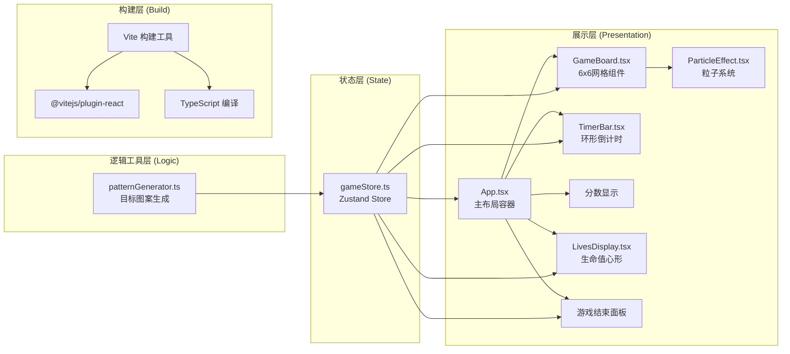

## 1. 架构设计



## 2. 技术说明

- **前端框架**：React 18 + TypeScript
- **构建工具**：Vite 5 + @vitejs/plugin-react
- **状态管理**：Zustand 4（轻量级，开箱即用）
- **样式方案**：原生CSS + CSS Modules（内联样式处理动态值）
- **动画实现**：CSS transition / @keyframes + requestAnimationFrame（粒子系统）
- **初始化方式**：Vite官方React+TS模板

## 3. 项目目录结构

```
auto284/
├── index.html                  # 入口HTML，全屏黑色背景容器
├── package.json                # 依赖与脚本配置
├── tsconfig.json               # TypeScript严格模式配置
├── vite.config.js              # Vite + React插件配置
└── src/
    ├── main.tsx                # React应用入口
    ├── App.tsx                 # 主布局组件
    ├── store/
    │   └── gameStore.ts        # Zustand全局状态
    ├── components/
    │   ├── GameBoard.tsx       # 6x6游戏网格
    │   ├── TimerBar.tsx        # 环形倒计时进度条
    │   ├── LivesDisplay.tsx    # 生命值心形组件
    │   └── ParticleEffect.tsx  # 粒子特效系统
    └── utils/
        └── patternGenerator.ts # 随机目标图案生成器
```

## 4. 核心数据模型

### 4.1 Zustand Store 状态定义

```typescript
// 游戏阶段
type GamePhase = 'idle' | 'playing' | 'ended';

// 单元格状态
interface CellState {
  isActive: boolean;      // 当前是否为蓝色
  isMatched: boolean;     // 是否已正确匹配（触发特效）
  isWrong: boolean;       // 是否刚刚错误点击（触发抖动）
}

// 粒子数据
interface Particle {
  id: number;
  x: number;
  y: number;
  color: string;
  createdAt: number;
}

// Store 状态
interface GameState {
  // 游戏状态
  phase: GamePhase;
  timeLeft: number;        // 剩余时间（秒）
  totalTime: number;       // 每关总时间
  score: number;           // 当前分数
  lives: number;           // 剩余生命值
  maxLives: number;        // 最大生命值

  // 网格与图案
  grid: CellState[];       // 6x6=36个单元格状态
  targetPattern: number[]; // 目标图案索引数组 1-4个

  // 统计
  correctCount: number;    // 正确匹配次数
  totalClicks: number;     // 总点击次数

  // 特效数据
  particles: Particle[];   // 当前活跃粒子
  scorePopups: ScorePopup[]; // 得分飘字

  // Actions
  startGame: () => void;
  endGame: () => void;
  resetGame: () => void;
  handleCellClick: (index: number) => void;
  tick: () => void;        // 倒计时tick
  addParticle: (...) => void;
  clearExpiredParticles: () => void;
}
```

## 5. 核心模块职责

| 模块 | 文件 | 核心职责 |
|------|------|---------|
| App主布局 | App.tsx | 组合所有子组件，订阅store，数据流：store→组件 |
| 游戏状态 | gameStore.ts | 管理全部游戏状态，提供startGame/endGame/handleCellClick等action |
| 网格组件 | GameBoard.tsx | 渲染6x6网格，接收grid和targetPattern，播放单元格动画 |
| 倒计时 | TimerBar.tsx | SVG环形进度条，timeLeft驱动，颜色绿→红渐变 |
| 生命值 | LivesDisplay.tsx | 5颗红色心形SVG，lives变化时动画 |
| 粒子系统 | ParticleEffect.tsx | requestAnimationFrame驱动，8粒子扩散+淡出，上限200 |
| 图案生成 | patternGenerator.ts | generatePattern()返回1-4个不重复索引，确保可解 |

## 6. 性能优化策略

1. **粒子池**：最多200个同时存在，超出删除最早创建的
2. **CSS动画**：单元格切换用transition，粒子用rAF更新transform
3. **memo优化**：子组件用React.memo避免不必要重渲染
4. **Store选择器**：Zustand使用selector精确订阅需要的state
5. **节流防抖**：玩家点击做基础防重复处理
6. **GPU加速**：动画属性仅用transform和opacity，避免layout thrash
