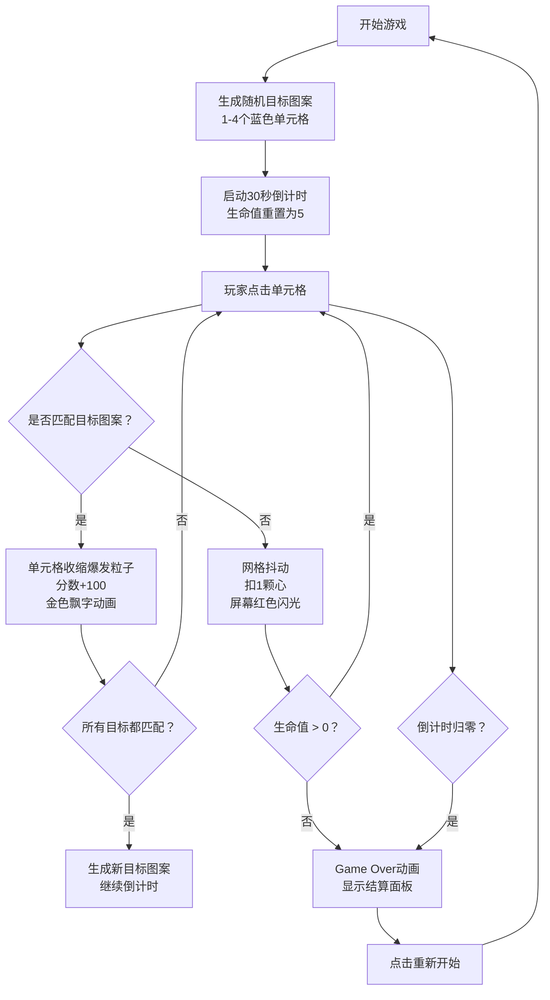

## 1. 产品概述

能量矩阵是一款科幻风格的记忆反应类小游戏，玩家需要在6x6的发光网格上快速点击匹配系统随机生成的目标图案。游戏考验玩家的记忆力、反应速度和精准度，通过连击加分、生命值机制和倒计时营造紧张刺激的游戏体验。

- 核心玩法：在限定时间内匹配目标图案，正确得分加连击，错误扣生命值
- 目标用户：休闲游戏爱好者，喜欢挑战反应速度和记忆力的玩家
- 产品价值：提供沉浸式的视觉特效体验与流畅的游戏手感

## 2. 核心功能

### 2.1 功能模块

1. **游戏主界面**：6x6发光网格、环形倒计时条、分数显示、生命值心形
2. **游戏逻辑引擎**：图案生成、匹配判定、分数计算、生命值管理、倒计时
3. **视觉特效系统**：单元格切换动画、匹配粒子爆发、得分飘字、错误抖动、屏幕闪光
4. **游戏结束界面**：总分展示、正确率统计、重新开始按钮、Game Over动画

### 2.2 页面详情

| 页面名称 | 模块名称 | 功能描述 |
|---------|---------|---------|
| 游戏主界面 | 发光网格 | 6x6单元格，点击切换颜色，正确匹配触发粒子特效，错误触发抖动 |
| 游戏主界面 | 环形倒计时条 | 30秒倒计时，绿→红渐变，归零触发游戏结束 |
| 游戏主界面 | 分数显示 | 实时更新，正确匹配+100弹出金色得分飘字 |
| 游戏主界面 | 生命值显示 | 5颗红色心形，错误扣1颗，扣光触发Game Over |
| 游戏主界面 | 目标图案指示 | 1-4个蓝色高亮单元格，玩家需匹配此图案 |
| 游戏结束界面 | 结算面板 | 显示总分、正确率、重新开始按钮 |
| 游戏结束界面 | Game Over动画 | 文字渐入缩放，心数为0时触发 |

## 3. 核心流程

## 4. 用户界面设计

### 4.1 设计风格

- **整体风格**：深色科幻、赛博朋克发光效果
- **主色调**：背景 #0D0D0D，网格线 #2A2A2A
- **强调色**：
  - 单元格默认灰色：#333333
  - 目标图案蓝色：#00E5FF（霓虹青蓝）
  - 得分飘字金色：#FFD700
  - 生命心形红色：#FF6B6B
  - 错误闪光红色：#F44336
  - 倒计时渐变：#4CAF90 → #F44336
- **字体**：无衬线科技感字体，数字用等宽字体
- **动效原则**：所有交互动效0.2-0.3秒，粒子扩散流畅不卡顿

### 4.2 页面设计概览

| 页面 | 模块 | UI元素 |
|------|------|--------|
| 主界面 | 顶部信息栏 | 半透明黑底 #00000080，居中布局，环形进度条居中，分数左侧，生命值右侧 |
| 主界面 | 游戏网格 | 居中显示，60x60px单元格，2px间距，hover轻微发光效果 |
| 主界面 | 单元格动画 | 点击切换0.3s淡入淡出，匹配后收缩→8粒子扩散（半径20px，3px大小） |
| 主界面 | 得分飘字 | #FFD700 字体，向上漂移1秒后消失 |
| 主界面 | 倒计时环 | 外径40px，内径32px，圆环渐变，实时更新进度 |
| 主界面 | 生命值 | 5颗红色心形SVG，20x20px，间距4px，减少时缩小消失动画 |
| 结束界面 | 结算面板 | 居中弹出，显示总分、正确率（正确/总点击×100%）、重新开始按钮 |

### 4.3 响应式适配

- **设计方式**：桌面端优先，移动端自适应
- **网格缩放**：单元格最小40px，最大60px，320px-1200px宽度区间按比例缩放
- **触控支持**：移动端支持触摸事件，桌面端支持鼠标点击
- **居中策略**：所有元素水平垂直居中，使用flex布局和CSS变量动态计算尺寸

### 4.4 性能要求

- 游戏循环稳定60FPS，使用requestAnimationFrame
- 粒子特效同时存在上限200个，超出自动回收最旧粒子
- 动画使用CSS transform和opacity，触发GPU加速
- 避免不必要的重绘重排
