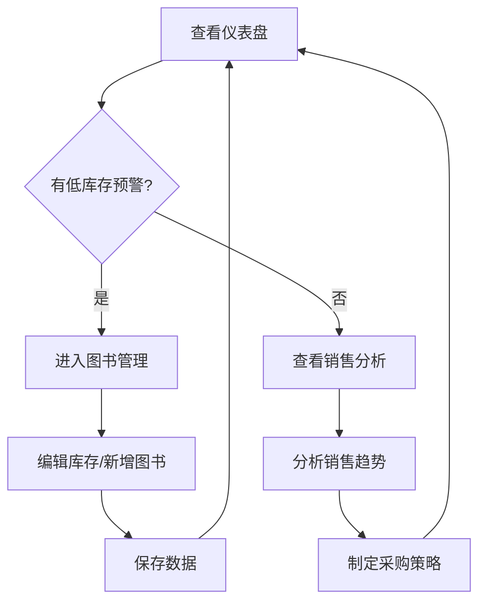

## 1. 产品概述
本产品是为小型书店设计的全栈图书库存管理与销售数据分析系统，解决店主无法直观掌握畅销书趋势、库存积压风险以及销售模式变化的问题。通过可视化仪表盘、智能预警和多维度数据分析，帮助店主实现精细化运营管理。

## 2. 核心功能

### 2.1 用户角色
| 角色 | 注册方式 | 核心权限 |
|------|----------|----------|
| 书店店主 | 系统内置 | 查看所有数据、管理图书库存、进行销售数据分析、配置预警阈值 |

### 2.2 功能模块
1. **仪表盘**：核心指标概览、低库存预警、实时数据展示
2. **图书管理**：图书CRUD操作、库存编辑、详情查看
3. **销售分析**：多维度销售数据可视化、趋势分析、类别占比

### 2.3 页面详情
| 页面名称 | 模块名称 | 功能描述 |
|----------|----------|----------|
| 仪表盘 | 指标卡片 | 显示总库存量、月销量、新入库数、低库存预警数，带数字动画和滚动滑入效果 |
| 仪表盘 | 预警通知 | 低库存图书自动预警，脉冲动画徽章，右上角滑入通知 |
| 图书管理 | 图书表格 | 展示所有图书信息，支持响应式布局，行点击展开详情 |
| 图书管理 | 详情面板 | 右侧滑入面板，展示30天销量折线图，支持库存编辑 |
| 图书管理 | 新增模态框 | 完整表单验证，ISBN 13位校验，提交动画效果 |
| 销售分析 | 柱状图 | 各月总销量统计，悬停显示详情，渐变色柱子 |
| 销售分析 | 饼图 | 各类别销量占比，点击扇区显示该类别图书销量排行 |

## 3. 核心流程
店主登录系统后，首先查看仪表盘了解整体运营状况，发现低库存预警后跳转至图书管理页面进行库存调整，定期查看销售分析页面了解销售趋势，优化采购策略。

## 4. 用户界面设计

### 4.1 设计风格
- 主背景：#1a1a2e，侧边栏：#16213e，内容区：#0f3460
- 主色调渐变：#667eea → #764ba2
- 辅助色：#e94560（激活态）、#e74c3c（警示）、#00b09b（成功）
- 按钮风格：圆角8px，悬停微缩放效果
- 字体：无衬线字体，数字加粗显示
- 布局：左侧固定导航栏 + 右侧内容区
- 图标风格：简洁线性图标，统一尺寸20px

### 4.2 页面设计概述
| 页面名称 | 模块名称 | UI元素 |
|----------|----------|----------|
| 仪表盘 | 指标卡片 | 渐变背景、白色加粗数字、0→目标值动画（1.5s ease-out）、滚动滑入动画（translateY 20px→0, 0.4s） |
| 仪表盘 | 预警徽章 | 圆形#e74c3c背景、白色感叹号、脉冲动画（scale 1.0→1.2→1.0, 2s周期） |
| 图书管理 | 详情面板 | 右侧滑入（350px宽）、白色背景、#e0e0e0边框阴影、Chart.js折线图 |
| 图书管理 | 新增模态框 | 居中、圆角12px、阴影层级10、半透明遮罩、表单验证失败抖动动画 |
| 销售分析 | 柱状图 | 渐变#f093fb→#f5576c、Tooltip背景#333、白色文字、圆角8px |
| 销售分析 | 饼图 | 5色区分类别、点击扇区展开排行列表、行渐入动画（间隔0.1s） |

### 4.3 响应式设计
- 桌面端（≥768px）：左侧导航220px固定，右侧内容区自适应
- 移动端（<768px）：导航转为顶部，表格转为卡片列表，卡片宽度100%纵向堆叠
- 触控优化：最小点击区域48px，手势支持

### 4.4 性能要求
- 页面初始加载时间 ≤ 2秒
- 图表渲染帧率稳定 ≥ 30fps
- 使用Vite代码分割和懒加载优化
