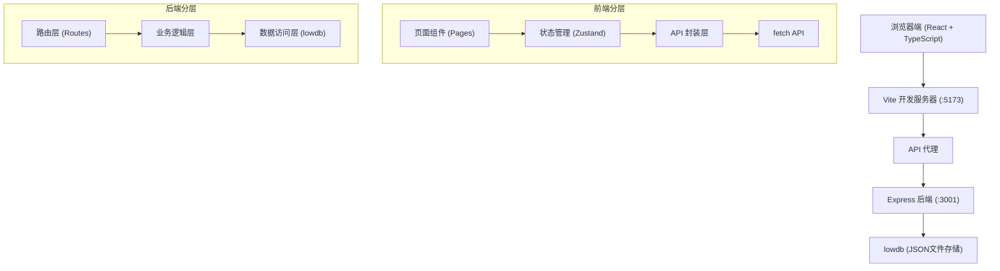
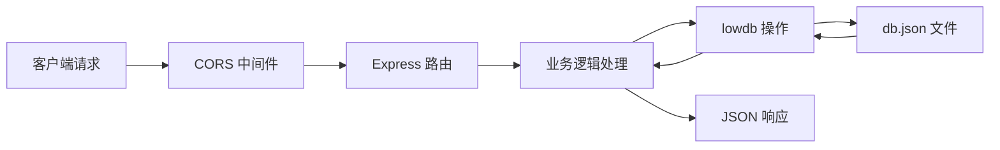
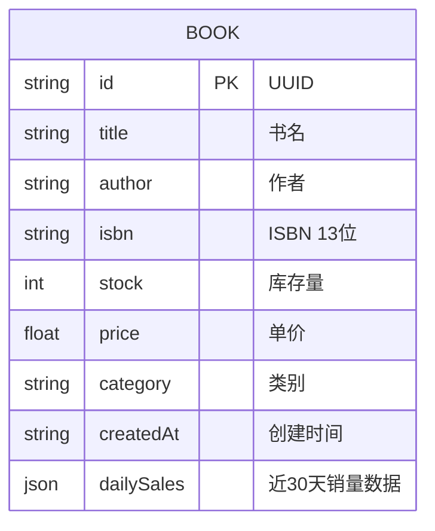

## 1. 架构设计



## 2. 技术描述
- 前端：React@18 + TypeScript + Vite@5 + react-router-dom@6 + zustand@4 + chart.js@4 + react-chartjs-2@5
- 构建工具：Vite，配置React插件和API代理
- 后端：Node.js + Express@4 + cors + lowdb@1.0.0 + uuid
- 数据库：lowdb，JSON文件持久化（db.json）
- 并发启动：concurrently

## 3. 路由定义
| 路由 | 页面 | 描述 |
|------|------|------|
| /dashboard | Dashboard.tsx | 仪表盘，展示核心指标和预警 |
| /books | BookManagement.tsx | 图书管理，CRUD操作 |
| /analytics | Analytics.tsx | 销售数据分析，图表展示 |
| * | 重定向到 /dashboard | 默认路由 |

## 4. API 定义

### 数据类型定义
```typescript
interface Book {
  id: string;
  title: string;
  author: string;
  isbn: string;
  stock: number;
  price: number;
  category: string;
  createdAt: string;
  dailySales: { date: string; sales: number }[];
}

interface SalesData {
  monthlySales: { month: string; total: number }[];
  categorySales: { category: string; total: number; books: { title: string; sales: number }[] }[];
}
```

### API 接口
| 方法 | 路径 | 描述 | 请求体 | 响应 |
|------|------|------|--------|------|
| GET | /api/books | 获取所有图书 | - | Book[] |
| POST | /api/books | 新增图书 | Omit<Book, 'id' \| 'createdAt' \| 'dailySales'> | Book |
| PUT | /api/books/:id | 更新图书 | Partial<Book> | Book |
| DELETE | /api/books/:id | 删除图书 | - | { success: boolean } |
| GET | /api/books/stats/sales | 获取销售统计 | - | SalesData |

## 5. 服务器架构图



## 6. 数据模型

### 6.1 数据模型定义



### 6.2 初始化数据
服务端启动时自动创建10本示例图书数据，包含完整的30天模拟销售记录，覆盖5个图书类别（文学、科技、历史、艺术、商业）。
