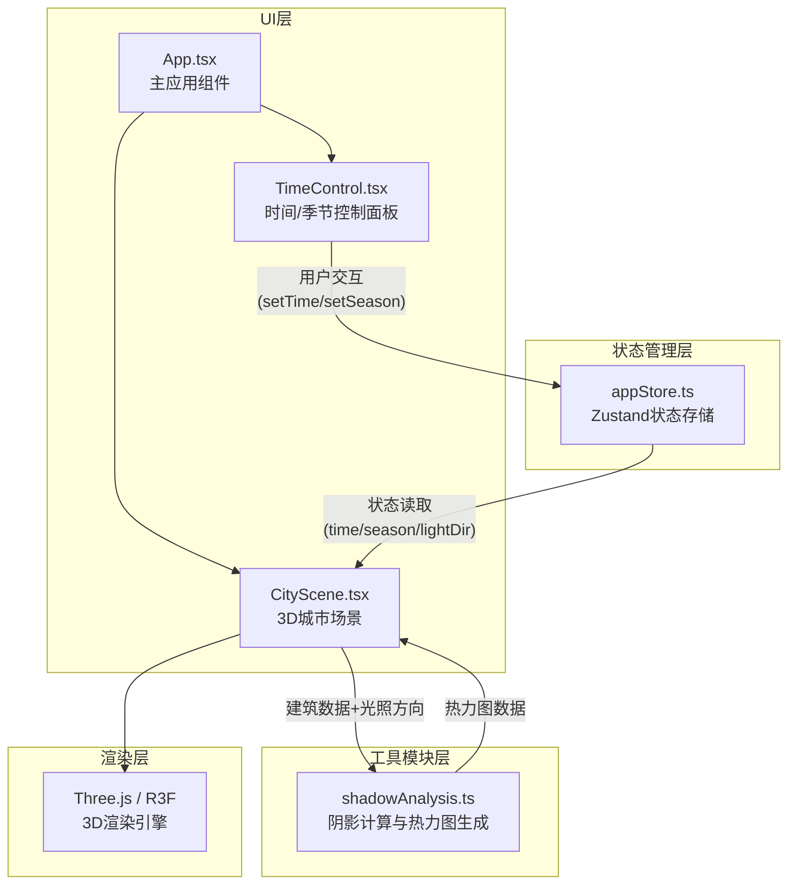

## 1. 架构设计



**数据流向说明：**
1. 用户在 `TimeControl` 组件中拖动滑块或点击季节按钮
2. `TimeControl` 调用 Zustand store 的 action 更新 `time` 或 `season`
3. `CityScene` 订阅 store 中的光照相关状态变化
4. 状态变更后，`CityScene` 重新计算光照参数并触发 Three.js 场景重渲染
5. 用户点击热力图按钮时，`CityScene` 将建筑位置和光照参数传递给 `shadowAnalysis` 工具模块
6. `shadowAnalysis` 计算并返回热力图数据，`CityScene` 将其渲染为叠加层

## 2. 技术说明

- **前端框架**：React 18 + TypeScript
- **构建工具**：Vite 5 + @vitejs/plugin-react
- **状态管理**：Zustand 4
- **3D渲染**：Three.js 0.160 + @react-three/fiber 8 + @react-three/drei 9
- **TypeScript目标**：ES2020，严格模式

### 依赖包清单
| 包名 | 用途 |
|------|------|
| react | UI框架核心 |
| react-dom | DOM渲染 |
| zustand | 轻量状态管理 |
| three | WebGL 3D引擎 |
| @react-three/fiber | React Three.js渲染器 |
| @react-three/drei | R3F常用组件库 |
| typescript | 类型系统 |
| vite | 构建与开发服务器 |
| @vitejs/plugin-react | Vite React插件 |

## 3. 项目文件结构

```
d:\Pro\tasks\auto286\
├── index.html
├── package.json
├── vite.config.js
├── tsconfig.json
└── src/
    ├── App.tsx              # 主应用：整合UI、场景、状态
    ├── store/
    │   └── appStore.ts      # Zustand状态：时间/季节/光照/阴影数据
    ├── components/
    │   ├── CityScene.tsx    # 3D场景：建筑群、光照、阴影、热力图
    │   └── TimeControl.tsx  # 控制面板：时间滑块、季节按钮
    └── utils/
        └── shadowAnalysis.ts # 阴影分析：计算阴影覆盖、生成热力图数据
```

**文件调用关系：**
- [App.tsx](file:///d:/Pro/tasks/auto286/src/App.tsx) → 引入 [CityScene.tsx](file:///d:/Pro/tasks/auto286/src/components/CityScene.tsx)、[TimeControl.tsx](file:///d:/Pro/tasks/auto286/src/components/TimeControl.tsx)，读取 [appStore.ts](file:///d:/Pro/tasks/auto286/src/store/appStore.ts)
- [TimeControl.tsx](file:///d:/Pro/tasks/auto286/src/components/TimeControl.tsx) → 调用 [appStore.ts](file:///d:/Pro/tasks/auto286/src/store/appStore.ts) 的 action
- [CityScene.tsx](file:///d:/Pro/tasks/auto286/src/components/CityScene.tsx) → 读取 [appStore.ts](file:///d:/Pro/tasks/auto286/src/store/appStore.ts)，调用 [shadowAnalysis.ts](file:///d:/Pro/tasks/auto286/src/utils/shadowAnalysis.ts)
- [shadowAnalysis.ts](file:///d:/Pro/tasks/auto286/src/utils/shadowAnalysis.ts) → 纯函数模块，无外部依赖

## 4. 数据模型

### 4.1 Zustand Store 状态定义

```typescript
type Season = 'spring' | 'summer' | 'autumn' | 'winter';

interface Building {
  id: string;
  position: [number, number, number]; // x, y, z
  size: [number, number, number];     // width, height, depth
}

interface AppState {
  // 用户可调参数
  time: number;           // 6.0 ~ 18.0，以小时为单位（如9.25表示9:15）
  season: Season;
  
  // 计算得出的光照参数
  sunAltitude: number;    // 太阳高度角（度）
  sunAzimuth: number;     // 太阳方位角（度）
  lightColor: string;     // 光照色温对应的颜色值
  lightIntensity: number; // 光照强度
  
  // UI状态
  showHeatmap: boolean;
  
  // 建筑数据（静态）
  buildings: Building[];
  
  // Actions
  setTime: (time: number) => void;
  setSeason: (season: Season) => void;
  toggleHeatmap: () => void;
}
```

### 4.2 阴影分析模块接口

```typescript
// 输入：建筑列表 + 当前时间/季节
// 输出：热力图网格数据（每个格子的阴影覆盖率 0~1）
interface HeatmapCell {
  x: number;          // 网格x坐标
  z: number;          // 网格z坐标
  coverage: number;   // 阴影覆盖率 0~1
}

function calculateShadowHeatmap(
  buildings: Building[],
  time: number,
  season: Season,
  gridSize?: number,      // 网格分辨率（默认每格1单位）
  sampleInterval?: number // 采样间隔分钟（默认10）
): HeatmapCell[];
```

## 5. 光照计算逻辑

### 5.1 时间 → 太阳方位
- 6:00 → 方位角-90°（正东），高度角0°
- 12:00 → 方位角0°（正南），高度角为季节最大值
- 18:00 → 方位角+90°（正西），高度角0°
- 使用正弦函数平滑插值

### 5.2 季节 → 太阳高度角最大值
- 春季/秋季：45°
- 夏季：70°
- 冬季：20°

### 5.3 时间 → 色温映射
- 6:00 → 3000K（暖橙）
- 12:00 → 6500K（正白）
- 18:00 → 2000K（暖红）
- 使用分段线性插值

### 5.4 季节 → 光照强度
- 春季：1.2
- 夏季：1.5
- 秋季：1.0
- 冬季：0.8
