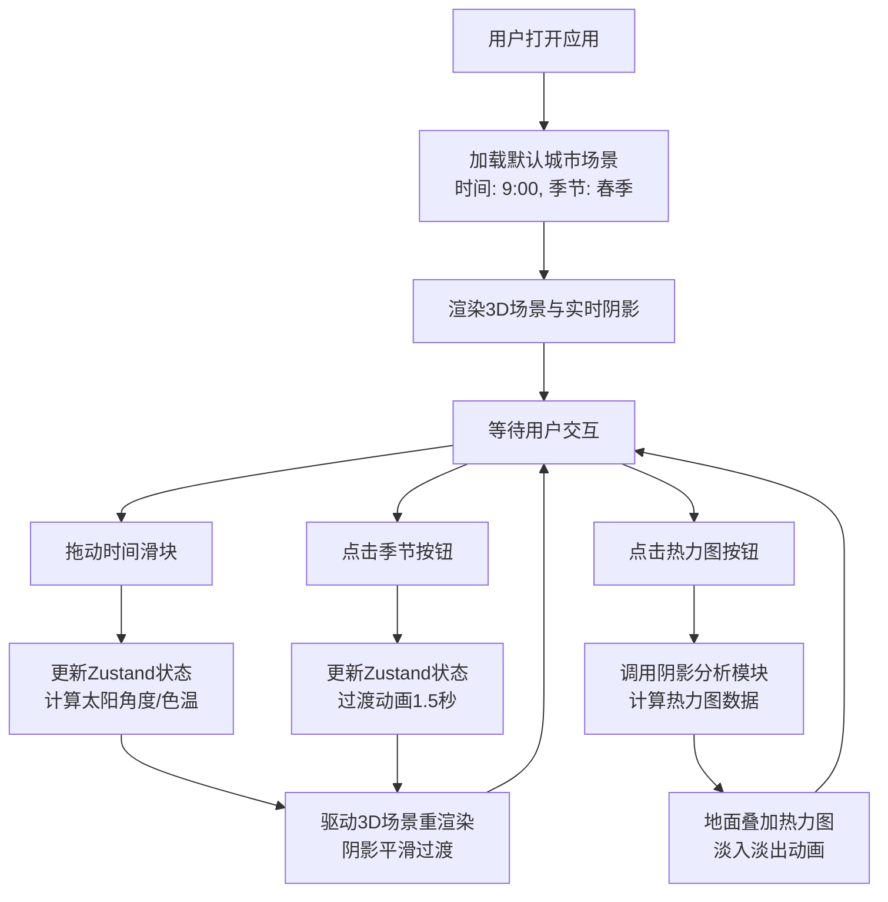

## 1. 产品概述

光影城市是一款面向城市规划部门的3D日照模拟器，帮助设计师在数字孪生城市中评估建筑群对周围环境的光照遮挡影响。用户可以通过调整时间和季节参数，实时观察建筑阴影的投射变化，并生成阴影覆盖率统计热力图。

- 目标用户：城市规划师、建筑设计师、环境评估人员
- 核心价值：提供直观的日照可视化分析工具，辅助科学决策

## 2. 核心功能

### 2.1 用户角色
| 角色 | 核心权限 |
|------|----------|
| 规划设计师 | 调整时间/季节参数、查看阴影变化、生成热力图、导出分析结果 |

### 2.2 功能模块
1. **3D城市场景**：低多边形建筑群渲染、实时阴影投射、天空穹顶与星空粒子
2. **时间控制面板**：时间滑块（6:00-18:00，步长15分钟）、季节切换按钮（春/夏/秋/冬）
3. **光照系统**：方向光角度与色温实时计算、建筑外墙反光效果、平滑过渡动画
4. **阴影分析热力图**：阴影覆盖率统计、彩色热力图叠加、淡入淡出动画
5. **信息展示面板**：当前时间、季节、光照强度数值显示

### 2.3 页面详情
| 页面名称 | 模块名称 | 功能描述 |
|---------|---------|----------|
| 主界面 | 3D城市场景 | 渲染6栋不同高度建筑，地面网格，实时阴影投射 |
| 主界面 | 时间控制面板 | 底部居中面板，时间滑块+季节按钮，磨砂玻璃效果 |
| 主界面 | 热力图切换 | 显示/隐藏阴影覆盖率热力图按钮 |
| 主界面 | 信息卡片 | 右侧显示当前时间、季节、光照强度 |

## 3. 核心流程

## 4. 用户界面设计

### 4.1 设计风格
- **主题风格**：暗色科幻风格
- **背景色**：#0A0A1A（深邃夜空蓝）
- **UI控件**：半透明磨砂玻璃效果 `rgba(255,255,255,0.08)`，边框 `1px solid #FFFFFF20`，`backdrop-filter: blur(8px)`
- **渐变天空穹顶**：地平线 #FF8C00 → 天顶 #1A237E
- **时间滑块渐变色**：#FF6B35 → #FFD93D → #6BCB77
- **季节按钮色**：春#4CAF50、夏#2196F3、秋#FF9800、冬#E0E0E0
- **热力图色**：蓝#0000FF → 红#FF0000
- **交互反馈**：hover放大1.05倍(0.2s ease-out)，点击scale 0.95(0.05s)

### 4.2 页面设计概览
| 组件 | 位置 | 尺寸/样式 |
|------|------|----------|
| 时间控制面板 | 底部居中 | 宽度60%，高度60px，距底20px，底部径向光晕 |
| 信息卡片 | 右上角 | 宽度220px，距右20px，距顶80px，字体#E0E0E0 14px |
| 热力图按钮 | 左侧或面板内 | 磨砂玻璃风格按钮 |
| 3D场景 | 全屏背景 | Canvas自适应 |

### 4.3 响应式设计
- 桌面端(1920x1080)：默认完美显示
- Pad端(1024x768)：UI整体缩放85%比例，控件布局自适应

### 4.4 3D场景指引
- **环境**：渐变天空穹顶（地平线#FF8C00→天顶#1A237E），100个随机星星粒子（1px，透明度0.3-0.8，2-5秒闪烁周期）
- **光照**：DirectionalLight投射阴影，ShadowMap尺寸2048x2048，PCFSoftShadowMap过滤，3像素软边
- **建筑材质**：MeshPhongMaterial，外墙#B0BEC5，屋顶#78909C，specular随色温变化，shininess=20
- **地面**：半透明浅灰色网格，透明度0.3
- **相机**：OrbitControls自由视角控制
- **动画**：时间/季节切换时平滑过渡，无跳跃感

## 5. 性能约束
- 拖动滑块时60FPS（每帧<16ms）
- 热力图渲染切换延迟<200ms
- 目标配置：i5-12400 + RTX 3060
