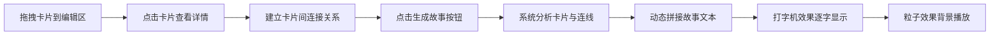

## 1. 产品概述

故事编织器是一款交互式奇幻故事创作工具，用户通过拖拽不同类型的故事元素卡片（角色、场景、事件、物件）自由组合，生成独特的短篇奇幻故事。

- 目标用户：创意写作者、故事爱好者、游戏设计师
- 核心价值：将抽象的故事创作过程转化为可视化的卡片拼图游戏，降低创作门槛，激发灵感

## 2. 核心功能

### 2.1 功能模块

1. **卡片池**：左侧展示所有可用的故事元素卡片，按类型分类
2. **故事编辑区**：右侧主工作区，支持拖放卡片、连接卡片、生成故事
3. **卡片详情模态框**：展示卡片详细信息，提供连接功能
4. **故事生成器**：基于卡片组合和连线关系，动态生成故事文本
5. **视觉动效系统**：粒子效果、打字机效果、连线发光动画

### 2.2 页面详情

| 页面名称 | 模块名称 | 功能描述 |
|-----------|-------------|---------------------|
| 主界面 | 卡片池 | 280px 固定宽度，深蓝色背景，自定义滚动条，可拖拽卡片列表 |
| 主界面 | 故事编辑区 | 渐变背景，支持卡片拖放、连线渲染、故事展示 |
| 主界面 | 可拖动分隔线 | 调整卡片池宽度（200px-600px） |
| 主界面 | 生成故事按钮 | 圆角红色按钮，悬停变色，点击脉冲动画 |
| 模态框 | 卡片详情 | 渐变背景，展示卡片描述，连接按钮 |
| 主界面 | 移动端汉堡菜单 | 小屏幕折叠卡片池 |

## 3. 核心流程

用户从左侧卡片池拖拽故事元素卡片到编辑区 → 点击卡片查看详情并与其他卡片建立连接 → 点击"生成故事"按钮 → 系统根据卡片组合和连线关系动态生成故事 → 故事以打字机效果逐字显示，伴随粒子飘散动画

## 4. 用户界面设计

### 4.1 设计风格
- **主色调**：深蓝底色（#1A1A2E、#16213E、#0F3460）
- **强调色**：红色 #E94560、紫色 #533483、亮红 #FF6B6B
- **文字色**：浅灰 #E0E0E0
- **按钮风格**：圆角矩形，0.3s 悬停过渡
- **字体**：故事展示使用 serif 衬线字体
- **动效**：卡片拖拽缩放、弹簧弹入、连线 draw 动画、脉冲、打字机、粒子飘散

### 4.2 页面设计概览

| 页面名称 | 模块名称 | UI 元素 |
|-----------|-------------|-------------|
| 主界面 | 卡片池 | 280px 宽、#1A1A2E 背景、银灰细滚动条、卡片列表 |
| 主界面 | 编辑区 | #16213E→#0F3460 渐变、卡片放置区、SVG 连线层、故事展示区 |
| 主界面 | 卡片组件 | 彩色形状标签（圆/方/三角/菱形）、半透明阴影拖拽效果、0.2s 缩放、弹簧弹入 |
| 主界面 | 生成按钮 | 右上角、#E94560 背景、hover #FF6B6B、0.3s 脉冲缩放 |
| 模态框 | 卡片详情 | #E94560→#533483 渐变背景、描述文字、连接按钮 |
| 主界面 | 连线 | 2px 宽、颜色渐变、发光滤镜、0.5s draw 动画 |
| 主界面 | 故事文字 | serif 字体、#E0E0E0、30ms/字打字机效果 |
| 主界面 | 粒子 | 50 个、2-5px、三色随机、0.5-1px/帧、0.6 透明度 |

### 4.3 响应式设计
- Desktop-first 设计
- 移动端卡片池自动折叠为汉堡菜单
- 触摸设备优化拖拽交互
