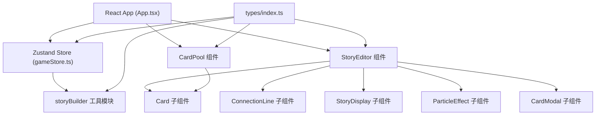

## 1. 架构设计



## 2. 技术说明

- **前端框架**：React 18 + TypeScript
- **构建工具**：Vite 5 + @vitejs/plugin-react
- **状态管理**：Zustand 4
- **拖拽库**：react-dnd + react-dnd-html5-backend
- **ID 生成**：uuid
- **样式方案**：原生 CSS（内联样式 + style 标签），无 Tailwind
- **后端**：无，纯前端应用
- **数据**：内置 mock 卡片数据

## 3. 路由定义

| 路由 | 用途 |
|-------|---------|
| / | 主应用页面（单页应用，无路由） |

## 4. 数据模型

### 4.1 类型定义

```typescript
type CardType = 'character' | 'scene' | 'event' | 'object';

interface StoryCard {
  id: string;
  type: CardType;
  name: string;
  description: string;
  x?: number;
  y?: number;
  placedInEditor?: boolean;
}

interface Connection {
  id: string;
  fromId: string;
  toId: string;
}

interface GameState {
  cards: StoryCard[];
  connections: Connection[];
  storyText: string;
  isDragging: boolean;
  selectedCardId: string | null;
  connectingFromId: string | null;
}
```

### 4.2 初始卡片数据

内置 4 类卡片，每类 3-4 张，涵盖奇幻故事常见元素：
- 角色：魔法师、龙、精灵、勇者
- 场景：古老森林、魔法城堡、神秘洞穴、云端之城
- 事件：时空裂缝、古老仪式、宝藏发现、正邪对决
- 物件：魔法水晶、远古卷轴、圣剑、神秘药剂

## 5. 核心模块说明

### 5.1 Zustand Store (gameStore.ts)
- 管理卡片列表、连线、故事文本、拖拽状态
- Actions: addCardToEditor, removeCard, moveCard, addConnection, generateStory, setSelectedCard, setConnectingFrom

### 5.2 storyBuilder.ts
- 输入：cards + connections
- 算法：基于拓扑排序确定叙事顺序，按卡片类型和连接关系选择叙事模板
- 输出：拼接好的奇幻故事字符串

### 5.3 StoryEditor.tsx
- 作为 react-dnd 的 DropTarget
- 渲染放置的卡片、SVG 连线层、故事文本区、粒子画布
- 处理卡片点击、连线绘制、打字机效果

### 5.4 CardPool.tsx
- 渲染可拖拽卡片源（作为 DragSource）
- 自定义滚动条样式
