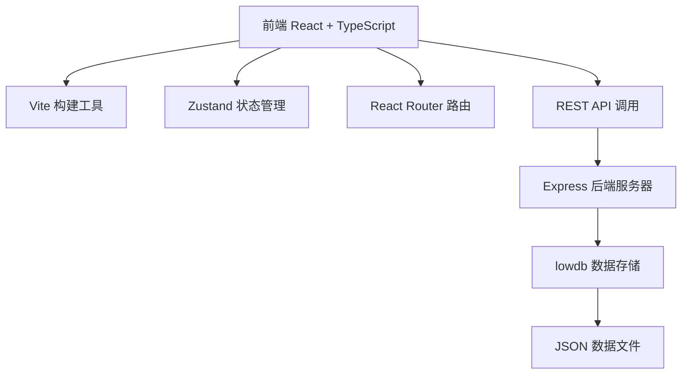
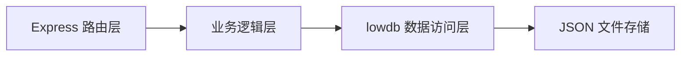
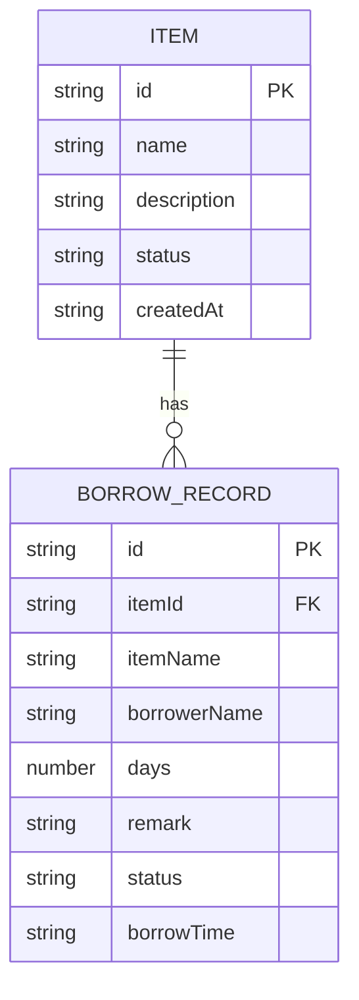

## 1. 架构设计



## 2. 技术选型说明

- 前端：React 18 + TypeScript + Vite
- 状态管理：Zustand（轻量级、缓存数据）
- 路由：React Router DOM
- 后端：Express 4.x
- 数据库：lowdb@1.0.0（轻量级JSON数据库）
- 样式：CSS Modules / 内联样式（按需求精确控制样式）
- 唯一ID：uuid

## 3. 路由定义

| 路由 | 页面组件 | 用途 |
|-------|---------|------|
| / | Home.tsx | 物品列表首页 |
| /borrow | Borrow.tsx | 我的借用记录页 |

## 4. API 定义

### 4.1 获取物品列表
- **GET** `/api/items`
- Query参数：`name`（可选，模糊搜索关键词）
- 响应：
```typescript
interface Item {
  id: string;
  name: string;
  description: string;
  status: 'available' | 'borrowed';
  image?: string;
  createdAt: string;
}
```

### 4.2 借用物品
- **POST** `/api/items/:id/borrow`
- 请求体：
```typescript
interface BorrowRequest {
  borrowerName: string;
  days: number;
  remark?: string;
}
```
- 响应：
```typescript
interface BorrowRecord {
  id: string;
  itemId: string;
  itemName: string;
  borrowerName: string;
  days: number;
  remark?: string;
  status: 'active' | 'returned';
  borrowTime: string;
}
```

### 4.3 获取借用记录
- **GET** `/api/borrows`
- 响应：`BorrowRecord[]`

## 5. 服务器架构图



## 6. 数据模型

### 6.1 数据模型定义



### 6.2 初始数据

物品初始数据：
- 电动螺丝刀：家用维修工具，可用
- 折叠梯子：3步梯，可用
- 电钻：多功能电钻套装，已借出
- 露营帐篷：4人帐篷，可用
- 投影仪：家用高清投影机，可用
- 烧烤架：便携式烧烤架，可用
