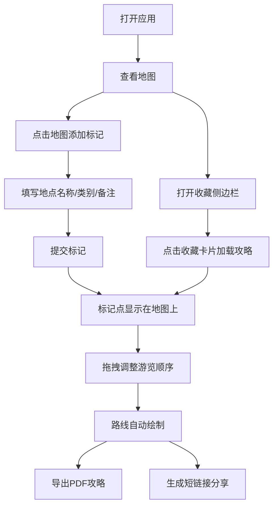

## 1. 产品概述

旅行攻略地图应用是一款帮助用户通过在地图上标记、分类和评论地点来生成个性化旅行攻略的工具。解决旅行规划时信息分散、缺少可视化整合的问题，让用户可以直观地规划旅行路线、记录地点信息并导出分享。

- 核心目标用户：自助旅行爱好者、行程规划师
- 核心价值：地图可视化 + 分类标记 + 路线规划 + 攻略导出

## 2. 核心功能

### 2.1 用户角色

| 角色 | 注册方式 | 核心权限 |
|------|----------|----------|
| 普通用户 | 无需注册（本地存储） | 地图标记、路线规划、攻略导出、收藏管理 |

### 2.2 功能模块

1. **地图交互模块**：全屏交互式地图、点击标记、分类标记点、悬停效果
2. **路线规划模块**：拖拽排序、路线连接线、数字气泡详情
3. **导出分享模块**：PDF攻略导出、短链接生成
4. **收藏管理模块**：侧边栏收藏夹、收藏卡片、攻略加载
5. **响应式适配**：移动端抽屉式面板、布局自适应

### 2.3 功能详情

| 模块名称 | 功能点 | 功能描述 |
|----------|--------|----------|
| 地图交互 | 地图视图 | 默认居中中国，缩放等级5，Leaflet渲染 |
| 地图交互 | 标记表单 | 浮动面板，地点名称、类别下拉、备注文本框 |
| 地图交互 | 标记点 | 圆形24px，分类颜色，Unicode图标，悬停放大到32px |
| 路线规划 | 拖拽排序 | 标记点可拖拽调整游览顺序 |
| 路线规划 | 路线绘制 | 曲线连接，紫色虚线动画，数字气泡 |
| 导出分享 | PDF导出 | 地图截图+标记列表+备注+路线图，5秒内完成 |
| 导出分享 | 短链接 | 模拟API生成分享短链接 |
| 收藏管理 | 收藏侧边栏 | 宽300px，收藏卡片280px宽，缩略图+标题 |
| 响应式 | 移动端适配 | <768px时纵向布局，底部滑入抽屉 |
| 动画效果 | 标记涟漪 | 点击标记时涟漪扩散效果 |
| 动画效果 | 表单缩放 | 弹出时0.95→1.0缩放动画 |

## 3. 核心流程

用户打开应用 → 查看地图 → 点击地图添加标记 → 填写地点信息 → 提交标记 → 拖拽调整顺序 → 查看路线 → 导出PDF/生成短链接 → 收藏攻略

## 4. 用户界面设计

### 4.1 设计风格

- **整体风格**：深灰配紫的科技感配色
- **主背景色**：#1A1A2E（深空灰紫）
- **强调色**：#6C63FF（紫罗兰）
- **辅助色**：#2C3E50（深蓝灰工具栏）、#E0E0E0（文本）、#FFFFFF（强调文本）
- **分类色**：美食#E74C3C、景点#3498DB、住宿#2ECC71、购物#F39C12
- **按钮样式**：工具栏按钮圆形40px，悬停上浮2px，背景变为紫色
- **字体**：现代无衬线字体，清晰易读
- **布局风格**：全屏地图 + 顶部工具栏 + 侧边栏收藏
- **动画风格**：细腻的微交互动画，200-400ms过渡

### 4.2 界面模块

| 界面区域 | 模块名称 | UI元素 |
|----------|----------|--------|
| 顶部 | 工具栏 | 背景#16213E，高60px，导出按钮、收藏开关 |
| 中央 | 地图区域 | 全屏Leaflet地图，边框1px #2D2D44 |
| 浮动 | 标记表单 | 宽320px，白背景，圆角16px，2px边框，柔和阴影 |
| 侧边 | 收藏栏 | 宽300px，背景#F8F9FA，圆角12px，收藏卡片 |
| 标记点 | 圆形标记 | 直径24px，分类颜色，Unicode图标，悬停放大 |
| 路线 | 连接线 | 曲线，#6C63FF，3px宽，虚线动画 |

### 4.3 响应式设计

- **设计原则**：桌面优先，移动端自适应
- **断点**：768px
- **移动端布局**：地图全屏纵向，标记详情底部抽屉式滑入
- **动画**：底部滑入300ms ease-out

### 4.4 性能指标

- 100个标记点保持60FPS
- 标记拖拽无肉眼延迟
- PDF生成5秒内完成
