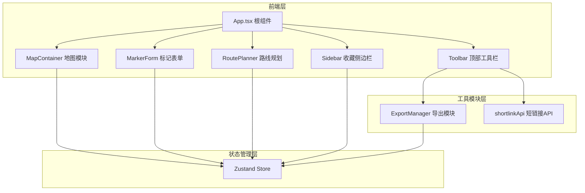

## 1. 架构设计



## 2. 技术选型

- **前端框架**：React 18 + TypeScript
- **构建工具**：Vite
- **状态管理**：Zustand
- **地图库**：Leaflet + react-leaflet
- **PDF生成**：jsPDF
- **唯一ID**：uuid
- **样式方案**：CSS Modules / 内联样式
- **路径别名**：@ → src

## 3. 项目结构

```
d:\Pro\tasks\auto29/
├── index.html                 # 入口HTML
├── package.json               # 依赖配置
├── vite.config.ts             # Vite配置
├── tsconfig.json              # TypeScript配置
└── src/
    ├── main.tsx               # React入口
    ├── App.tsx                # 根组件
    ├── modules/
    │   ├── map/
    │   │   ├── MapContainer.tsx    # 地图容器
    │   │   └── MarkerForm.tsx      # 标记表单
    │   ├── planner/
    │   │   └── RoutePlanner.tsx    # 路线规划
    │   └── export/
    │       └── ExportManager.ts    # 导出管理
    ├── stores/
    │   └── useMapStore.ts          # Zustand状态
    └── api/
        └── shortlinkApi.ts         # 短链接模拟API
```

## 4. 数据模型

### 4.1 标记点 (Marker)

```typescript
interface Marker {
  id: string;
  name: string;
  category: 'food' | 'attraction' | 'hotel' | 'shopping';
  note: string;
  lat: number;
  lng: number;
  order: number;
}
```

### 4.2 收藏攻略 (Collection)

```typescript
interface Collection {
  id: string;
  title: string;
  thumbnail: string;
  markers: Marker[];
  center: [number, number];
  zoom: number;
  createdAt: number;
}
```

### 4.3 地图状态 (MapState)

```typescript
interface MapState {
  markers: Marker[];
  routeOrder: string[];
  collections: Collection[];
  currentView: {
    center: [number, number];
    zoom: number;
  };
  selectedMarkerId: string | null;
  showSidebar: boolean;
}
```

## 5. 状态管理 (Zustand)

```typescript
interface MapStore {
  // 状态
  markers: Marker[];
  routeOrder: string[];
  collections: Collection[];
  selectedMarkerId: string | null;
  showSidebar: boolean;
  mapCenter: [number, number];
  mapZoom: number;
  
  // Actions
  addMarker: (marker: Omit<Marker, 'id' | 'order'>) => void;
  updateMarker: (id: string, updates: Partial<Marker>) => void;
  deleteMarker: (id: string) => void;
  reorderMarkers: (order: string[]) => void;
  selectMarker: (id: string | null) => void;
  toggleSidebar: () => void;
  addCollection: (collection: Collection) => void;
  loadCollection: (id: string) => void;
  setMapView: (center: [number, number], zoom: number) => void;
}
```

## 6. API 定义

### 6.1 短链接API

```typescript
// 请求
interface ShortLinkRequest {
  markers: Marker[];
  center: [number, number];
  zoom: number;
}

// 响应
interface ShortLinkResponse {
  shortUrl: string;
  expiresAt: number;
}

// 方法
function generateShortLink(data: ShortLinkRequest): Promise<ShortLinkResponse>;
```

## 7. 性能优化

- **地图标记**：使用Leaflet原生标记，避免不必要的重渲染
- **状态管理**：Zustand按需订阅，减少组件重渲染
- **拖拽优化**：使用requestAnimationFrame节流
- **PDF生成**：异步处理，避免阻塞主线程
- **响应式**：CSS媒体查询，避免JS计算布局
