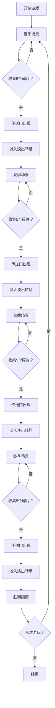

## 1. 产品概述
季节旅程是一款以天气变化为核心机制的像素风休闲解谜游戏，玩家操控像素角色穿越春夏秋冬四个主题场景，收集光之碎片解锁传送门进入下一关。
- 目标用户：独立游戏爱好者、休闲解谜玩家
- 产品价值：通过季节主题与天气粒子系统营造沉浸式像素美学体验，结合地形交互机制提供轻松有趣的解谜玩法

## 2. 核心功能

### 2.1 功能模块
1. **主场景系统**：四个季节主题场景（春、夏、秋、冬），每个场景有独特地形和天气效果
2. **玩家控制系统**：键盘WASD/虚拟摇杆双端控制，角色行走动画
3. **地形交互系统**：墙壁碰撞、水面减速、冰面惯性滑动
4. **光之碎片收集系统**：5个碎片/场景，吸附效果、收集特效、进度UI
5. **传送门与场景切换**：集齐碎片解锁传送门，淡入淡出转场动画
6. **天气粒子系统**：花瓣、雨滴、落叶、雪花四种粒子效果
7. **HUD与UI系统**：场景标题、碎片进度、重置按钮、胜利画面

### 2.2 页面详情
| 页面名称 | 模块名称 | 功能描述 |
|-----------|-------------|---------------------|
| 春季场景 | 花田地形 | 粉色花瓣飘落，花朵装饰，玩家收集光之碎片 |
| 夏季场景 | 河流地形 | 蓝色雨滴下落，水面减速效果，收集光之碎片 |
| 秋季场景 | 落叶堆地形 | 橙色落叶旋转飘落，收集光之碎片 |
| 冬季场景 | 冰面地形 | 白色雪花飘落，冰面惯性滑动，收集光之碎片 |
| 胜利画面 | 通关结算 | 深蓝色背景，金色通关文字，再次游玩按钮 |

## 3. 核心流程
玩家从春季场景开始，使用键盘或触屏控制角色移动，收集场景中5个光之碎片。集齐后传送门出现，触碰触发淡入淡出转场进入下一个季节场景。依次通过春夏秋冬四个场景后，进入胜利画面，可点击按钮重新开始游戏。

## 4. 用户界面设计

### 4.1 设计风格
- 整体风格：16-bit像素美学，像素边缘清晰无抗锯齿
- 主色调渐变：
  - 春季：浅粉#FFB6C1 → 浅绿#90EE90
  - 夏季：浅蓝#87CEEB → 黄色#FFD700
  - 秋季：橙色#FF8C00 → 棕色#8B4513
  - 冬季：深蓝#1E3A5F → 灰色#808080
- 边框：2px深色边框#333333
- 按钮交互：悬停缩放1.1倍，点击缩放0.95倍并闪烁金色#FFD700
- 字体：白色#FFFFFF，场景标题18px，胜利文字32px金色#FFD700

### 4.2 页面设计概述
| 页面名称 | 模块名称 | UI元素 |
|-----------|-------------|-------------|
| 游戏场景 | 顶部标题 | 居中场景名称，白色18px，0.5秒淡入 |
| 游戏场景 | 碎片进度 | 左上角图标+数字，显示收集进度 |
| 游戏场景 | 重置按钮 | 右下角圆形，直径40px，半透明白色背景 |
| 游戏场景 | 虚拟摇杆 | 左下方圆形区域，直径80px，触屏控制 |
| 游戏场景 | 传送门 | 旋转蓝色六边形环，集齐碎片后出现 |
| 胜利画面 | 通关文字 | 居中"恭喜通关！"，32px金色 |
| 胜利画面 | 再次游玩按钮 | 通关文字下方，悬停/点击交互动画 |

### 4.3 响应式设计
- 推荐分辨率：1280x720横屏模式（16:9），所有元素居中
- 竖屏适配：虚拟摇杆放大到屏幕左下角，碎片进度移至顶部居中
- 双端支持：键盘WASD（PC）+ 虚拟摇杆触屏（移动端）
