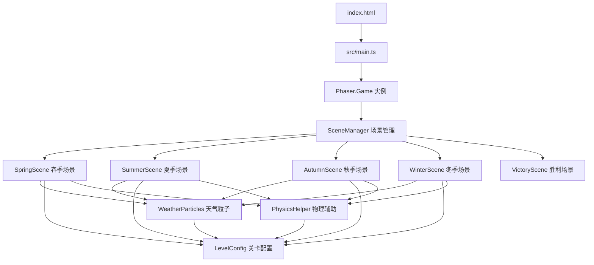

## 1. 架构设计

**数据流向说明：**
- `main.ts` 创建Phaser.Game实例，注册所有场景并启动初始场景
- 各季节场景（SpringScene等）从`LevelConfig`读取地图、碎片、传送门配置
- 各季节场景调用`WeatherParticles`生成对应天气粒子
- 各季节场景通过`PhysicsHelper`处理地形碰撞、碎片overlap、传送门触发
- 玩家集齐碎片后，场景向`main.ts`发送完成事件，触发场景切换

## 2. 技术描述
- 游戏引擎：Phaser 3.80.1
- 编程语言：TypeScript（严格模式，target ES2020）
- 构建工具：Vite
- 类型定义：@types/phaser

## 3. 文件结构与职责

| 文件路径 | 职责 | 调用关系 |
|----------|------|----------|
| `package.json` | 项目依赖与启动脚本配置 | - |
| `vite.config.js` | Vite构建配置，指定index.html入口 | - |
| `tsconfig.json` | TypeScript编译配置（严格模式，ES2020） | - |
| `index.html` | HTML入口，#game容器，加载主脚本 | 引用src/main.ts |
| `src/main.ts` | 游戏初始化入口，创建Phaser.Game，注册所有场景，管理场景切换 | 调用scenes目录下所有场景；接收场景完成事件→触发切换 |
| `src/scenes/SceneManager.ts` | 定义春夏秋冬四个场景类，每个场景包含Tilemap、玩家Sprite、碎片Group、天气粒子；处理玩家输入（WASD/触屏摇杆）、移动速度150px/s、碰撞检测、碎片收集 | 调用WeatherParticles、LevelConfig、PhysicsHelper |
| `src/systems/WeatherParticles.ts` | 天气粒子系统，按季节类型生成花瓣/雨滴/落叶/雪花，控制粒子大小、速度、数量、旋转、摇摆、BlendMode.ADD叠加、水花特效 | 被SceneManager调用 |
| `src/systems/LevelConfig.ts` | 导出JSON关卡配置数组，每关包含场景类型、2D地形地图（0空地/1墙壁/2水面/3冰面）、玩家出生点、5个碎片坐标、传送门坐标 | 被SceneManager、PhysicsHelper读取 |
| `src/systems/PhysicsHelper.ts` | 物理碰撞辅助函数：地形碰撞检测（返回碰撞方向和碰撞点）、碎片overlap检测、传送门trigger检测 | 被SceneManager调用；读取LevelConfig |

## 4. 核心模块技术实现

### 4.1 玩家移动与地形交互
- 玩家精灵：16x16像素，使用Phaser.Graphics绘制4帧行走动画
- 控制方式：Phaser.Keyboard（WASD）+ Phaser.Input.Touch（虚拟摇杆，左下方直径80px圆形区域）
- 移动速度：基础150px/s
- 地形交互通过PhysicsHelper实现：
  - 墙壁（值1）：Arcade Physics碰撞体，阻止移动
  - 水面（值2）：速度×0.5，角色tint=0x4444FF
  - 冰面（值3）：摩擦系数0.95，延迟转向（滑动0.3秒）

### 4.2 光之碎片收集
- 碎片外观：Phaser.Graphics绘制黄色六角星形，12px宽
- 呼吸动画：Phaser.Tweens scale 0.8→1.2，周期1秒
- 吸附触发：距离玩家<30px时，Tween线性移动200px/s飞向玩家，持续0.3秒
- 收集特效：8个黄色粒子（ParticleEmitter，大小6px，持续0.5秒向外散开）
- UI更新：顶部HUD显示场景碎片进度

### 4.3 传送门与场景切换
- 传送门外观：Phaser.Graphics绘制旋转蓝色六边形环，0.02弧度/帧，半径40px
- 解锁条件：碎片收集数量=5
- 场景切换：玩家触碰传送门→Camera Fade Out(0.75s黑色)→启动下一场景→Camera Fade In(0.75s)，总计1.5秒

### 4.4 天气粒子系统
- 渲染层级：地形depth=0，玩家depth=1，粒子depth=2
- 混合模式：BlendMode.ADD实现柔和叠加
- 粒子规格：
  - 春：粉色花瓣，8-12px，0.5-1px/帧，数量20
  - 夏：蓝色雨滴，2×6px，2-4px/帧，数量80，0.1px水平摇摆，落地水花（4帧×0.05s）
  - 秋：橙色落叶，12×8px，旋转0.02-0.05弧度/帧，0.3-0.8px/帧，数量15
  - 冬：白色雪花，4-8px，0.2-0.5px/帧，数量60，0.05px水平摇摆
- 性能控制：粒子池最大150，超出回收最旧；帧率<60时自动降至30FPS，粒子数量×0.7

### 4.5 HUD与UI
- 场景标题：Phaser.GameObjects.Text，居中顶部，白色#FFFFFF，18px，Fade In 0.5秒
- 碎片进度：左上角，碎片图标Graphics + Text
- 重置按钮：右下角圆形Graphics，直径40px，背景#FFFFFF44，点击→玩家回到出生点
- 胜利画面：背景#0A0A2E，"恭喜通关！"Text 32px #FFD700，"再次游玩"按钮
