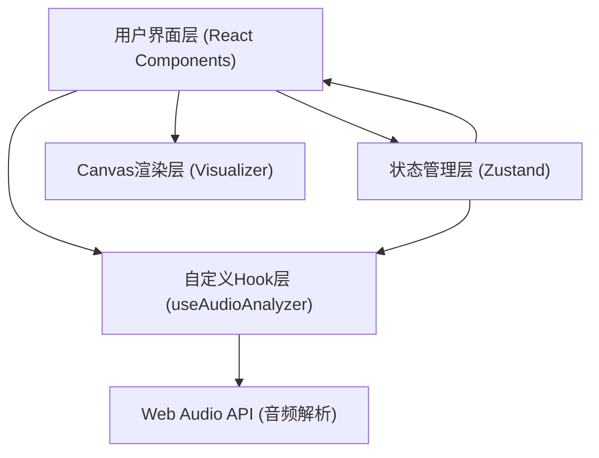

## 1. 架构设计


## 2. 技术描述
- 前端：React 18 + TypeScript + Vite
- 状态管理：Zustand
- 音频处理：Web Audio API（AudioContext, AnalyserNode）
- 图形渲染：HTML5 Canvas API
- 构建工具：Vite

## 3. 项目文件结构
```
├── package.json              # 依赖配置
├── vite.config.js            # Vite配置（React插件）
├── tsconfig.json             # TypeScript配置（严格模式，ES2020）
├── index.html                # 入口页面
└── src/
    ├── App.tsx               # 主应用组件
    ├── hooks/
    │   └── useAudioAnalyzer.ts  # 音频分析自定义Hook
    └── components/
        └── Visualizer.tsx    # Canvas可视化组件
```

## 4. 核心模块说明

### 4.1 Zustand状态管理
- audioFile: File | null - 当前上传的音频文件
- isPlaying: boolean - 播放状态
- volume: number - 音量（0-100）
- currentTime: number - 当前播放时间（秒）
- duration: number - 音频总时长（秒）
- frequencyData: Uint8Array - 频率数据数组（64个值）
- waveformData: Uint8Array - 波形数据数组（256个值）

### 4.2 useAudioAnalyzer Hook
封装Web Audio API逻辑：
- 创建AudioContext和AnalyserNode
- 处理音频文件加载和解码
- 使用requestAnimationFrame以60FPS采集频率和波形数据
- 控制播放/暂停和音量
- 跟踪播放时间

### 4.3 Visualizer组件
Canvas绘制逻辑：
- 频谱柱状图：64个柱子，高度映射（0-255 → 0-300px），颜色渐变，垂直抖动
- 波形图：256个采样点，连续线条，渐进式扫描动画

## 5. 性能要求
- 渲染帧率稳定60FPS
- 音频文件大小限制≤10MB
- 使用requestAnimationFrame确保平滑动画
