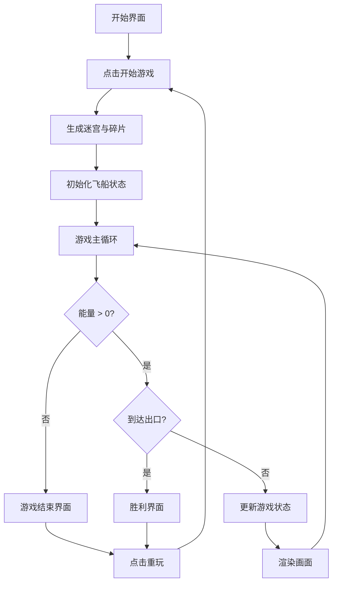

## 1. 产品概述

时空裂隙迷宫是一款基于 HTML5 Canvas 的科幻风格迷宫探险游戏。玩家操控一艘微型飞船在随机生成的扭曲时空裂隙迷宫中穿梭，通过收集时空碎片维持能量、躲避时空风暴，最终找到隐藏在迷宫深处的稳定出口。

- 核心玩法：迷宫探索 + 资源管理 + 障碍躲避
- 目标用户：休闲游戏玩家、科幻题材爱好者
- 产品价值：提供快节奏、高重玩性的迷宫探险体验

## 2. 核心特性

### 2.1 特征模块

1. **开始界面**：动态星空背景、游戏标题、开始按钮
2. **迷宫生成系统**：递归分割算法生成 21x21 迷宫，随机裂隙通道
3. **飞船操控系统**：WASD 移动、碰撞检测、拖尾粒子
4. **时空碎片系统**：随机分布、自动收集、能量奖励、收集特效
5. **时空风暴系统**：随机生成、沿裂隙移动、能量消耗、屏幕预警
6. **能量系统**：能量条显示、低能量警告、游戏结束判定
7. **摄像机系统**：平滑跟随、视口自适应
8. **游戏结算**：胜利界面、失败界面、重玩按钮

### 2.2 功能详情

| 模块名称 | 功能描述 |
|-----------|-------------|
| 迷宫生成 | 21x21 网格，递归分割算法，10-15 个裂隙通道，深紫色墙壁 |
| 飞船物理 | WASD 控制，120px/s 恒定速度，碰撞反弹，朝向跟随移动方向 |
| 碎片收集 | 30 个时空碎片，20px 内自动收集，+20 能量，扩散粒子特效 |
| 风暴系统 | 每 10-15 秒生成，沿裂隙 40px/s 移动，距离<20px 每秒-15 能量 |
| 能量系统 | 初始 100 能量，能量条显示，低于 30% 闪烁，归零游戏结束 |
| 摄像机 | 飞船居中，平滑跟随（系数 0.1），迷宫全图可见自适应 |
| 开始界面 | 50 个星空粒子，游戏标题发光效果，渐变按钮悬浮动画 |
| 结算界面 | 胜利/失败弹窗，显示得分/用时/碎片数，重玩按钮 |

## 3. 核心流程

## 4. 用户界面设计

### 4.1 设计风格

- **整体风格**：深色科幻风格，迷幻时空扭曲感
- **主色调**：
  - 背景：黑色 `#0D0D0D`
  - 墙壁：深紫色 `#2D1B69`
  - 飞船：青色 `#00FFFF`
  - 碎片：金色 `#FFD700`
  - 风暴：品红 `#FF00FF`
  - 裂隙：紫色渐变 `#6A0DAD` → `#9B59B6`
- **发光效果**：所有 UI 元素带 text-shadow 或 box-shadow 发光效果
- **按钮动画**：悬浮缩放 1.05 倍 + 渐变翻转，过渡 200ms

### 4.2 页面设计概览

| 页面 | UI 元素 | 细节 |
|------|---------|------|
| 开始界面 | 星空背景、游戏标题、开始按钮 | 50 个粒子随机运动，标题 48px 青色发光，按钮紫紫渐变 |
| 游戏界面 | Canvas 画布、能量条、得分显示 | 能量条 200x16px，绿到红渐变，低于 30% 闪烁 |
| 胜利界面 | 金色渐变背景、文字、用时、碎片数、重玩按钮 | "成功逃离时空裂隙"，显示统计信息 |
| 失败界面 | 半透明黑色背景、文字、得分、重玩按钮 | "时空失稳，游戏结束" |

### 4.3 响应式设计

- 画布自适应窗口大小，保持 16:9 宽高比
- UI 元素随窗口缩放等比缩放
- 迷宫全图可见策略：按窗口等比缩放，始终保持完整迷宫可见

### 4.4 性能要求

- 帧率稳定 60FPS 以上
- 粒子总数控制在 500 以内
- 使用 requestAnimationFrame 驱动游戏循环
- 迷宫生成耗时不超过 100ms
