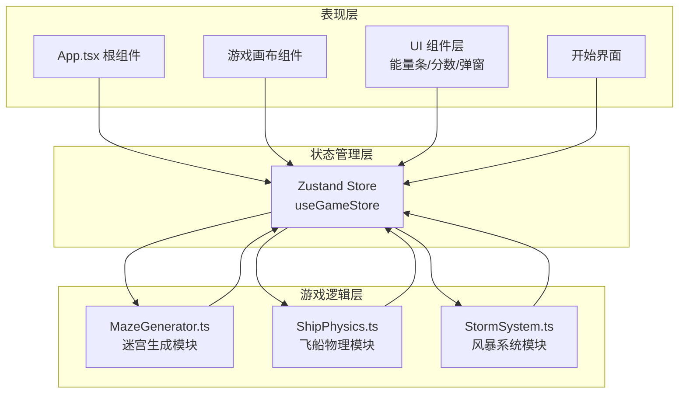

## 1. 架构设计



## 2. 技术选型

| 技术 | 版本 | 用途 |
|------|------|------|
| React | 18 | UI 框架 |
| TypeScript | 5.x | 类型安全 |
| Vite | 5.x | 构建工具 |
| Zustand | 4.x | 全局状态管理 |
| Canvas API | - | 游戏渲染 |
| @vitejs/plugin-react | 4.x | Vite React 插件 |

## 3. 项目结构

```
src/
├── App.tsx              # 根组件
├── main.tsx             # 入口文件
├── index.css            # 全局样式
├── store/
│   └── useGameStore.ts  # Zustand 状态管理
├── game/
│   ├── MazeGenerator.ts # 迷宫生成模块
│   ├── ShipPhysics.ts   # 飞船物理模块
│   └── StormSystem.ts   # 风暴系统模块
├── components/
│   ├── GameCanvas.tsx   # 游戏画布组件
│   ├── StartScreen.tsx  # 开始界面
│   ├── EnergyBar.tsx    # 能量条组件
│   ├── VictoryScreen.tsx# 胜利界面
│   └── GameOverScreen.tsx# 失败界面
└── types/
    └── game.ts          # 类型定义
```

## 4. 核心数据模型

### 4.1 迷宫数据

```typescript
type CellType = 0 | 1; // 0: 通道, 1: 墙壁

interface MazeData {
  grid: CellType[][];      // 21x21 网格
  width: number;           // 21
  height: number;          // 21
  cellSize: number;        // 40px
  rifts: Rift[];           // 裂隙通道列表
  fragments: Fragment[];   // 时空碎片列表
  exit: { x: number; y: number }; // 出口位置
}
```

### 4.2 飞船状态

```typescript
interface ShipState {
  x: number;           // 像素坐标
  y: number;
  vx: number;          // 速度
  vy: number;
  angle: number;       // 朝向角度
  energy: number;      // 当前能量
  isHit: boolean;      // 是否被击中（闪烁）
  hitTime: number;     // 击中时间
  trailParticles: Particle[]; // 拖尾粒子
}
```

### 4.3 风暴数据

```typescript
interface Storm {
  id: number;
  x: number;
  y: number;
  vx: number;
  vy: number;
  radius: number;      // 当前半径
  maxRadius: number;   // 最大半径 25px
  lifetime: number;    // 剩余生命
  particles: StormParticle[]; // 风暴内部粒子
}
```

### 4.4 游戏状态

```typescript
interface GameState {
  phase: 'start' | 'playing' | 'victory' | 'gameover';
  maze: MazeData | null;
  ship: ShipState;
  storms: Storm[];
  fragments: Fragment[];
  collectedFragments: number;
  startTime: number;
  elapsedTime: number;
  camera: { x: number; y: number; scale: number };
  isStormNearby: boolean;
}
```

## 5. 关键算法

### 5.1 递归分割迷宫生成算法

1. 初始化全墙壁网格
2. 在指定区域内随机选择一行/列打通
3. 递归处理上下/左右子区域
4. 基础迷宫完成后，随机在墙壁上打开 10-15 个裂隙通道

### 5.2 碰撞检测

- 飞船与墙壁：圆形与线段/矩形碰撞检测
- 飞船与碎片：距离检测（< 20px 自动收集）
- 飞船与风暴：距离检测（< 20px 每秒扣能量）

### 5.3 摄像机平滑跟随

```
camera.x += (ship.x - camera.x) * smoothFactor
camera.y += (ship.y - camera.y) * smoothFactor
```

smoothFactor = 0.1

## 6. 性能优化策略

- 使用 Canvas 2D 直接绘制，避免 DOM 操作
- 粒子对象池复用
- 分层渲染（背景 → 迷宫 → 碎片 → 风暴 → 飞船 → UI）
- requestAnimationFrame 时间戳计算 deltaTime
- 迷宫生成一次性计算完成
