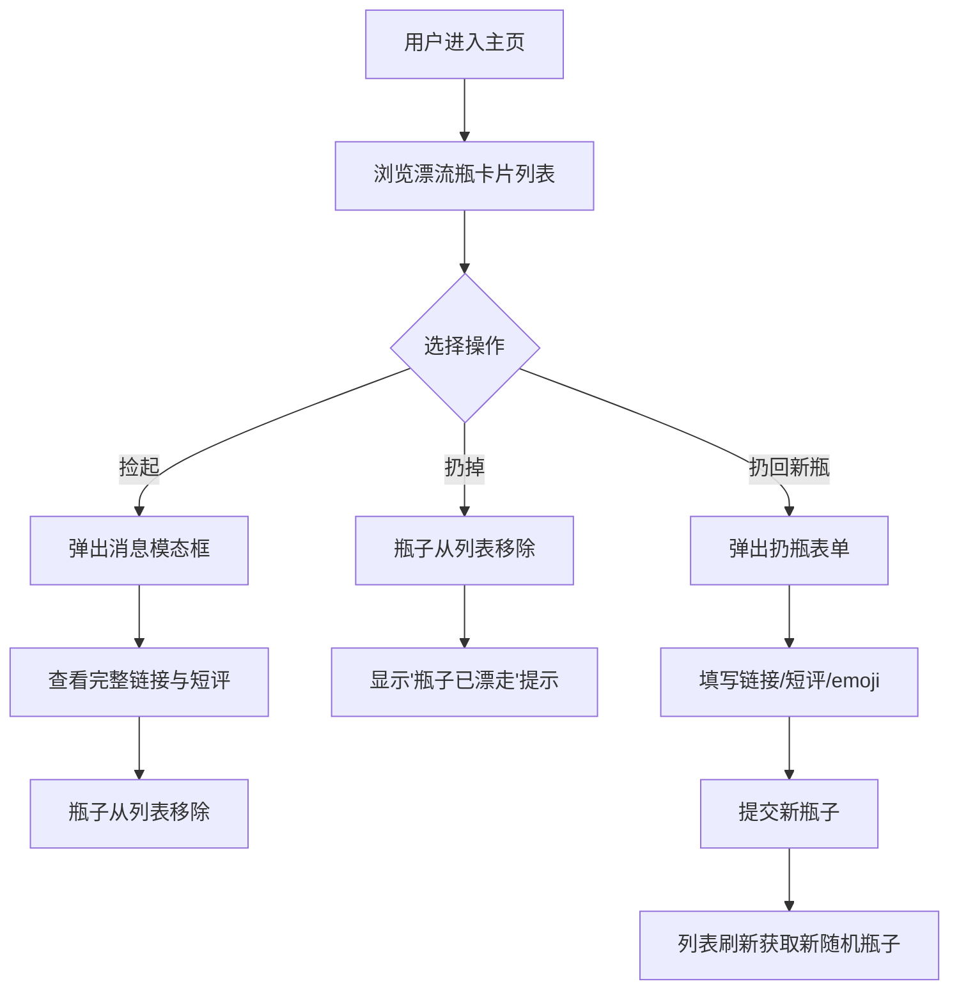

## 1. 产品概述

收藏夹漂流瓶是一个轻量级的匿名网页链接分享平台，用户可以随机收到他人分享的网页链接及短评，体验"捡瓶子"的惊喜感，也可将自己的收藏以漂流瓶形式抛出，让好内容在人际间自然漂流传递。

- 目标用户：对网页收藏、内容分享有兴趣的轻量用户群体
- 核心价值：以匿名随机的方式让优质链接跨越社交圈层流动，赋予"收藏"社交性和趣味性

## 2. 核心功能

### 2.1 用户角色

| 角色 | 注册方式 | 核心权限 |
|------|----------|----------|
| 匿名用户 | 无需注册 | 捡起/扔掉/扔回漂流瓶 |

### 2.2 功能模块

1. **主页**：漂流瓶瀑布流列表、捡起/扔掉操作、扔回新瓶浮动按钮
2. **消息模态框**：完整网页链接、短评内容、传递次数展示
3. **扔瓶表单**：链接输入、短评填写、匿名标识选择

### 2.3 页面详情

| 页面名称 | 模块名称 | 功能描述 |
|----------|----------|----------|
| 主页 | 瀑布流卡片列表 | 展示当前可捡的漂流瓶卡片，每张卡片显示匿名标识、来源标签、短评预览、传递次数，支持捡起和扔掉操作 |
| 主页 | 浮动扔瓶按钮 | 右上角圆形按钮，点击弹出扔瓶表单 |
| 主页 | 扔瓶表单弹窗 | 包含链接输入框（URL验证）、短评文本框（100字限制）、匿名标识emoji选择，提交后新瓶加入列表并刷新 |
| 消息模态框 | 瓶子详情 | 展示完整网页链接（可点击跳转）、短评全文、传递次数，半透明遮罩背景 |

## 3. 核心流程

1. **捡瓶流程**：用户浏览卡片列表 → 点击"捡起" → 弹出模态框展示完整消息 → 瓶子从列表移除
2. **扔瓶流程**：用户浏览卡片列表 → 点击"扔掉" → 瓶子从列表移除 → 底部显示"瓶子已漂走"提示（2秒后消失）
3. **扔回新瓶流程**：用户点击浮动按钮 → 弹出表单 → 填写链接+短评+选择emoji → 提交 → 新瓶加入列表 → 自动刷新获取新随机瓶子

## 4. 界面设计

### 4.1 设计风格

- **主题**：极简深色主题
- **背景**：从深蓝紫#1A1A2E到炭黑#16213E的垂直渐变
- **卡片**：背景#0F3460，圆角12px，1px #533483边框，悬停上浮4px+外发光box-shadow 0 0 20px rgba(108,99,255,0.4)
- **字体**：标题#E0E0E0，短评#B0B0B0，行高1.6；传递次数12px #9CA3AF
- **按钮**：捡起按钮#6C63FF白字圆角8px hover变亮；扔掉按钮#E74C3C白字圆角8px hover变暗
- **模态框**：背景半透明遮罩#00000055，白色卡片圆角16px，内边距24px，淡入淡出动画300ms
- **浮动按钮**：圆形直径48px，背景#6C63FF，白色加号图标
- **扔瓶表单**：宽400px，圆角16px

### 4.2 页面设计概览

| 页面名称 | 模块名称 | UI要素 |
|----------|----------|--------|
| 主页 | 瀑布流卡片列表 | 等宽240px、高度随机160-280px、间隔12px、深色渐变背景、悬停上浮发光动画 |
| 主页 | 浮动按钮 | 右上角固定定位、圆形48px、#6C63FF背景、白色+号 |
| 主页 | 扔瓶表单弹窗 | 居中弹窗400px宽、圆角16px、链接输入+短评文本框+emoji选择器 |
| 消息模态框 | 瓶子详情 | 居中白色卡片、半透明遮罩、链接可点击、淡入淡出+scale动画300ms |

### 4.3 响应式设计

- 桌面优先设计
- 大屏（≥1200px）：4列卡片
- 中屏（768-1199px）：3列卡片
- 小屏（<768px）：2列卡片，每个卡片宽度自适应calc(50% - 12px)

### 4.4 性能要求

- 页面初始化渲染时间不超过500ms
- 模拟API单次请求返回时间0.5-1.5秒，不允许超过2秒
